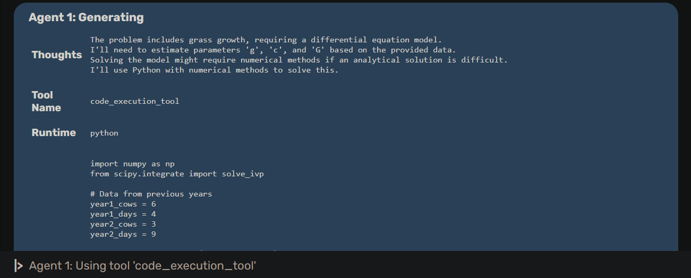
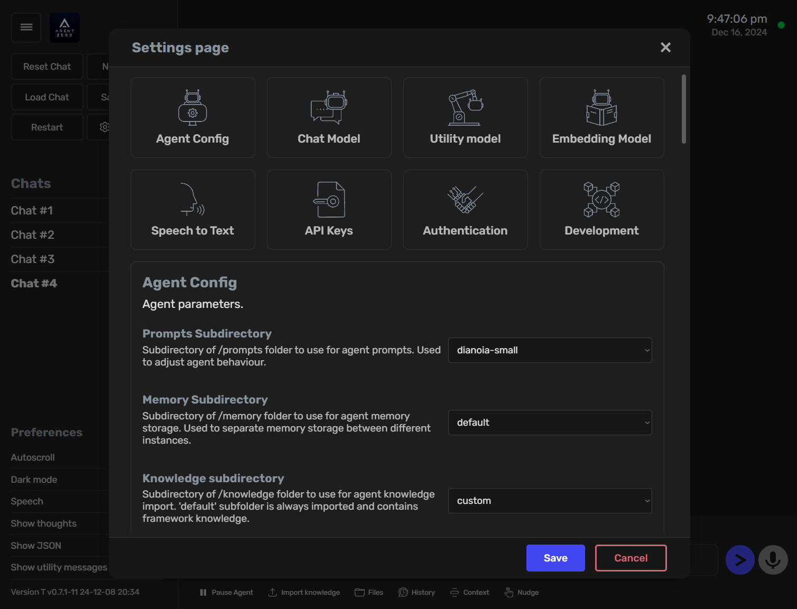

<div align="center">

# `Korev Oracle`

### Système cognitif autonome par KOREV AI

[](https://github.com/Makk7709/PRISM-Oracle)
[](./LICENSE)

## Documentation

[Introduction](#un-framework-dagent-ia-personnel-qui-grandit-et-apprend-avec-vous) •
[Installation](./docs/installation.md) •
[Développement](./docs/development.md) •
[Extensibilité](./docs/extensibility.md) •
[Utilisation](./docs/usage.md)

</div>

---

## Un framework d'agent IA personnel qui grandit et apprend avec vous

- Korev Oracle n'est pas un framework rigide. Il est conçu pour être dynamique, évolutif et apprenant au fil de votre utilisation.
- Korev Oracle est entièrement transparent, lisible, compréhensible, personnalisable et interactif.
- Korev Oracle utilise l'ordinateur comme un outil pour accomplir vos tâches.

---

# 💡 Fonctionnalités Clés

## 1. Assistant Polyvalent

Korev Oracle n'est pas pré-programmé pour des tâches spécifiques. C'est un assistant personnel généraliste. Donnez-lui une tâche, et il collectera les informations, exécutera du code, coopérera avec d'autres instances d'agents et fera tout son possible pour l'accomplir.

Il dispose d'une **mémoire persistante**, lui permettant de mémoriser les solutions précédentes, le code, les faits et instructions pour résoudre les tâches plus rapidement à l'avenir.


## 2. L'Ordinateur comme Outil

- Korev Oracle utilise le système d'exploitation comme outil pour accomplir ses tâches.
- Il peut écrire son propre code et utiliser le terminal pour créer et utiliser ses propres outils selon les besoins.
- **Outils par défaut** : recherche en ligne, fonctionnalités mémoire, communication (avec l'utilisateur et autres agents), exécution de code/terminal.
- **Outils personnalisés** : Étendez les fonctionnalités en créant vos propres outils.
- **Instruments** : Créez des fonctions et procédures personnalisées appelables par Korev Oracle.

## 3. Coopération Multi-Agents

- Chaque agent a un agent supérieur qui lui donne des tâches et instructions.
- Chaque agent peut créer des agents subordonnés pour décomposer et résoudre des sous-tâches.
- Cela permet à tous les agents de garder leur contexte propre et focalisé.




## 4. Entièrement Personnalisable et Extensible

- Presque rien n'est codé en dur. Rien n'est caché. Tout peut être étendu ou modifié.
- Le comportement est défini par un prompt système dans **prompts/default/agent.system.md**.
- Chaque prompt, chaque template de message peut être trouvé dans le dossier **prompts/** et modifié.
- Chaque outil par défaut peut être trouvé dans **python/tools/** et modifié.


## 5. Profils Métiers Spécialisés

Korev Oracle supporte des **profils d'agents** spécialisés par métier :

| Profil | Spécialisation |
|--------|----------------|
| `finance` | Analyste financier, comptabilité, KPIs, valorisation |
| `marketing` | Stratégie marketing, copywriting, SEO, ads |
| `sales` | Commercial, CRM, prospection, closing |
| `developer` | Développement logiciel, architecture |
| `researcher` | Recherche, analyse de données, reporting |

Changez de profil via **Settings → Default agent profile**.

---

# 🚀 Exemples d'Utilisation

- **Projets de développement** — `"Crée un dashboard React avec visualisation de données en temps réel"`
- **Analyse de données** — `"Analyse les données de vente du dernier trimestre et crée un rapport"`
- **Création de contenu** — `"Rédige un article technique sur les microservices"`
- **Administration système** — `"Configure un système de monitoring pour nos serveurs"`
- **Recherche** — `"Résume les 5 derniers articles sur le prompting CoT"`
- **Finance** — `"Analyse la santé financière de cette entreprise"`
- **Marketing** — `"Crée une séquence email de nurturing B2B"`
- **Commercial** — `"Génère un script de prospection téléphonique"`

---

# ⚙️ Installation

### Prérequis

- Python 3.10+
- Docker (optionnel mais recommandé)

### Installation Rapide

```bash
# Cloner le repository
git clone https://github.com/Makk7709/PRISM-Oracle.git
cd PRISM-Oracle

# Installer les dépendances
pip install -r requirements.txt

# Lancer l'application
python run_ui.py --port 8080

# Ouvrir http://localhost:8080
```

### Avec Docker

```bash
docker build -t prism-oracle .
docker run -p 8080:80 prism-oracle
```

---

# 🐳 Interface Web Complète



- Paramètres personnalisables pour adapter le comportement de l'agent
- Interface propre, fluide et interactive
- Sauvegarde et chargement des conversations
- Logs automatiquement sauvegardés dans **logs/**
- Mode Jour/Nuit avec persistance


- Sortie en temps réel, permettant d'intervenir à tout moment
- Aucun code requis, uniquement des compétences de prompting et communication
- Fiable même avec de petits modèles grâce à un prompt système solide

---

# ⚠️ Points Importants

### Korev Oracle Peut Être Puissant

Avec les bonnes instructions, Korev Oracle est capable de nombreuses actions, y compris potentiellement dangereuses concernant votre ordinateur, données ou comptes. Exécutez toujours Korev Oracle dans un environnement isolé (comme Docker) et soyez prudent dans vos demandes.

### Korev Oracle Est Basé sur les Prompts

Tout le framework est guidé par le dossier **prompts/**. Guidelines de l'agent, instructions des outils, messages, fonctions utilitaires IA — tout est là.

---

# 📚 Documentation

| Page | Description |
|------|-------------|
| [Installation](./docs/installation.md) | Installation, configuration |
| [Utilisation](./docs/usage.md) | Usage basique et avancé |
| [Développement](./docs/development.md) | Développement et personnalisation |
| [Extensibilité](./docs/extensibility.md) | Étendre Korev Oracle |
| [Connectivité](./docs/connectivity.md) | Endpoints API, connexions MCP, protocole A2A |
| [Architecture](./docs/architecture.md) | Design système et composants |
| [Contribution](./docs/contribution.md) | Comment contribuer |
| [Dépannage](./docs/troubleshooting.md) | Problèmes courants et solutions |

---

# 🔧 Configuration Runtime

Korev Oracle supporte deux modes d'exécution :

| Mode | Description |
|------|-------------|
| `user` (défaut) | Aucune dépendance RFC, exécution directe |
| `dev` | Bridge RFC optionnel pour développement |

```bash
# Variables d'environnement
export PRISM_RUNTIME_MODE=user
export SEARCH_PROVIDER=searxng
export SEARXNG_URL=http://localhost:55510
```

---

# 📝 Changelog

### v1.0.0 — Korev Oracle

- Rebranding complet avec design system PRISM
- Mode Jour/Nuit avec persistance
- Profils métiers : Finance, Marketing, Sales
- Mode USER-SAFE sans dépendance RFC
- Correction upload PDF local
- Support OCR pour PDF scannés
- Fix température LiteLLM pour GPT-5

---

<div align="center">

**Korev Oracle** — Système cognitif par **KOREV AI**

</div>
