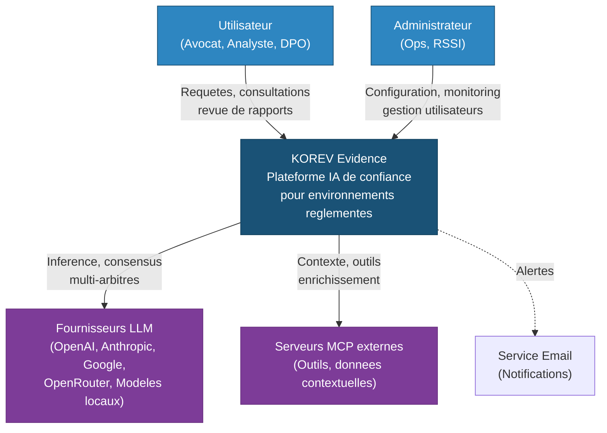
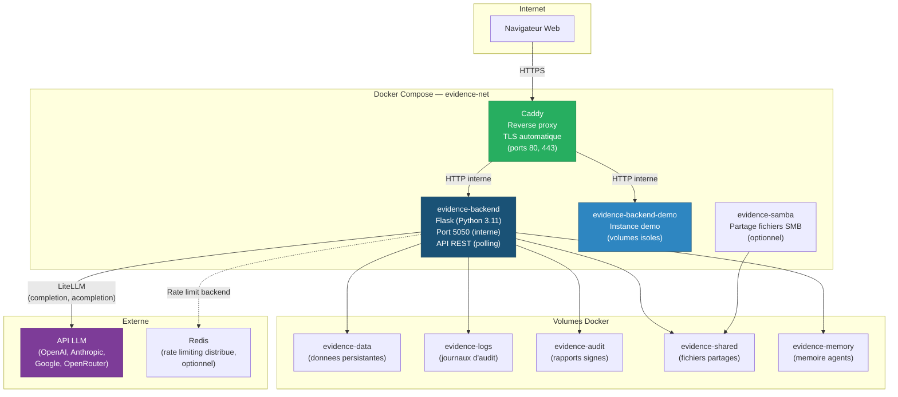
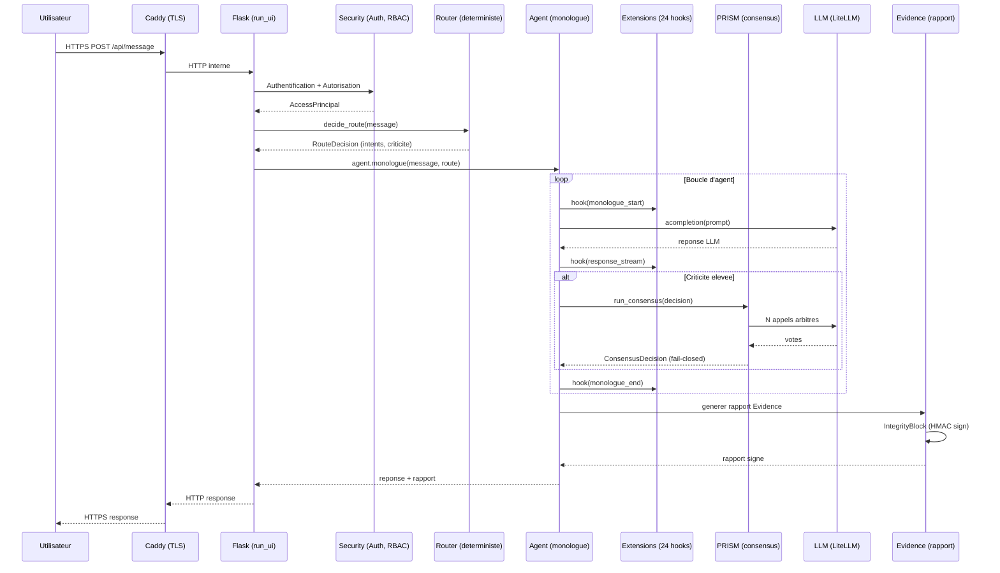

# Diagrammes d'architecture C4 — KOREV Evidence

Ce document presente l'architecture de KOREV Evidence selon le modele C4 (Context, Containers, Components) en notation Mermaid. Chaque niveau de zoom permet a un public different (direction, architecte, developpeur) de comprendre le systeme.

---

## Niveau 1 — Diagramme de contexte (Context)

Vue d'ensemble des acteurs externes et de leurs interactions avec le systeme Evidence.

**Acteurs :**
- **Utilisateur** : professionnel reglemente (avocat, analyste financier, DPO, medecin) qui soumet des requetes et consulte les rapports d'audit.
- **Administrateur** : responsable technique ou RSSI qui configure, surveille et gere les acces.
- **Fournisseurs LLM** : services d'inference interroges pour la generation et le consensus multi-arbitres.
- **Serveurs MCP** : protocole standardise d'echange de contexte, outils et donnees.

---

## Niveau 2 — Diagramme de conteneurs (Containers)

Decomposition du systeme en conteneurs de deploiement (services, applications).

**Conteneurs :**
- **Caddy** : reverse proxy avec TLS automatique (Let's Encrypt). Point d'entree unique.
- **evidence-backend** : application Flask (Python 3.11, Node.js 20 pour le build frontend). Contient le noyau d'orchestration, le consensus, le routage, les extensions, la securite.
- **evidence-backend-demo** : instance identique avec volumes isoles pour les demonstrations.
- **evidence-samba** : service de partage de fichiers SMB (optionnel, pour l'acces aux fichiers partages).
- **Redis** : backend optionnel pour le rate limiting distribue.

---

## Niveau 3 — Diagramme de composants (Components)

Vue interne du conteneur **evidence-backend** : modules Python et leurs interactions.

```mermaid
graph TB
    subgraph API["API Layer (Flask)"]
        RunUI["run_ui.py<br/>App Factory<br/>Routes, Auth, Sessions"]
        ApiHandler["api_handler.py<br/>WebSocket, REST"]
        HealthEP["health_endpoints.py<br/>/healthz, /readyz"]
    end

    subgraph Agent["Agent Orchestration"]
        AgentCore["agent.py<br/>Agent Loop<br/>(monologue-action)"]
        Extensions["Extensions<br/>(24 hooks, 48 modules)<br/>Cycle de vie"]
    end

    subgraph Security["Security Module"]
        Auth["auth.py<br/>Argon2id hashing"]
        Authz["authorization.py<br/>RBAC multi-tenant"]
        RateLimit["rate_limit/<br/>Memory + Redis backends"]
        PathSafety["path_safety.py<br/>Traversal protection"]
        UploadVal["upload_validation.py<br/>Extension, MIME, taille"]
        ShellSafe["shell_safety.py<br/>Allowlist, sanitization"]
    end

    subgraph Consensus["PRISM Consensus"]
        Engine["ConsensusEngine<br/>(run_consensus)"]
        Manager["ConsensusManager<br/>Votes, quorum"]
        Arbiters["ArbiterCaller<br/>Multi-LLM calls"]
        Contracts["ConsensusContracts<br/>Schemas, validation"]
    end

    subgraph Router["Deterministic Router"]
        RouterCore["router.py<br/>decide_route()"]
        Policy["policy.py<br/>Keywords, thresholds"]
        Contract["routing_contract.py<br/>RouteDecision type"]
        Judge["judge.py<br/>Criticality eval"]
    end

    subgraph Evidence["Evidence Framework"]
        EvidenceCore["evidence.py<br/>Orchestration centrale"]
        Integrity["integrity_block.py<br/>HMAC-SHA256 / RSA"]
        Session["session_envelope.py<br/>KRV-SES-* IDs"]
        Native["evidence_native.py<br/>Rapport 10 blocs"]
        Replay["ReplayEngine<br/>Snapshot, rejeu"]
        HumanRev["HumanReview<br/>Revue humaine"]
        RiskReg["DynamicRiskRegister<br/>Scoring temps reel"]
    end

    subgraph Models["LLM Abstraction"]
        ModelsCore["models.py<br/>LiteLLM wrapper"]
        Providers["providers.py<br/>Provider config"]
        RateLimiterLLM["rate_limiter.py<br/>Throttling appels LLM"]
    end

    RunUI --> AgentCore
    RunUI --> Auth
    RunUI --> Authz
    RunUI --> RateLimit
    RunUI --> HealthEP
    ApiHandler --> AgentCore
    AgentCore --> Extensions
    AgentCore --> Engine
    AgentCore --> RouterCore
    AgentCore --> ModelsCore
    Extensions --> EvidenceCore
    Extensions --> Replay
    Extensions --> HumanRev
    Extensions --> RiskReg
    Engine --> Manager
    Engine --> Arbiters
    Engine --> Contracts
    Arbiters --> ModelsCore
    RouterCore --> Policy
    RouterCore --> Contract
    RouterCore --> Judge
    EvidenceCore --> Integrity
    EvidenceCore --> Session
    EvidenceCore --> Native
    ModelsCore --> Providers
    ModelsCore --> RateLimiterLLM

    style Engine fill:#e74c3c,stroke:#c0392b,color:#fff
    style RouterCore fill:#e67e22,stroke:#d35400,color:#fff
    style EvidenceCore fill:#1a5276,stroke:#154360,color:#fff
    style AgentCore fill:#2e86c1,stroke:#1a5276,color:#fff
    style Auth fill:#27ae60,stroke:#1e8449,color:#fff
```

**Composants principaux :**

| Composant | Responsabilite | Fichier(s) cle(s) |
|---|---|---|
| **Agent Loop** | Orchestration monologue-action, gestion des iterations | `agent.py` |
| **Extensions** | 48 modules sur 24 hooks : audit, masquage, replay, validation strategique, legal-safe, memorisation | `python/extensions/` |
| **PRISM Consensus** | Consensus multi-arbitres, fail-closed, quorum, votes | `python/consensus/engine.py` |
| **Deterministic Router** | Routage par mots-cles et hashing, anti-injection, multi-intent | `python/helpers/router/` |
| **Evidence Framework** | Rapports d'audit signes, SessionEnvelope, IntegrityBlock, pipeline audit-proof | `python/helpers/` |
| **Security Module** | Auth Argon2id, RBAC, rate limiting, path/upload/shell validation | `python/security/` |
| **LLM Abstraction** | Interface unifiee multi-provider via LiteLLM | `models.py` |

---

## Relations inter-composants

Le flux d'une requete utilisateur traverse les composants dans l'ordre suivant :

---

*Document genere le 17 avril 2026. Version 1.0.*
*Notation : Mermaid (compatible GitHub, GitLab, Notion, Obsidian, MkDocs).*
