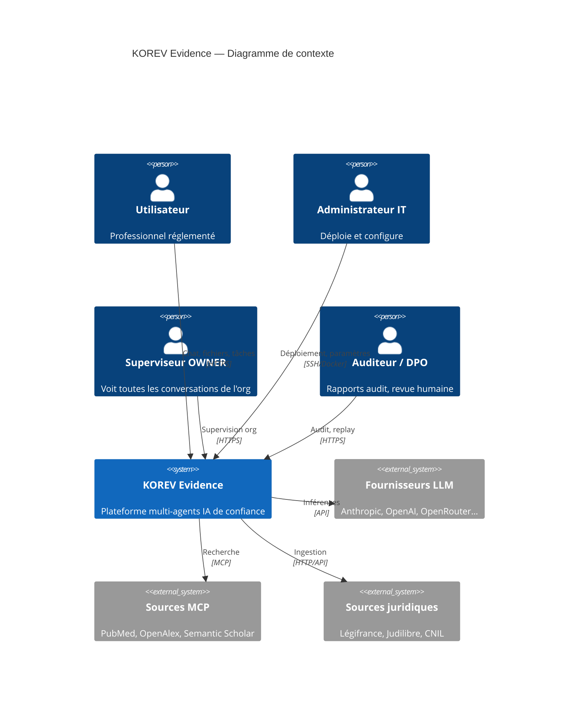
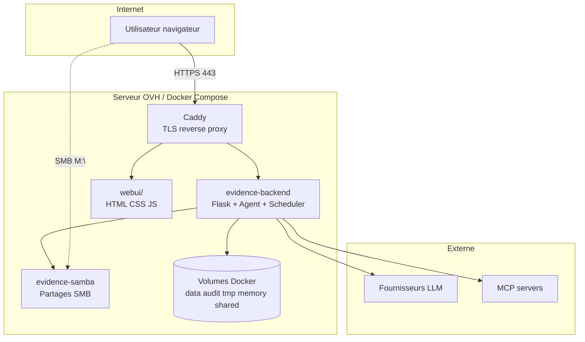
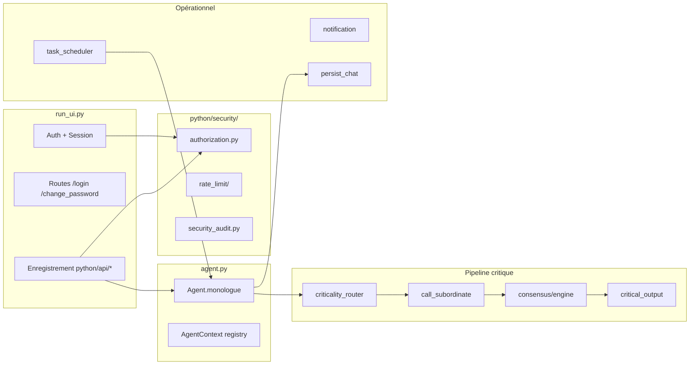
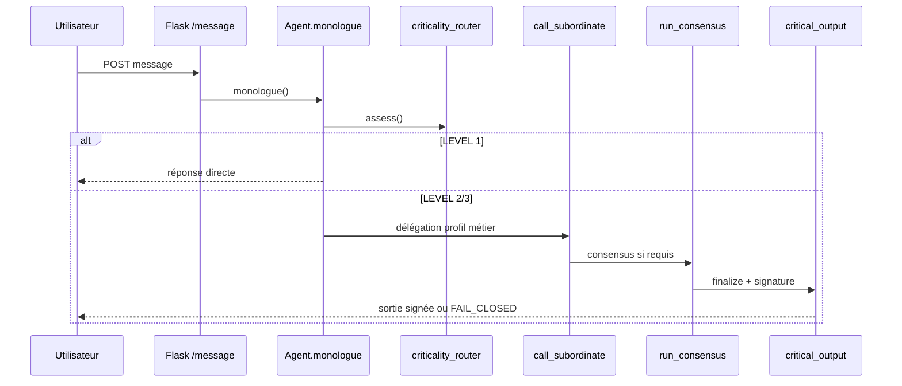
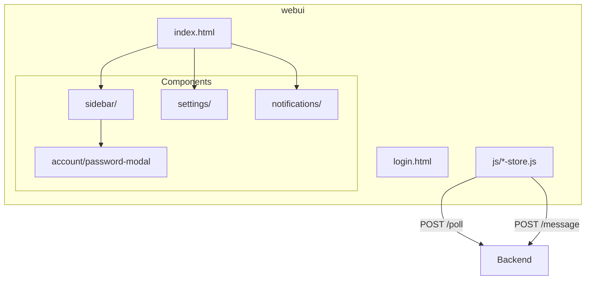

# Diagrammes C4 — KOREV Evidence

**Version** : v1.3.1 · **Public** : architectes, auditeurs · **Format** : C4 (Contexte, Conteneurs, Composants)

> Ce document remplace la référence absente `ARCHITECTURE_C4_DIAGRAMS.md` citée dans `PROJECT_DOCUMENTATION_STANDARD.md`. Les diagrammes sont en Mermaid (rendu GitHub / IDE).

---

## Niveau 1 — Contexte système

---

## Niveau 2 — Conteneurs

### Table des conteneurs

| Conteneur | Image | Port | Rôle |
|-----------|-------|------|------|
| `evidence-caddy` | `caddy:2-alpine` | 80, 443 | TLS, reverse proxy |
| `evidence-backend` | `korev/evidence-backend:1.0.0` | 5050 (interne) | Application principale |
| `evidence-backend-demo` | idem | 5050 (interne) | Instance démo |
| `evidence-samba` | `dperson/samba` | 445 (localhost) | Workspaces utilisateurs |
| `evidence-postgres` | — | — | Profil `db` optionnel (ADR-007) |

---

## Niveau 3 — Composants backend (simplifié)

---

## Niveau 4 — Flux critique (séquence)

---

## Niveau 3 — Composants frontend

---

## Correspondance fichiers

| Élément C4 | Fichier(s) source |
|------------|-------------------|
| Contexte utilisateur | `webui/`, `run_ui.py` |
| Conteneur backend | `deploy/docker-compose.yml`, `run_ui.py` |
| Criticality router | `python/helpers/criticality_router.py` |
| Consensus | `python/consensus/engine.py` |
| Critical output | `python/helpers/critical_output.py` |
| Scheduler | `python/helpers/task_scheduler.py` |
| Multi-tenant | `python/security/authorization.py`, `python/helpers/user_manager.py` |

---

## Documents liés

- [ARCHITECTURE_EVIDENCE.md](../ARCHITECTURE_EVIDENCE.md) — synthèse narrative
- [EVIDENCE_DELEGATION_ARCHITECTURE_VERIFIED.md](EVIDENCE_DELEGATION_ARCHITECTURE_VERIFIED.md) — délégation vérifiée
- [critical_request_path_map.md](../audit/critical_request_path_map.md) — chemin critique audité

---

*Diagrammes C4 — KOREV Evidence v1.3.1. Dernière révision : 2026-06-13.*
