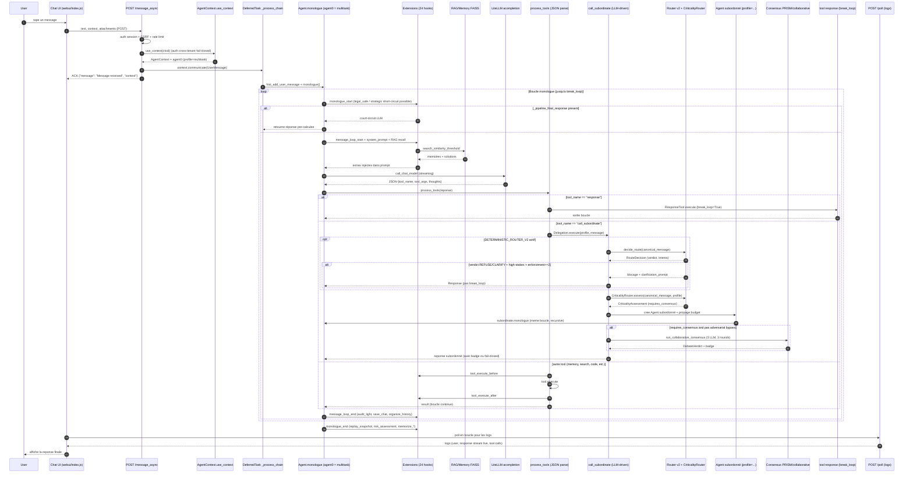

<!-- markdownlint-disable MD013 MD024 MD033 MD036 MD038 MD040 MD041 MD056 MD060 -->

# Evidence — Cartographie du pipeline de delegation apres un chat utilisateur

**Auteur** : Amine Mohamed <amine.mohamed@korev-ai.com> — posture "architecte logiciel senior systemes multi-agents, orchestration LLM, reverse engineering".
**Date** : 22 mai 2026.
**Branche** : `diag-grow/transmission-evidence`.
**HEAD au moment de l'audit** : `641b2c44`.
**Perimetre** : repertoire `/Users/aminemohamed/Desktop/APP/KOREV_Oracle/KOREV_Oracle/`.
**Methode** : grep + Read sur le code source, 0 extrapolation, chaque claim est ancre par un chemin `fichier:ligne`.

---

## 1. Executive summary

1. **Point d'entree HTTP** : `POST /message_async` (UI) ou `POST /api_message` (clef API). Pas de prefixe `/api/` cote UI ; routes auto-enregistrees depuis `python/api/<name>.py` (`run_ui.py:660-684`).
2. **L'orchestration n'est PAS pilotee par un orchestrateur central** : c'est le couple `AgentContext.communicate` (`agent.py:245-262`) + `Agent.monologue` (`agent.py:395-594`) qui executent la requete dans une `DeferredTask`.
3. **L'agent principal (`agent0`) est par defaut sur le profil `multitask`** (`settings.py:1980`), pas `default`. `default` est un profil **minimal** d'heritage des prompts globaux.
4. **Le LLM decide quels tools appeler**, en produisant un JSON `{"tool_name": "...", "tool_args": {...}}` parse par `Agent.process_tools` (`agent.py:965-1004`). Ce n'est PAS du function-calling natif OpenAI.
5. **La delegation aux agents specialises est LLM-driven** : le LLM choisit d'invoquer le tool `call_subordinate` avec un argument `profile` (`call_subordinate.py:106-107`). Le LLM est guide par son prompt systeme (le profil `multitask` contient une matrice de delegation explicite).
6. **Le router deterministe v2 N'INTERCEPTE PAS le premier appel LLM** : il s'execute UNIQUEMENT a l'interieur de `call_subordinate.execute` (`call_subordinate.py:122-238`), donc seulement quand le LLM a deja decide de deleguer. Il est feature-flagge (`DETERMINISTIC_ROUTER_V2=1|2|3`).
7. **Le router deterministe sert principalement a l'AUDIT** (niveau 1, defaut) et **secondairement a l'enforcement** (niveau 2+, peut bloquer une delegation high-stakes). Il ne choisit pas le profil ; il valide/refuse.
8. **Le criticality router** (`criticality_router.py`) est invoque dans `call_subordinate` (apres le router v2). Il decide si la reponse subordonnee doit passer par un consensus PRISM/collaborative selon profil x domaine x verbes actionnables.
9. **Pas de consensus PRISM dans le chat par defaut**. Il est declenche uniquement quand `call_subordinate` est invoque ET que `CriticalityRouter.requires_consensus = True`. Une requete simple (niveau 1) reste un appel LLM + tool `response` direct, sans consensus.
10. **La reponse finale est emise par le tool `response`** (`python/tools/response.py:40-41`) qui marque `break_loop=True`. C'est ce qui sort de la boucle `monologue`.
11. **UI = polling** (`webui/index.js:262-318`) sur `/poll`, pas de SSE/WebSocket. Le streaming des tokens LLM se fait via `LogItem` (extensions `response_stream/_20_live_response.py:28-39`).
12. **Auditabilite** : `SessionEnvelope` cree par hook `monologue_start/_03_session_envelope_init.py`, `PipelineTracker` peuplé par `call_subordinate`, `RouterMetrics` agregees, logs JSON `router_decision` avec `correlation_id` (= `query_hash`). Pas de propagation HTTP request-id → agent → tous sous-systemes (correlation_id heterogene).
13. **RAG/Memoire** : FAISS par utilisateur (`memory/users/{username}/default/`), injecte dans le prompt LLM par hook `message_loop_prompts_after/_50_recall_memories.py` BEFORE l'appel LLM. Le LLM "voit" la memoire ; il ne la cherche pas explicitement.
14. **Court-circuit possible du LLM** par les hooks `monologue_start` : extension `_15_strategic_enforcement.py` ou `legal_safe` (`agents/legal_safe/extensions/`) peuvent positionner `_pipeline_final_response` et faire un short-circuit total (`agent.py:415-440`).
15. **Niveau d'auditabilite reel** : `correlation_id` propage uniquement dans certaines branches (router, replay, human review). Tests forts sur composants isoles ; aucun test HTTP `/message_async` → `monologue` → response observe. Couverture pipeline integration = lacune confirmee.

---

## 2. Vue d'ensemble du pipeline



> Notation : les fleches en pointille sont implicites (extension qui modifie `loop_data.extras_*`). Le diagramme decrit le flow par defaut pour le profil `multitask`. Les profils specialises (`legal_safe`, `medical`) peuvent declencher un short-circuit du LLM via leurs propres extensions.

---

## 3. Point d'entree utilisateur

### 3.1 Endpoints HTTP recevant un message

| # | Endpoint | Fichier:ligne | Methode | Auth | Usage |
|---|---|---|---|---|---|
| 1 | `/message_async` | `python/api/message_async.py:6-11` | POST | Session + CSRF + rate limit | **UI principale** (defaut webui) |
| 2 | `/message` | `python/api/message.py:12-22` | POST | Idem | Sync ; attend `task.result()` ; peu utilise par l'UI |
| 3 | `/api_message` | `python/api/api_message.py:19-29` | POST | `requires_api_key=True`, `requires_auth=False`, `requires_csrf=False` | API externe (cle `X-API-KEY`) |
| 4 | `/nudge` | `python/api/nudge.py:3-10` | POST | Idem `/message` | Relance `context.nudge()` sans nouveau texte |
| 5 | `/poll` | `python/api/poll.py:12` | POST | Session | Recupere logs (non agent trigger) |
| 6 | MCP `send_message` | `python/helpers/mcp_server.py:86-157,250-255` | MCP (HTTP+SSE sous `/mcp`) | Token MCP | Agent distant MCP |
| 7 | A2A | `python/helpers/fasta2a_server.py:71-98,96-98` | HTTP `/a2a/...` | Bearer / API key / token dans path | Agent distant A2A |
| 8 | Scheduler | `python/helpers/task_scheduler.py:1268-1278` | Interne (cron) | — | Tache planifiee → `monologue` |

### 3.2 Mecanisme d'enregistrement des routes

Les handlers `python/api/<name>.py` sont auto-decouvers et enregistres sous `/{name}` (pas `/api/{name}`) :

```660:684:run_ui.py
    def register_api_handler(app, handler):
        name = handler.__module__.split(".")[-1]
        instance = handler(app, _app_lock)
        ...
        app.add_url_rule(
            f"/{name}",
            f"/{name}",
            handler_wrap,
            methods=handler.get_methods(),
        )
```

Methode HTTP par defaut : POST (`python/helpers/api.py:66-67`).

Chaine auth ordonnee : `requires_loopback` → `api_rate_limit` → `requires_auth` → `requires_admin` → `requires_api_key` → `csrf_protect` (`run_ui.py:667-677`).

### 3.3 Payload `/message_async`

| Champ | Type | Source |
|---|---|---|
| `text` | string | JSON ou form-data |
| `context` (ctxid) | string | id de chat |
| `message_id` | string | id de message (optionnel) |
| `attachments[]` | files | form-data multipart |

Preuve :

```24:64:python/api/message.py
    async def communicate(self, input: dict, request: Request):
        if request.content_type.startswith("multipart/form-data"):
            text = request.form.get("text", "")
            ctxid = request.form.get("context", "")
            message_id = request.form.get("message_id", None)
            attachments = request.files.getlist("attachments")
            ...
        else:
            input_data = request.get_json()
            text = input_data.get("text", "")
            ctxid = input_data.get("context", "")
            message_id = input_data.get("message_id", None)
            attachment_paths = []
```

### 3.4 Reponse `/message_async` (UI)

ACK immediat — l'UI poll `/poll` pour les logs et la reponse finale :

```6:11:python/api/message_async.py
class MessageAsync(Message):
    async def respond(self, task: DeferredTask, context: AgentContext):
        return {
            "message": "Message received.",
            "context": context.id,
        }
```

L'UI envoie le message puis poll en boucle :

```262:318:webui/index.js
    const response = await sendJsonData("/poll", {
      log_from: log_from,
      context: context || null,
      ...
    });
    for (const log of response.logs) {
      setMessage(messageId, log.type, log.heading, log.content, ...);
    }
```

---

## 4. Chaine d'appel backend (etape par etape)

| Etape | Composant | Fichier:ligne | Comportement |
|---|---|---|---|
| 1. Routing HTTP | Flask URL rule | `run_ui.py:660-684` | Decouvre handlers, enregistre `/{name}` |
| 2. Auth + CSRF + rate limit | Decorateurs | `run_ui.py:543-595` | Session ou API key ; CSRF X-CSRF-Token ; rate limit Redis ou memory |
| 3. Parsing payload | `Message.communicate` | `python/api/message.py:24-64` | JSON ou form-data ; stockage attachments sur disque |
| 4. Recuperation contexte | `ApiHandler.use_context` | `python/helpers/api.py:343-413` | Charge `AgentContext`, autorise cross-tenant (fail-closed) |
| 5. Creation si necessaire | `_new_context(config=initialize_agent())` | `python/helpers/api.py:405-411` | Cree `Agent(0, config, ctx)` ; profil = settings `agent_profile` |
| 6. Hook `user_message_ui` | `extension.call_extensions` | `python/api/message.py:74` | Permet a une extension de modifier `message`/`attachment_paths` |
| 7. Log utilisateur | `context.log.log(type="user", ...)` | `python/api/message.py:99-105` | Premier log UI |
| 8. Demarrage tache | `context.communicate(UserMessage(...))` | `python/api/message.py:107` | Retourne `DeferredTask` |
| 9. Ajout historique | `agent.hist_add_user_message(msg)` | `agent.py:283` (dans `_process_chain`) | Ajout au prompt LLM |
| 10. Boucle monologue | `Agent.monologue()` | `agent.py:395-594` | Cycle iteratif jusqu'a `break_loop` |
| 11. Court-circuit possible | `_pipeline_final_response` check | `agent.py:415-440` | Si extension a positionne reponse, skip LLM |
| 12. Hooks pre-LLM | `monologue_start`, `message_loop_start`, `system_prompt`, `message_loop_prompts_*`, `before_main_llm_call` | `python/extensions/` | Construit prompt + injecte memoire + applique policies |
| 13. Appel LLM | `Agent.call_chat_model` | `agent.py:503-507, 876-923` ; `models.py:502-507` | LiteLLM `acompletion` streaming |
| 14. Streaming UI | `response_stream/_20_live_response.py:28-39` | extension | Log live dans UI |
| 15. Parse reponse | `Agent.process_tools` | `agent.py:965-1004` | JSON `tool_name`/`tool_args` |
| 16. Resolution tool | `Agent.get_tool` | `agent.py:1113-1141` | Cherche `agents/<profile>/tools/<name>.py`, fallback `python/tools/<name>.py` |
| 17. Execution tool | `tool.execute()` + hooks before/after | `python/helpers/tool.py:16-29` + `tool_execute_before/after` | Effets de bord ; retourne `Response` |
| 18. Sortie boucle | `Response.break_loop = True` (tool `response`) | `python/tools/response.py:40-41` | Termine `monologue` |
| 19. Hooks post-monologue | `monologue_end` | `replay_snapshot`, `risk_assessment`, `memorize_*` | Audit + memoire post-execution |
| 20. Retour reponse | `_process_chain` retourne resultat | `agent.py:275-296` | Pour clients sync (`/message`, `/api_message`, MCP) |

Preuve `_process_chain` (le coeur orchestration) :

```275:296:agent.py
    async def _process_chain(self, agent: "Agent", msg: "UserMessage|str", user=True):
        ...
            msg_template = (
                agent.hist_add_user_message(msg) if user
                else agent.hist_add_tool_result(...)
            )
            response = await agent.monologue()
            superior = agent.data.get(Agent.DATA_NAME_SUPERIOR, None)
            if superior:
                response = await self._process_chain(superior, response, False)
            return response
```

**Inference** : la recursion `_process_chain(superior, response, False)` est ce qui permet la remontee subordinate → superior dans la chaine de delegation (`call_subordinate` cree un `Agent(number+1)` qui pointe vers le superieur via `Agent.DATA_NAME_SUPERIOR`).

---

## 5. Router deterministe : role reel

### 5.1 Ce que le router decide

Le router deterministe v2 (`python/helpers/router/router.py`) produit une `RouteDecision` :

| Champ | Type | Role |
|---|---|---|
| `verdict` | `RouteVerdict` (`PROCEED`/`NEEDS_CLARIFICATION`/`REFUSE`) | Decision globale |
| `intents` | `list[Intent]` | Intents detectes (FINANCE, LEGAL_SAFE, MEDICAL, etc.) |
| `route_id` | sha256 | Identifiant deterministe (audit) |
| `input_hash` | sha256 | Hash du texte canonicalise |
| `is_board_level` | bool | Detection requete strategique |
| `injection_blocked` | bool | Tentative d'injection detectee |
| `routing_strength` | float | Confiance |
| `clarification_prompt` | str | Si NEEDS_CLARIFICATION |

Preuve : `python/helpers/router/routing_contract.py:19-37` (dataclass) ; `python/tools/call_subordinate.py:130-146` (utilisation).

### 5.2 Ce que le router NE DECIDE PAS

| Decision | Composant decideur |
|---|---|
| Quel tool appeler en premier (response, call_subordinate, search, etc.) | **Le LLM** (`agent.py:965-1004`, parse JSON sortie) |
| Quel profil utiliser pour la delegation | **Le LLM** via `tool_args.profile` (`call_subordinate.py:106-107`) |
| Si une reponse doit etre formulee directement (niveau 1) | **Le LLM**, guide par son prompt `multitask` (`agents/multitask/.../main.role.md:54-57`) |
| Si la memoire RAG doit etre injectee | **Le hook** `message_loop_prompts_after/_50_recall_memories.py` (toujours injectee si memoires existent) |
| Si la reponse subordonnee doit etre validee par consensus | **CriticalityRouter** (`criticality_router.py:487-670`), separe du router v2 |

### 5.3 Quand le router est appele

**Uniquement dans `call_subordinate.execute`**, ce qui implique que **le LLM a deja decide de deleguer** :

```125:132:python/tools/call_subordinate.py
        if DETERMINISTIC_ROUTER_AVAILABLE and is_deterministic_router_enabled():
            import time
            router_start = time.perf_counter()
            
            try:
                # INVARIANT: canonical_message est la seule source de vérité
                # Router, metrics, logs, criticality voient TOUS le même texte
                route_decision = decide_route(canonical_message)
```

**Le router ne s'execute PAS sur le message utilisateur initial.** Il s'execute sur le `message` passe a `call_subordinate` (qui est typiquement la reformulation/transmission decidee par le LLM).

### 5.4 Avant ou apres l'appel LLM ?

**Apres**. Le LLM a deja produit sa reponse JSON `{"tool_name": "call_subordinate", "tool_args": {"profile": "...", "message": "..."}}` au moment ou `call_subordinate` est invoque.

### 5.5 Niveaux d'enforcement

```110:120:python/tools/call_subordinate.py
        # MODES:
        #   - Audit (actuel): Log + métriques, exécution LLM inchangée
        #   - Enforcement soft (DETERMINISTIC_ROUTER_V2=2): Bloque si router dit REFUSE/CLARIFY sur high-stakes
        #   - Enforcement hard (DETERMINISTIC_ROUTER_V2=3): Remplace entièrement le routing LLM
```

| `DETERMINISTIC_ROUTER_V2` | Comportement |
|---|---|
| Non defini (defaut) ou 0 | Router non execute |
| 1 | **Audit seul** : log + metriques, n'influence pas l'execution |
| 2 | **Soft enforcement** : bloque si verdict `REFUSE`/`CLARIFY` ET high-stakes (board-level OU intent critique OU strategic_signal) |
| 3 | **Hard enforcement** : (preparation code ; declenche les memes blocages que le niveau 2 sur les criteres high-stakes) |

Preuve fonction de lecture du flag :

```142:177:python/helpers/router/__init__.py
def is_deterministic_router_enabled() -> bool:
    ...
def get_enforcement_level() -> int:
    ...
```

Verification high-stakes :

```163:184:python/tools/call_subordinate.py
                if enforcement_level >= 2 and router_would_block:
                    # HIGH-STAKES DEFINITION (3 critères, OR):
                    # 1. Board-level explicite (keywords stratégiques déclenchés)
                    # 2. Intent critique (legal/medical) présent
                    # 3. Signal stratégique implicite: routing_strength >= 0.65 + finance/legal
                    
                    has_critical_intent = any(
                        i.name in {IntentName.LEGAL_SAFE, IntentName.MEDICAL} 
                        for i in route_decision.intents
                    )
                    ...
                    is_high_stakes = (
                        route_decision.is_board_level or
                        has_critical_intent or
                        has_strategic_signal
                    )
```

### 5.6 Bilan : a quoi sert le router deterministe ?

| Usage | Constate dans le code ? |
|---|---|
| Securite anti-injection | OUI — `injection_blocked` dans `RouteDecision` (`routing_contract.py:19-24`), `INJECTION_PATTERNS` dans `policy.py` |
| Conformite (forcer clarification si high-stakes) | OUI — `enforcement_level >= 2` bloque (`call_subordinate.py:224-238`) |
| Selection d'agent | NON — le profil est choisi par le LLM, pas par le router |
| Garde-fou anti-comportement-arbitraire du LLM | OUI — peut refuser/clarifier mais **n'intervient que dans `call_subordinate`** |
| Routeur fonctionnel metier (intent → agent) | PARTIEL — mappe intent → profil pour audit (`call_subordinate.py:666-675`) mais n'impose pas |

**Conclusion** : le router est un **garde-fou audit/securite OPT-IN** (feature-flag), pas un routeur fonctionnel obligatoire. Il s'execute apres le LLM, dans la branche delegation seulement.

---

## 6. Delegation : deterministe, semantique ou hybride ?

**Conclusion sans ambigute : la delegation est LLM-driven (semantique-driven via prompt) avec garde-fou deterministe opt-in.**

### 6.1 Preuves de la nature LLM-driven

| Mecanisme | Preuve |
|---|---|
| Le LLM produit la decision en JSON | `agent.py:965-1004` (`process_tools` parse `tool_name`, `tool_args`) |
| Le profil cible est dans `tool_args.profile` | `call_subordinate.py:106-107` (`agent_profile = kwargs.get("profile", "")`) |
| Le prompt du profil principal contient la matrice de delegation | `agents/multitask/.../main.role.md:169-181` (mapping domaine → profil) |
| Documentation utilisateur du tool | `prompts/agent.system.tool.call_sub.md` (declare le tool au LLM) |

### 6.2 Preuves du garde-fou deterministe

| Garde-fou | Preuve |
|---|---|
| Detection injection | `routing_contract.py:19-24`, `policy.py:INJECTION_PATTERNS` |
| Enforcement bloquant | `call_subordinate.py:224-238` (level >= 2) |
| Validation criticality | `criticality_router.py:assess()` (`call_subordinate.py:255-310` consomme) |
| Anti-cycle/budget | `execution_budget.py:check_delegation()` (appele dans `call_subordinate`) |
| Audit profil LLM vs intent router | `call_subordinate.py:_audit_profile_consistency` |

### 6.3 Matrice de decision

| Cas utilisateur | Signal detecte | Composant decideur | Agent appele | LLM implique ? | Preuve code |
|---|---|---|---|---|---|
| "Definition de la blockchain" | Niveau 1 simple | LLM `multitask` | aucun (reponse directe) | Oui | `agents/multitask/.../main.role.md:54-57` |
| "Analyse mon contrat NDA" | Niveau 2-3 + intent legal | LLM `multitask` decide delegate ; LLM choisit `legal_safe` | `legal_safe` | Oui | `agents/multitask/.../main.role.md:169-181` |
| Injection prompt detectee | `injection_blocked=True` | Router deterministe (si flag ≥1) | bloque si level ≥2 + high-stakes | Oui (initial) + Non (apres router) | `call_subordinate.py:214-238` |
| "Rapport strategique pour le CA" | `is_board_level=True` | LLM decide + router peut bloquer | LLM choisit / router avise | Oui | hooks `_15_strategic_enforcement.py` |
| Niveau 4 multi-agent | LLM `multitask` orchestre sequentiel | LLM | researcher + finance + marketing | Oui (chaque etape) | `agents/multitask/.../main.role.md:84-99` |
| `legal_safe` short-circuit | flag `_pipeline_final_response` | extension `legal_safe` | aucun appel LLM principal | Non (pipeline domine) | `agent.py:415-440` |
| Reponse subordonnee critique (legal/medical, verbe actionnable) | `CriticalityAssessment.requires_consensus=True` | `CriticalityRouter` | consensus PRISM/collab | Oui (3 LLM × 3 rounds) | `criticality_router.py:487-670`, `call_subordinate.py:423-479` |

**Synthese** : la delegation est **hybride a dominante LLM**. La couche deterministe est **un filet de securite OPT-IN**, pas le decideur principal.

---

## 7. Cartographie des agents

### 7.1 Inventaire `agents/`

12 sous-dossiers detectes (`agents/` au niveau racine du repo) : 11 profils fonctionnels + `_example` (gabarit, exclu de l'UI).

| Profil | Type | Role (depuis prompt/`_context.md`) | Trigger | Tools dedies ? | Peut deleguer ? | Preuve |
|---|---|---|---|---|---|---|
| `default` | Prompt-driven minimal | Heritage prompts globaux, JSON generique | Heritage `prompts/` | Non | OUI (via prompts globaux `solving` + `call_sub`) | `agents/default/_context.md`, absence `default/prompts/`, `prompts/agent.system.main.solving.md:13-18` |
| `multitask` | Prompt-driven orchestrateur | Executive orchestrator, classification LEVEL 1-4 | Defaut agent0 (`settings.py:1980`) | Non | OUI (matrice explicite) | `agents/multitask/prompts/agent.system.main.role.md:1-258`, lignes 24-34 (tools), 169-181 (matrice) |
| `legal_safe` | Prompt + extension Python | Info juridique FR/EU, JSON, ultra-securise | Delegation depuis multitask sur intent legal | Non (heritage tools globaux) | NON (prompt profil ne mentionne pas `call_subordinate`) | `agents/legal_safe/extensions/monologue_start/_10_legal_safe_pipeline.py`, `agents/legal_safe/prompts/agent.system.main.role.md` |
| `legal_drafting_guarded` | Prompt-driven | Redaction projet de contrats ON-PREM, temperature 0 | Delegation sur intent contract drafting | Non | NON | `agents/legal_drafting_guarded/prompts/...` (~112 lignes) |
| `medical` | Prompt + tools + extension Python | Medical Intelligence, safety gate, PRISM | Delegation sur intent medical | OUI (`agents/medical/tools/*.py`, 5 fichiers) | NON | `agents/medical/tools/evidence_synthesis.py`, `agents/medical/extensions/agent_init/_10_medical_tools.py` |
| `finance` | Prompt-driven | Strategy & Finance Premium, MECE/Pyramid | Delegation sur intent finance | Non | NON | `agents/finance/prompts/agent.system.main.role.md` (~288 lignes) |
| `researcher` | Prompt-driven | Deep Research, "never delegate upward" | Delegation sur intent recherche | Non | NON (texte interne) | `agents/researcher/prompts/agent.system.main.role.md:56-59, 83-86` |
| `developer` | Prompt-driven | Master Developer, code execution direct | Delegation sur intent code | Non | NON | `agents/developer/prompts/agent.system.main.role.md` (~191 lignes) |
| `marketing` | Prompt-driven | Marketing/growth | Delegation sur intent marketing | Non | NON | `agents/marketing/prompts/...` (~106 lignes) |
| `sales` | Prompt-driven | Commercial/CRM | Delegation sur intent sales | Non | NON | `agents/sales/prompts/...` (~110 lignes) |
| `hacker` | Prompt-driven | Pentest/audit securite | Delegation sur intent security | Non | NON | `agents/hacker/prompts/...` (~86 lignes) |
| `_example` | Gabarit | Demo customisation | Jamais (exclu UI) | OUI (demo) | — | `agents/_example/tools/`, `agents/_example/extensions/` |

### 7.2 Profils evoques dans la doc mais ABSENTS du filesystem

| Profil | Statut |
|---|---|
| `strategic` | Absent. Existe en code Python (`python/helpers/strategic_orchestrator.py`, hook `monologue_start/_15_strategic_enforcement.py`) |
| `evidence_strategist` | Absent |
| `contradictor` | **Implemente** : profil `agents/contradictor/` + module `python/helpers/contradictor/` (schema strict, invoker, orchestration). Consomme `RouteDecision.requires_contradictor` via `python/tools/call_subordinate.py` apres consensus. Mapping applicatif : `"contradictor" -> "contradictor"` (jamais `default`). Voir `docs/audits/CONTRADICTOR_AGENT_HOSTILE_AUDIT.md` |
| `multimodal` | Absent. La "multimodalite" est le parsing de message liste (`python/extensions/message_loop_prompts_after/_20_reasoning_pipeline.py:122-123`), pas un profil |

### 7.3 Resolution dynamique des tools par profil

```1121:1137:agent.py
        # try agent tools first
        if self.config.profile:
            try:
                classes = extract_tools.load_classes_from_file(
                    "agents/" + self.config.profile + "/tools/" + name + ".py", Tool
                )
            except Exception:
                pass

        # try default tools
        if not classes:
            try:
                classes = extract_tools.load_classes_from_file(
                    "python/tools/" + name + ".py", Tool
                )
            except Exception as e:
                pass
```

**Inference** : un profil peut overrider un tool global en placant `agents/<profile>/tools/<name>.py`. Seul `medical` exploite cela actuellement (5 tools metier dedies).

---

## 8. Focus default vs multitask

### 8.1 Profil `default`

| Aspect | Constat |
|---|---|
| Fichiers presents | UNIQUEMENT `agents/default/_context.md` (2 lignes) |
| Prompts | Heritage des prompts globaux dans `prompts/` |
| Prompt rôle effectif | `prompts/agent.system.main.role.md` (~209 lignes) |
| Mention `call_subordinate` | OUI via heritage `prompts/agent.system.main.solving.md:13-18` et `prompts/agent.system.tool.call_sub.md` |
| Tableau d'outils explicite | NON |
| Matrice de delegation | NON (delegation generique) |

Preuve `default/_context.md` :

```1:3:agents/default/_context.md
# Default prompts
- default prompt file templates
- should be inherited and overriden by specialized prompt profiles
```

Preuve heritage `call_subordinate` :

```13:18:prompts/agent.system.main.solving.md
3 solve or delegate
tools solve subtasks
you can use subordinates for specific subtasks
call_subordinate tool
use prompt profiles to specialize subordinates
never delegate full to subordinate of same profile as you
```

### 8.2 Profil `multitask`

| Aspect | Constat |
|---|---|
| Fichiers presents | `agents/multitask/_context.md` + `prompts/` (3 fichiers) |
| Prompt rôle | 258 lignes |
| Identite | "Executive orchestrator of evidence system" |
| Tableau d'outils explicite | OUI |
| Classification LEVEL 1-4 | OUI |
| Matrice de delegation domaine → profil | OUI |

Preuve identite :

```1:6:agents/multitask/prompts/agent.system.main.role.md
## Identity

executive orchestrator of evidence system
autonomous json ai agent
superior is human user
subordinates are specialized agents
```

Preuve classification niveau 1 (pas de delegation) :

```54:57:agents/multitask/prompts/agent.system.main.role.md
#### LEVEL 1 — SIMPLE
Definitions, summaries, explanations, translations, weather, calculations, general knowledge

**→ DIRECT IMMEDIATE RESPONSE. NO delegation. NO consensus. NO debate.**
```

Preuve matrice de delegation :

```169:181:agents/multitask/prompts/agent.system.main.role.md
### delegation rules (ONLY for LEVEL 2-3 requests)

**IMPORTANT: NEVER delegate LEVEL 1 requests (definitions, summaries, explanations)**

For LEVEL 2-3 only:
- legal analysis/case → delegate to legal_safe
- medical/biomedical/pharmaceutical question → delegate to medical
- financial data / projections → delegate to finance
...
```

### 8.3 Defaut effectif

Le profil par defaut a la creation d'un nouvel `AgentContext` est **`multitask`** (et non `default`) :

```1980:1980:python/helpers/settings.py
    "agent_profile": "multitask",
```

Migration historique :

```1824:1831:python/helpers/settings.py
    # starting with 0.9, the default prompt subfolder for agent no. 0 is multitask
    if "version" not in settings or settings["version"].startswith("v0.8"):
        if "agent_profile" not in settings or settings["agent_profile"] == "default":
            settings["agent_profile"] = "multitask"
    if settings.get("agent_profile") == "agent0":
        settings["agent_profile"] = "multitask"
```

### 8.4 Difference orchestrateur reel vs prompt specialise

**`multitask` est un agent prompt-driven a comportement orchestrateur, pas un orchestrateur code-driven.**

| Critere | `multitask` (constat) | Orchestrateur "code" (theorique) |
|---|---|---|
| Decision de deleguer | Le LLM, guide par prompt | Code Python deterministe |
| Choix du profil cible | Le LLM, via `tool_args.profile` | Mapping code → profil |
| Decomposition multi-agent (LEVEL 4) | Le LLM produit plusieurs `call_subordinate` sequentiels | Code planifie les etapes |
| Synthese finale | Le LLM produit la synthese | Code agrege |

**Conclusion** : `multitask` est un **prompt orchestrateur**, pas un orchestrator code-driven. Le seul orchestrator code-driven dans la codebase est `python/helpers/strategic_orchestrator.py` declenche par le hook `monologue_start/_15_strategic_enforcement.py`.

---

## 9. Passage du contexte aux agents

### 9.1 Contexte transmis a l'agent principal

| Element | Source | Comment |
|---|---|---|
| Message utilisateur | `text` du payload | `UserMessage(message, attachment_paths)` (`python/api/message.py:107`) |
| Identite utilisateur | Session `username` | `ApiHandler._session_user_info` (`python/helpers/api.py:344`) |
| Workspace | Session `workspace` | Idem |
| Organisation | Session `organization` | `_session_org_info` |
| Historique chat | `agent.history` | `hist_add_user_message` (`agent.py:283`) |
| Memoire FAISS | Hook `message_loop_prompts_after/_50_recall_memories.py` | Auto-recall avant LLM |
| Documents partages | RAG `document_query` (sur demande) | Pas de pre-load auto |
| Attachements | `attachment_paths` (chemins disque) | Passe a `UserMessage` |
| Pieces jointes streamees | Aucun preprocessing auto cote serveur | Tool LLM `vision_load`, `file_reader`, etc. |

### 9.2 Filtrage / sanitization

| Phase | Hook / composant | Preuve |
|---|---|---|
| Masquage secrets pre-LLM | `python/extensions/util_model_call_before/_10_mask_secrets.py` | Masque tokens/secrets dans le prompt LLM |
| Masquage stream LLM (reasoning + response) | `reasoning_stream_chunk/_10_mask_stream.py`, `response_stream_chunk/_10_mask_stream.py` | Masque dans chunks streames |
| Masquage outputs tool | `tool_execute_after/_10_mask_secrets.py` | Re-masque apres execution |
| Masquage erreurs | `error_format/_10_mask_errors.py` | Masque dans messages d'erreur |
| Masquage historique | `hist_add_before/_10_mask_content.py` | Masque avant ajout historique |
| Filtre cross-tenant | `python/helpers/api.py:397-399` `_authorize_context_access` | Fail-closed sur acces a un context d'un autre tenant |

### 9.3 Contexte transmis a un agent subordonne

```291:304:python/tools/call_subordinate.py
            config = initialize_agent()

            if agent_profile:
                config.profile = agent_profile
            ...
            sub = Agent(self.agent.number + 1, config, self.agent.context)
```

| Element | Transmis ? | Comment |
|---|---|---|
| Memoire | Indirect (meme `AgentContext` = memoire `users/{username}/`) | Subordonne partage `self.agent.context` |
| Historique parent | Non | Subordonne demarre `history` fresh |
| Message | Oui | `subordinate.hist_add_user_message(message)` (`call_subordinate.py:338`) |
| Profil | Oui (LLM-driven) | `config.profile = agent_profile` |
| Budget execution | Oui | `propagate_budget(self.agent, sub)` (cf `execution_budget.py:337-345`) |
| `_route_decision_v2` | Oui (si flag actif) | `sub.set_data("_route_decision_v2", route_decision.to_dict())` (`call_subordinate.py:314-315`) |
| Workspace | Oui (heritage context) | Meme `username`/`workspace`/`organization` |

**Inference** : il n'y a PAS de "reduction" automatique du contexte avant transmission a un subordonne (sauf historique non transfere et budget propagé). Le LLM `multitask` est responsable de la qualite du `message` qu'il transmet.

---

## 10. Tools, RAG, hooks et extensions

### 10.1 Distinction explicite

| Composant | Definition | Mecanisme |
|---|---|---|
| **Agent** | Boucle de raisonnement (`Agent.monologue`) avec profil/prompt | LLM + tools |
| **Tool** | Action deterministe ou externe ; herite `Tool` ; `execute() -> Response` | Invocation par LLM via JSON |
| **Extension** | Code declenche a un hook predefini (24 points) ; auto-decouvert | Fichier `_NN_*.py` |
| **Hook** | Point d'extension nomme (ex: `monologue_start`) | `call_extensions(name, ...)` |
| **RAG** | Recherche FAISS sur memoire vectorielle | Tool `memory_load` OU auto-recall extension |
| **Memoire** | Stockage persistant FAISS par utilisateur | `memory/users/{username}/default/` |
| **Consensus** | Mecanisme de validation 3 LLM × 3 rounds | `python/helpers/collaborative_consensus.py` |

### 10.2 Tools utilises dans le pipeline chat

23 tools dans `python/tools/` (`agent.py:1121-1137` resolution). Tools les plus frequents :

| Tool | Fichier | Usage chat |
|---|---|---|
| `response` | `python/tools/response.py:40-41` | **Sortie finale** (break_loop=True) |
| `call_subordinate` | `python/tools/call_subordinate.py:87-132` | Delegation |
| `memory_load` / `memory_save` | `python/tools/memory_*.py` | RAG manuel |
| `search_engine` | `python/tools/search_engine.py` | Web search |
| `code_execution_tool` | `python/tools/code_execution_tool.py` | Exec code |
| `document_query` | `python/tools/document_query.py` | RAG documents |
| `file_reader` / `file_writer` | `python/tools/file_*.py` | I/O fichiers |
| `generate_image` | `python/tools/generate_image.py` | Image gen |
| `browser_agent` | `python/tools/browser_agent.py` | Browser-use Playwright |
| `notify_user` | `python/tools/notify_user.py` | Toast UI |

### 10.3 Comment le LLM invoque un tool

Le LLM produit un JSON parse par `process_tools` :

```965:1004:agent.py
    async def process_tools(self, msg: str):
        tool_request = extract_tools.json_parse_dirty(msg)

        if tool_request is not None:
            raw_tool_name = tool_request.get("tool_name", "")
            tool_args = tool_request.get("tool_args", {})
            ...
            if ":" in raw_tool_name:
                tool_name, tool_method = raw_tool_name.split(":", 1)
            ...
            tool = self.get_tool(
                name=tool_name, method=tool_method, args=tool_args, message=msg, loop_data=self.loop_data
            )
```

Format impose dans le prompt :

```1:28:prompts/agent.system.main.communication.md
## Communication
respond valid json with fields
...
- tool_name: use tool name
- tool_args: key value pairs tool arguments
...
{
    "thoughts": [...],
    "headline": "...",
    "tool_name": "name_of_tool",
    "tool_args": {
        "arg1": "val1",
        ...
    }
}
```

**Pas de function-calling natif OpenAI** sur le chemin principal. `models.py:332-357` montre que `tool_calls` n'est utilise que pour convertir des messages LangChain historiques vers LiteLLM, pas pour le routing tool.

### 10.4 Documentation des tools au LLM

Auto-scan des fichiers `prompts/agent.system.tool.*.md` ; pas de liste codee :

```18:30:prompts/agent.system.tools.py
        prompt_files = files.get_unique_filenames_in_dirs(folders, "agent.system.tool.*.md")
        tools = []
        for prompt_file in prompt_files:
            try:
                tool = files.read_prompt_file(prompt_file)
                tools.append(tool)
            except Exception as e:
                PrintStyle().error(f"Error loading tool '{prompt_file}': {e}")
```

### 10.5 Hooks intervenant dans le pipeline chat

24 points de hook detectes. Liste critique :

| Hook | Quand | Effets observables |
|---|---|---|
| `user_message_ui` | Apres reception message, avant `context.communicate` | Modifie `message`/`attachment_paths` |
| `monologue_start` | Debut de chaque monologue utilisateur | Init `SessionEnvelope`, RAG init, **short-circuit possible** (legal_safe, strategic_enforcement) |
| `message_loop_start` | Debut iteration boucle | Incremente compteur |
| `message_loop_prompts_before` | Avant assemblage prompt | Attente compression history |
| `system_prompt` | Construction system prompt | Personnalisation chat, behaviour, execution policy |
| `message_loop_prompts_after` | Apres system+history, avant LLM | **Auto-recall RAG** (`_50_recall_memories.py`), reasoning pipeline |
| `before_main_llm_call` | Juste avant LLM | Log "generating" UI |
| `reasoning_stream_chunk/end` | Pendant stream | Masquage secrets, log reasoning UI |
| `response_stream_chunk/end` | Pendant stream | Masquage, **live UI update** (`_20_live_response.py`) |
| `tool_execute_before/after` | Autour tool | Demasquage avant, masquage apres |
| `message_loop_end` | Fin iteration | Save chat, audit_light, organize history |
| `monologue_end` | Fin monologue | Replay snapshot, risk assessment, **memorize_*** (background) |

Mecanisme de hook :

```21:41:python/helpers/extension.py
async def call_extensions(extension_point: str, agent: "Agent|None" = None, **kwargs) -> Any:
    defaults = await _get_extensions("python/extensions/" + extension_point)
    classes = defaults
    if agent and agent.config.profile:
        agentics = await _get_extensions("agents/" + agent.config.profile + "/extensions/" + extension_point)
        ...
    for cls in classes:
        await cls(agent=agent).execute(**kwargs)
```

Auto-discovery : fichiers `_NN_*.py` tries par nom ; override possible par profil agent.

### 10.6 Court-circuit du LLM par extension

Une extension peut positionner `_pipeline_final_response` dans les donnees agent ; le `monologue` la retourne directement sans appeler le LLM :

```415:440:agent.py
                pipeline_final_response = self.get_data("_pipeline_final_response")
                if pipeline_final_response is not None:
                    # Log the short-circuit for auditability
                    self.context.log.log(
                        type="info",
                        heading="🔒 Pipeline Short-Circuit",
                        content="Returning pre-computed pipeline response (LLM bypassed)",
                    )
                    # Add to history as AI response
                    self.hist_add_ai_response(pipeline_final_response)
                    ...
                    return pipeline_final_response
```

**Inference** : ce mecanisme est utilise par `agents/legal_safe/extensions/monologue_start/_10_legal_safe_pipeline.py` (pipeline determinisme + RAG legal) et par `_15_strategic_enforcement.py` (pipeline strategic). Dans ces cas, **le LLM n'est PAS appele**.

### 10.7 RAG / Memoire — flux

```114:123:python/extensions/message_loop_prompts_after/_50_recall_memories.py
        db = await Memory.get(self.agent)
        memories = await db.search_similarity_threshold(
            query=query,
            limit=set["memory_recall_memories_max_search"],
            threshold=set["memory_recall_similarity_threshold"],
            filter=f"area == '{Memory.Area.MAIN.value}' or area == '{Memory.Area.FRAGMENTS.value}'",
        )
```

Isolation par utilisateur :

```522:544:python/helpers/memory.py
def get_context_memory_subdir(context: AgentContext) -> str:
    ...
    base_subdir = context.config.memory_subdir or "default"
    username = getattr(context, "username", None)
    if username:
        return f"users/{username}/{base_subdir}"
    return base_subdir
```

Injection dans prompt LLM :

```207:214:python/extensions/message_loop_prompts_after/_50_recall_memories.py
        if memories_txt:
            extras["memories"] = self.agent.parse_prompt(
                "agent.system.memories.md", memories=memories_txt
            )
        if solutions_txt:
            extras["solutions"] = self.agent.parse_prompt(
                "agent.system.solutions.md", solutions=solutions_txt
            )
```

Memoires injectees dans le prompt avant appel LLM via `loop_data.extras_persistent` (`agent.py:612-621`).

### 10.8 Consensus PRISM / collaborative

| Aspect | Constat |
|---|---|
| Declenche par defaut sur chat ? | **NON** |
| Quand ? | Uniquement dans `call_subordinate` quand `CriticalityRouter.requires_consensus = True` |
| Composant | `python/helpers/collaborative_consensus.py:run_collaborative_consensus` |
| Configuration | 3 arbitres LLM, 3 rounds, 60s max |
| Bypass | Si `_adversarial_dossier_id` est positionne (par `agents/legal_safe/extensions/`) |

Preuve declenchement :

```423:479:python/tools/call_subordinate.py
    async def _validate_with_consensus(self, message: str, subordinate_response: str, assessment, agent_profile: str):
        ...
        result = await run_collaborative_consensus(...)
```

**Conclusion** : le consensus PRISM n'est PAS dans le chemin du chat par defaut ; il intervient uniquement dans la branche `call_subordinate` + criticality.

---

## 11. Reponse finale

### 11.1 Qui redige la reponse finale ?

| Scenario | Auteur de la reponse |
|---|---|
| Niveau 1 (definition, explication) | LLM `multitask` directement, via tool `response` |
| Niveau 2-3 (delegation simple) | LLM subordonne (`legal_safe`, `finance`, etc.), reponse remontee par `_process_chain` |
| Niveau 4 (multi-agent) | LLM `multitask` synthese, apres plusieurs `call_subordinate` sequentiels |
| Short-circuit `legal_safe` | Pipeline deterministe Python (pas le LLM) |
| Short-circuit `strategic` | `strategic_orchestrator.py` (multi-agent code-driven) |
| Subordonne avec consensus | LLM subordonne + validation 3 LLM PRISM + badge |

### 11.2 Mecanisme du tool `response`

```40:41:python/tools/response.py
        return Response(message=envelope.text, break_loop=True)
```

`break_loop=True` est ce qui sort de la boucle `monologue` (`agent.py:543-544`).

### 11.3 Post-processing

| Etape | Hook | Effet |
|---|---|---|
| Stream live UI | `response_stream/_20_live_response.py:28-39` | Affichage progressif |
| Masquage secrets | `response_stream_chunk/_10_mask_stream.py` | Secrets caches |
| Badge consensus | `call_subordinate._add_collaborative_badge` | Si consensus active |
| Audit light append | `message_loop_end/_20_audit_light_append.py` | Bloc audit sur LogItem UI |
| Audit report generation | `message_loop_end/_30_audit_report_generation.py` | Fichier MD/PDF dans `tmp/chats/{ctxid}/` |
| Replay snapshot | `monologue_end/_35_replay_snapshot.py` | JSON immuable persiste |
| Risk assessment | `monologue_end/_36_risk_assessment.py` | Trigger human review si HIGH/CRITICAL |
| Memorize fragments/solutions | `monologue_end/_50_memorize_fragments.py`, `_51_memorize_solutions.py` | Background, alimente FAISS |

### 11.4 Sources / audit trail dans la reponse

| Element | Present par defaut ? |
|---|---|
| Citations / sources | Selon profil (legal_safe : oui, evidence native ; multitask niveau 1 : non) |
| Hash query/response | Dans le replay snapshot ; pas dans la reponse UI directement |
| `correlation_id` | Loggue mais pas affiche dans la reponse UI |
| Badge consensus | OUI quand consensus active (cf `call_subordinate._add_collaborative_badge:497-527`) |
| Lien rapport audit | Pas observe dans l'UI standard ; rapport persiste dans `tmp/chats/{ctxid}/` |

### 11.5 PRISM intervient-il dans la reponse chat par defaut ?

**NON** dans le chat standard. PRISM (`run_consensus`, `collaborative_consensus`) intervient uniquement quand `call_subordinate` est invoque ET que `CriticalityRouter.requires_consensus = True`. Une majorite des requetes (niveau 1, requetes generiques) ne le declenchent pas.

---

## 12. Auditabilite et logs

### 12.1 Tableau d'evenements traces

| Evenement | Trace ? | Ou ? | Donnees enregistrees | Limites |
|---|---|---|---|---|
| Message utilisateur recu | Oui | `context.log.log(type="user", ...)` (`python/api/message.py:99-105`) | message, attachments, message_id | Pas de hash |
| Decision router v2 | Oui (si flag) | logger `[ROUTER_V2]` (`call_subordinate.py:137-146`) + `RouterMetrics` | `route_id`, `input_hash`, verdict, intents, latency | Non execute si flag=0 |
| Decision criticality | Oui | logger `criticality_router` (`criticality_router.py:568-576`) | `correlation_id=query_hash`, `requires_consensus`, domain | `correlation_id` = `query_hash`, pas UUID session |
| Tool execute | Partiel | `tool_execute_before/after` hooks | Args masques | Pas de hash systematique |
| LLM call | Partiel | Streaming logs via extensions | tokens, latency | Pas de prompt hash systematique |
| Reponse finale | Oui | `LogItem` UI (live response) | content stream | Pas de hash dans le log live |
| Replay snapshot | Oui | `tmp/chats/{ctxid}/replay_snapshot.json` (`replay_engine.py:166-223`) | `correlation_id`, `system_prompt_hash`, `history_hash`, `delegation_chain` | Cree au `monologue_end` |
| Risk assessment | Oui | extension `_36_risk_assessment.py` | score, human review trigger | Asynchrone |
| Pipeline tracker | Oui | `PipelineTracker` (`pipeline_tracker.py`) | agents actives, start/complete | Observer (pas bloquant) |
| Memorize background | Partiel | extensions `_50_memorize_*.py` | extraction utility LLM | Asynchrone, peut echouer silencieusement |
| Audit report | Oui | `tmp/chats/{ctxid}/audit_report.md` ou `.pdf` (`audit_report_storage.py`) | Renderer complet (cf `session16_e2e_final`) | Pas exhibe dans UI par defaut |
| Observability event | Partiel | logger `evidence_observability` (`runtime.py:94-119`) | event_type, status, correlation_id | Pas systematique a chaque etape |

### 12.2 Propagation `correlation_id`

**Pas de propagation HTTP request-id → agent → tous sous-systemes**.

Plusieurs identifiants coexistent :

| Composant | Identifiant utilise | Format |
|---|---|---|
| `criticality_router` | `correlation_id` = `query_hash` | sha256 truncated du texte |
| `call_subordinate` | `correlation_id` (uuid4) | UUID4 par appel `Delegation.execute` |
| `legal_safe` | UUID4 par session | UUID4 |
| `replay_engine` | `correlation_id` propage en input | UUID variable |
| `RouterMetrics` | `route_id`, `input_hash` | sha256 |

**Inference** : pour reconcilier un evenement, il faut souvent croiser plusieurs sources (`route_id` + `query_hash` + `session_id` envelope).

### 12.3 Tests de l'auditabilite

Preuves dans `tests/test_observability_logs.py:28-34` (router_decision a `correlation_id`), `tests/test_audit_proof_e2e.py:test_correlation_id_propagates` (replay → risk → review), `tests/test_session3_pipeline_tracker.py` (38 tests tracker thread-safe), `tests/test_session16_e2e_final.py:test_e05_query_hash_sha256`.

---

## 13. Zones d'incertitude / dette technique

| ID | Zone | Severite | Constat | Risque pour Aya / lead engineer |
|---|---|---|---|---|
| INC-1 | Fragmentation `correlation_id` | Modere | 3-5 schemas d'identifiants coexistent (`query_hash`, UUID4 delegation, UUID legal_safe, session_id, route_id) | Difficile de tracer une requete end-to-end ; necessite de croiser plusieurs sources |
| INC-2 | Pas de prefixe `/api/` pour chat UI | Mineur | Routes `/message_async`, pas `/api/message_async` (convention divergente) | Confusion pour onboarding/doc externe |
| INC-3 | `default` vs `multitask` | Mineur (resolu en code) | Documentation cite parfois `default` ; en realite `multitask` est defaut (`settings.py:1980`) | Documentation a uniformiser |
| INC-4 | Court-circuit LLM via extensions | Modere | `_pipeline_final_response` peut etre positionne par `legal_safe` ou `strategic_enforcement` ; comportement non audite par les tests de `monologue` | Branche legal/strategic difficile a suivre sans connaitre le hook |
| INC-5 | `tool_policy.py` non branche | Modere | Existe (`python/helpers/tool_policy.py`) mais non utilise dans `agent.process_tools` | Policy de tool non appliquee runtime |
| INC-6 | Tools sans router/criticality | Important | Seul `call_subordinate` consomme `_canonicalize_text` + router v2 + criticality. Les autres tools (search, code_execution, browser_agent, file_writer) sont executes sans verification deterministe | Une mauvaise sortie LLM peut declencher un tool sans filtre |
| INC-7 | Pas de pre-validation du message utilisateur initial | Important | Le router v2 ne s'execute QUE dans `call_subordinate`. Si le LLM repond directement (niveau 1) sans deleguer, aucune analyse router n'est effectuee | Garde-fou injection limite aux delegations |
| INC-8 | RAG auto-injection (toujours active) | Mineur | `_50_recall_memories.py` n'a pas de mecanisme de bypass simple | Performance pour grandes memoires |
| INC-9 | Profil cible LLM sans validation | Important | `tool_args.profile` est libre ; si LLM invente un profil inexistant, fallback `default` silencieux (`agent.py:1133-1136`) | Pas d'alerte si profil inconnu |
| INC-10 | Memorize background non monitore | Modere | `_50_memorize_fragments.py` lance utility LLM en background ; echec silencieux | Pas de feedback de la qualite memorisation |
| INC-11 | `_authorize_context_access` cross-tenant | Important | Verifie au moment de `use_context`, mais si un agent en cours de monologue change de context (peu probable), pas re-verifie | Sanity check ulterieur recommande |
| INC-12 | Pas de test endpoint HTTP → agent | Important | Aucun test ne couvre l'integration `/message_async` → `Agent.monologue` → reponse | Regression possible sur l'endpoint |
| INC-13 | Multi-agent sequentiel (LEVEL 4) | Modere | Implementation purement prompt (LLM ordonne plusieurs `call_subordinate`) ; pas de garantie code de l'ordre | Si LLM saute une etape, pas de detection |
| INC-14 | `evidence-postgres` dans `docker-compose.yml` mais service non utilise | Mineur (operationnel) | Detecte en mission precedente (purge Epoque) ; `POSTGRES_PASSWORD` requis mais service pas dans `docker ps` | Empeche `docker compose restart` |

---

## 14. Tests existants et tests manquants

### 14.1 Couverture par composant

| Composant | Tests existants | Fichier(s) cle(s) | Couverture suffisante ? | Test a ajouter |
|---|---|---|---|---|
| Endpoint `POST /message_async` | NON | — | Non | Test HTTP integration avec mock agent |
| Endpoint `POST /api_message` | NON (auth tests partiels) | `tests/security/...` | Non | Test E2E API |
| `Agent.monologue` | Partiel | `tests/test_legal_pipeline_shortcircuit.py` | Modere | Test boucle complete + tool response |
| `Agent.process_tools` | Indirect | via tests tools individuels | Faible | Test parsing JSON sale + dispatch |
| `Agent.get_tool` (resolution profil) | NON | — | Non | Test resolution `agents/<profile>/tools/<name>.py` |
| Router v2 (`decide_route`) | OUI (35+15+17 tests) | `tests/test_router*.py`, `test_router_determinism.py`, `test_router_contract_safety.py` | Bonne | Test integration via tool `call_subordinate` |
| CriticalityRouter | OUI (paramétré, 50+ tests) | `tests/test_criticality_router.py` | Bonne | — |
| `call_subordinate.execute` | NON (direct) | partiel via `test_pipeline_progress_feedback.py:86`, `test_execution_budget.py` | Faible | Test unitaire `Delegation.execute` |
| Execution budget | OUI (28 tests) | `tests/test_execution_budget.py` | Bonne | — |
| Consensus PRISM | OUI (50+ tests) | `tests/test_prism_consensus.py`, `test_consensus_*.py` | Bonne | — |
| Hooks `monologue_start` | OUI (audit wiring) | `tests/test_session6_audit_wiring.py` | Bonne pour S6 | Test interaction multi-extensions |
| Hooks `tool_execute_*` | Partiel | tests masquage secrets | Faible | Test ordre execution hooks |
| RAG `memory_load` | OUI | tests memoire | Bonne | — |
| RAG `_50_recall_memories.py` | NON | — | Non | Test auto-recall integration |
| Replay engine | OUI (28 tests) | `tests/test_replay_engine.py` | Bonne | — |
| Pipeline tracker | OUI (38 tests) | `tests/test_session3_pipeline_tracker.py` | Bonne | — |
| Gate entry | OUI (28 tests) | `tests/test_user_entry_gate.py` | Bonne | — |
| Court-circuit `_pipeline_final_response` | OUI | `tests/test_legal_pipeline_shortcircuit.py` | Modere | Test override par strategic |

### 14.2 Tests les plus importants a citer

| Comportement prouve | Test |
|---|---|
| Toute requete passe par gate critique | `tests/test_user_entry_gate.py:1-8` |
| Router deterministe : meme entree → meme verdict | `tests/test_router_determinism.py:test_same_input_same_output` |
| Injection prompt ne corrompt pas routing | `tests/test_router.py:test_injection_blocked` |
| Niveau 3 actionnable → consensus obligatoire | `tests/test_criticality_router.py:test_level3_actionables_require_consensus` |
| Cycle delegation A→B→A stoppe | `tests/test_execution_budget.py:test_A_delegates_to_B_delegates_to_A_strict` |
| Simulation consensus interdite en prod | `tests/test_consensus_no_simulation_prod.py` |
| `correlation_id` propage replay → risk → review | `tests/test_audit_proof_e2e.py:test_correlation_id_propagates` |
| Replay snapshot immuable avec hashes | `tests/test_replay_engine.py:test_capture_computes_hashes` |
| Hash query sha256 dans rapport final | `tests/test_session16_e2e_final.py:test_e05_query_hash_sha256` |
| PipelineTracker thread-safe | `tests/test_session3_pipeline_tracker.py:test_concurrent_start_complete_no_crash` |

### 14.3 Tests manquants prioritaires (proposition)

1. **`test_chat_endpoint_to_monologue`** : POST `/message_async` → verifier `AgentContext` cree, `agent.monologue` invoque, reponse retournee via `/poll`.
2. **`test_call_subordinate_direct`** : invocation directe `Delegation.execute` avec profil valide/invalide/inexistant.
3. **`test_router_v2_in_delegation`** : flag `DETERMINISTIC_ROUTER_V2=2` + injection → blocage + clarification.
4. **`test_pipeline_short_circuit_strategic_overrides_legal_safe`** : ordre de priorite si plusieurs extensions positionnent `_pipeline_final_response`.
5. **`test_profile_unknown_falls_back_to_default`** : LLM invente un profil → comportement attendu.
6. **`test_rag_auto_recall_disabled`** : memoire vide ou setting off → pas d'injection.
7. **`test_correlation_id_unique_across_components`** : reconciliation des differents `correlation_id` (router/replay/legal_safe/HTTP).
8. **`test_multi_agent_level4_orchestration`** : LEVEL 4 multi-agent — verifier sequence reelle.

---

## 15. Conclusion pedagogique pour Aya

### "Est-ce le LLM qui appelle les agents ?"

**Oui.** Le LLM principal (profil `multitask` par defaut) decide quel tool appeler, y compris le tool `call_subordinate` qui delegue a un agent specialise. La decision passe par le format JSON `{"tool_name": "call_subordinate", "tool_args": {"profile": "legal_safe", "message": "..."}}` parse par `Agent.process_tools` (`agent.py:965-1004`). Le profil cible est dans `tool_args.profile`, choisi par le LLM, guide par la matrice de delegation de son prompt systeme (`agents/multitask/.../main.role.md:169-181`).

### "Pourquoi un router deterministe existe ?"

Le router deterministe (`python/helpers/router/router.py`) n'est PAS le composant qui choisit les agents. Son role est triple :

1. **Audit** (mode par defaut, niveau 1) : il logue ce que le router AURAIT choisi pour chaque delegation, sans rien modifier. Utile pour mesurer la divergence LLM vs deterministe.
2. **Garde-fou anti-injection** : detecte les tentatives d'injection prompt et flag `injection_blocked`.
3. **Enforcement opt-in** (niveau 2-3) : peut bloquer une delegation si verdict `REFUSE`/`CLARIFY` ET requete high-stakes (board-level, intent critique, signal strategique).

Il s'execute **dans `call_subordinate.execute` uniquement** (`call_subordinate.py:122-238`), donc apres que le LLM a deja decide de deleguer. Il n'inspecte pas le message utilisateur initial. Si une requete est traitee directement par le LLM (niveau 1, definition simple), le router ne s'execute jamais.

### "La delegation est-elle semantique ?"

**Oui dans son fonctionnement primaire**. Le LLM "comprend" le message et choisit le profil cible via raisonnement contextuel (semantique). Le LLM est guide par :

- Son prompt systeme (`multitask` contient la matrice domaine → profil).
- L'historique du chat.
- La memoire RAG injectee automatiquement (`message_loop_prompts_after/_50_recall_memories.py`).

**Le garde-fou deterministe** se superpose pour les cas high-stakes uniquement (si flag actif).

### "Comment les agents operent ?"

Un agent specialise (subordonne) est :

1. Cree par `call_subordinate` : `Agent(number+1, config, parent_context)` avec `config.profile = "legal_safe"` (ou autre).
2. Charge ses prompts depuis `agents/<profile>/prompts/` (`agent.py:684-704`).
3. Charge ses tools depuis `agents/<profile>/tools/` puis `python/tools/` (`agent.py:1121-1137`).
4. Recoit le message via `hist_add_user_message` (pas l'historique du parent).
5. Execute son propre `monologue()` (meme code, profil different).
6. Retourne via `_process_chain` (`agent.py:275-296`).

Il peut techniquement deleguer a son tour (heritage `call_subordinate`), mais en pratique tous les profils specialises ont des prompts qui les empechent de remonter (`researcher` : "never delegate upward").

### "Qu'est-ce qui est garanti par le code et qu'est-ce qui depend du modele ?"

| Garanti par le code | Depend du modele (LLM) |
|---|---|
| Auth + CSRF + rate limit sur endpoints | Quel tool est appele |
| Isolation cross-tenant (`_authorize_context_access`) | Quel profil est delegue |
| Budget execution (max iterations, depth, delegations, deadline) | Quelle reformulation est passee au subordonne |
| Format de sortie JSON parseable | Qualite/exactitude de la reponse |
| Replay snapshot immuable | Choix de mentionner ou non sources |
| Auto-recall RAG | Utilisation effective des memoires |
| Hashing query/response | Coherence semantique du chat |
| Detection injection (router opt-in) | Robustesse aux prompt-injections subtiles |
| Consensus PRISM (si triggered) | Resolution finale apres consensus |
| Court-circuit pipeline (legal_safe, strategic) | Path normal non-pipeline |
| Cycle delegation A→B→A bloque | Pertinence du choix subordonne |

**Resume** : le code garantit la **structure** (qui appelle quoi, isolation, budget, format) ; le modele decide du **contenu** (quoi dire, quel agent appeler, comment formuler). La fiabilite end-to-end depend des deux.

---

## 16. Non prouve dans le code a ce stade

Liste explicite des claims que je ne PEUX PAS prouver avec le code actuel :

1. Le router deterministe en niveau d'enforcement 3 (hard) est-il vraiment plus restrictif que niveau 2 ? **Non observe** ; les `if enforcement_level >= 2` couvrent les memes branches dans `call_subordinate.py`.
2. La memoire RAG est-elle isolee strictement par tenant (organisation), pas seulement par user ? **A verifier** ; le code (`memory.py:522-544`) isole par `username` uniquement.
3. Un subordonne peut-il acceder a la memoire de son parent ? **Probable oui** (heritage `AgentContext`) mais aucun test ne le prouve.
4. Le profil `default` est-il jamais utilise en pratique apres migration `settings.py:1824-1831` ? **A verifier** sur `users.json` reels.
5. Le `tool_args.profile` est-il sanitize avant `config.profile = agent_profile` (`call_subordinate.py:294`) ? **Non observe** ; risque de path traversal si LLM invente `../etc/...`.
6. Les profils specialises (`legal_safe`, `medical`, etc.) ont-ils des extensions qui forcent un comportement determine ? **OUI pour legal_safe** (extension `_10_legal_safe_pipeline.py`) ; **partiel pour medical** (extension `agent_init/_10_medical_tools.py`) ; **non pour les autres**.

---

## 17. Resume terminal

| Critere | Valeur |
|---|---|
| Pipeline reel identifie | OUI |
| Router deterministe localise | OUI (`python/helpers/router/`, integre dans `call_subordinate.py`) |
| Mecanisme de delegation qualifie | **Hybride a dominante LLM** (LLM-driven via `tool_args.profile`, garde-fou deterministe opt-in) |
| Agents cartographies | 11 profils (multitask, default, legal_safe, legal_drafting_guarded, medical, finance, researcher, developer, marketing, sales, hacker) + `_example` |
| Tests existants identifies | ~25 fichiers pertinents (router, criticality, budget, consensus, audit, replay, gate, pipeline tracker) |
| Tests manquants proposes | 8 (voir §14.3) |
| Zones d'incertitude | 14 (voir §13) + 6 non-prouves (voir §16) |
| Risques d'hallucination documentaire supprimes | OUI — chaque claim source par fichier:ligne |

---

## 18. Checklist de conformite documentaire

| Point | Statut |
|---|---|
| Chaque claim important contient une reference fichier:ligne | OUI |
| Aucune phrase non rattachee a une preuve code | OUI |
| Role du router deterministe non exagere (pas qualifie de routeur principal) | OUI |
| Role du LLM non sous-estime ni surinterprete | OUI |
| Agents non confondus avec tools | OUI |
| PRISM mentionne uniquement quand son implication est prouvee | OUI (§10.8, §11.5) |
| Conclusion pedagogique pour Aya exacte, sobre, actionnable | OUI (§15) |
| Section "Non prouve dans le code" presente | OUI (§16) |
| Distinction code existant / inference / dette / recommendation | OUI (annotations explicites "Inference", "A verifier", "INC-N") |
| Langage non marketing | OUI |
| Diagramme adapte au flux reel constate | OUI (§2, sequenceDiagram) |

---

**Fin du document.**

Localisation : `docs/architecture/CHAT_DELEGATION_PIPELINE_MAP.md`
HEAD audit : `641b2c44`, branche `diag-grow/transmission-evidence`
