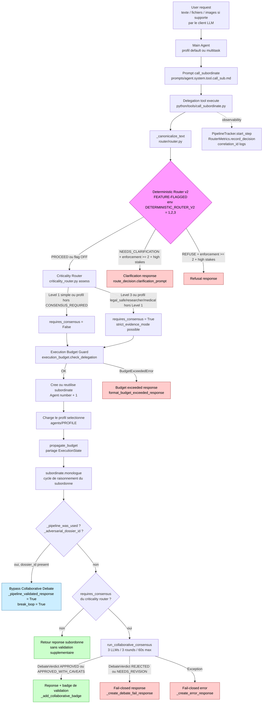

<!-- markdownlint-disable MD060 MD032 MD029 MD014 MD013 MD040 MD036 MD034 -->

# Evidence — Architecture verifiee de la delegation multi-agents

Document technique de reference pour comprehension, audit et onboarding. Toutes les affirmations citent un fichier et, si applicable, une ligne. Ce document ne contient aucune extrapolation, aucune promesse produit, aucune affirmation marketing.

- Branche analysee : `diag-grow/transmission-evidence`
- HEAD analyse : `641b2c44`
- Date d'audit du code : 18 mai 2026
- Outils utilises : lecture directe des fichiers source listes dans la section "1. Resume factuel".

---

## 1. Resume factuel

Le mecanisme de delegation est implemente principalement dans `python/tools/call_subordinate.py` (classe `Delegation`). Il enchaine trois couches de controle (router determinste optionnel, criticality router, budget guard), instancie un agent subordonne avec un profil specialise, execute son `monologue()`, puis valide eventuellement la reponse via le consensus collaboratif `python/helpers/collaborative_consensus.py`. Un pipeline adversarial parallele peut court-circuiter la validation legacy si l'agent subordonne a deja signale `_adversarial_dossier_id`. Tous les agents d'une chaine de delegation partagent un meme `ExecutionState` (anti-cascade).

Fichiers verifies pour ce document :

| Fichier | Role |
|---|---|
| `agents/` (12 sous-dossiers dont `_example`) | Definitions des profils agents |
| `agent.py` | Classe `Agent`, `AgentContext`, `AgentConfig`, hierarchie superieur/subordonne |
| `prompts/agent.system.tool.call_sub.md` | Instructions LLM pour appeler `call_subordinate` |
| `python/tools/call_subordinate.py` | Implementation de la delegation |
| `python/helpers/router/__init__.py` | Feature flags `DETERMINISTIC_ROUTER_V2`, `DETERMINISTIC_ROUTER` |
| `python/helpers/router/routing_contract.py` | Enums `RouteVerdict`, `IntentName`, dataclass `RouteDecision` |
| `python/helpers/router/router.py` | Fonction `decide_route`, detection injection |
| `python/helpers/router/policy.py` | `INJECTION_PATTERNS`, `INTENT_POLICIES`, `BOARD_LEVEL_KEYWORDS` |
| `python/helpers/criticality_router.py` | `CriticalityRouter`, `CONSENSUS_REQUIRED_PROFILES`, `LEVEL1_SIMPLE_PATTERNS`, `LEVEL3_CRITICAL_PATTERNS` |
| `python/helpers/execution_budget.py` | `BudgetLimits`, `ExecutionState`, `check_delegation`, `propagate_budget` |
| `python/helpers/collaborative_consensus.py` | `run_collaborative_consensus`, `DebateConfig`, `DebateVerdict` |
| `python/helpers/pipeline_tracker.py` | `PipelineTracker`, `AGENT_ROLE_DESCRIPTIONS` |
| `python/extensions/message_loop_prompts_after/_20_reasoning_pipeline.py` | Unique occurrence du mot "multimodal" dans le code Python |
| `python/extensions/legal_safe_mode/_10_legal_safe_integration.py` | Emetteur du flag `_adversarial_dossier_id` |

---

## 2. Profils agents reellement presents

Source : `ls agents/` (12 entrees, dont `_example` qui est un gabarit).

| Profil | Dossier present | Role apparent d'apres `_context.md` ou equivalent | Niveau de certitude |
|---|---|---|---|
| `_example` | Oui | Gabarit (sous-dossiers `extensions/`, `prompts/`, `tools/`, pas de `_context.md`) | Verifie (squelette) |
| `default` | Oui | "default prompt file templates - should be inherited and overriden by specialized prompt profiles" (`agents/default/_context.md`) | Verifie |
| `developer` | Oui | "agent specialized in complex software development" (`agents/developer/_context.md`) | Verifie |
| `finance` | Oui | "Agent specialise en analyse financiere, comptabilite, et conseil fiscal" (`agents/finance/_context.md`) | Verifie |
| `hacker` | Oui | "agent specialized in cyber security and penetration testing" (`agents/hacker/_context.md`) | Verifie |
| `legal_drafting_guarded` | Oui | "Agent specialise en redaction de projets contractuels securises" (`agents/legal_drafting_guarded/_context.md`) | Verifie |
| `legal_safe` | Oui | "Agent specialise en analyse juridique securisee" (`agents/legal_safe/_context.md`) | Verifie |
| `marketing` | Oui | "Agent specialise en strategie marketing, copywriting et growth" (`agents/marketing/_context.md`) | Verifie |
| `medical` | Oui | "Medical Intelligence Agent — analyses medicales completes, sourcees, et exploitables" (`agents/medical/_context.md`) | Verifie |
| `multitask` | Oui | "Multitask — Executive Agent. Primary orchestrator of the Evidence system" (`agents/multitask/_context.md`) | Verifie |
| `researcher` | Oui | "agent specialized in research, data analysis and reporting" (`agents/researcher/_context.md`) | Verifie |
| `sales` | Oui | "Agent specialise en developpement commercial, CRM et prospection" (`agents/sales/_context.md`) | Verifie |

Total : 11 profils fonctionnels + 1 gabarit (`_example`). Le code (`agents/medical/`, `agents/legal_safe/`) confirme que certains profils embarquent des `extensions/`, `demos/`, `tools/` supplementaires ; ce document ne detaille pas ce niveau.

---

## 3. Multimodal : agent ou capacite de parsing ?

Recherche exhaustive du terme `multimodal` (Grep insensible a la casse, repository entier) : **une seule occurrence Python**.

```120:128:python/extensions/message_loop_prompts_after/_20_reasoning_pipeline.py
            if isinstance(content, str):
                return content
            elif isinstance(content, list):
                # Message multimodal - extraire le texte
                for part in content:
                    if isinstance(part, dict) and part.get("type") == "text":
                        return part.get("text", "")
                    elif isinstance(part, str):
                        return part
```

Conclusion factuelle :

- **Il n'existe aucun profil agent nomme `multimodal` dans `agents/`.**
- Le terme `multimodal` apparait exclusivement comme **commentaire de code** decrivant le format de message LLM lorsque `content` est une liste de parties (typique des APIs OpenAI / Anthropic supportant texte + image).
- Il s'agit d'une **capacite de parsing** de la couche `_extract_user_query`, pas d'un agent distinct.

Toute affirmation qui presenterait un "agent multimodal" comme entite distincte serait non sourcee.

---

## 4. Chaine de delegation verifiee

Le prompt qui instruit le LLM (`prompts/agent.system.tool.call_sub.md`, lignes 1-34) :

```1:13:prompts/agent.system.tool.call_sub.md
### call_subordinate

you can use subordinates for subtasks
subordinates can be scientist coder engineer etc
message field: always describe role, task details goal overview for new subordinate
delegate specific subtasks not entire task
reset arg usage:
  "true": spawn new subordinate
  "false": continue existing subordinate
if superior, orchestrate
respond to existing subordinates using call_subordinate tool with reset false
profile arg usage: select from available profiles for specialized subordinates, leave empty for default
```

Parametres reels acceptes par l'outil (signature dans `python/tools/call_subordinate.py` ligne 92) :

```92:92:python/tools/call_subordinate.py
    async def execute(self, message="", reset="", **kwargs):
```

Le `profile` est lu via `kwargs.get("profile", "")` (ligne 107). La liste des profils disponibles est injectee dynamiquement dans le prompt via `{{agent_profiles}}` (ligne 34).

Sequence verifiee d'execution dans `execute()` :

| Etape | Code (fichier:lignes) | Comportement reel |
|---|---|---|
| 1. Generer correlation ID | `call_subordinate.py:104` | `correlation_id = str(uuid.uuid4())` |
| 2. Lire profile demande | `call_subordinate.py:107` | `agent_profile = kwargs.get("profile", "")` |
| 3. Canonicaliser le message | `call_subordinate.py:123` | `_canonicalize_text(message)` si module router importable |
| 4. Appeler deterministic router | `call_subordinate.py:125-247` | Seulement si `DETERMINISTIC_ROUTER_V2` ou `DETERMINISTIC_ROUTER` actif |
| 5. Decider blocage (enforcement >= 2) | `call_subordinate.py:162-200` | Bloque uniquement si `is_high_stakes` ET verdict `NEEDS_CLARIFICATION`/`REFUSE` |
| 6. Appeler criticality router | `call_subordinate.py:255-259` | `router.assess(query=message, agent_profile=agent_profile)` |
| 7. Verifier budget de delegation | `call_subordinate.py:271-284` | `check_delegation()` -> `BudgetExceededError` |
| 8. Creer ou reutiliser subordonne | `call_subordinate.py:286-315` | `Agent(self.agent.number + 1, config, self.agent.context)` |
| 9. Charger profil | `call_subordinate.py:293-294` | `config.profile = agent_profile` |
| 10. Propager budget | `call_subordinate.py:308, 320` | `propagate_budget(self.agent, sub)` |
| 11. Ajouter message a l'historique | `call_subordinate.py:321` | `subordinate.hist_add_user_message(...)` |
| 12. Tracker l'etape | `call_subordinate.py:324-332` | `PipelineTracker.start_step(...)`, `emit_delegation_progress(...)` |
| 13. Lancer monologue subordonne | `call_subordinate.py:338` | `result = await subordinate.monologue()` |
| 14. Detecter pipeline shortcut | `call_subordinate.py:357-358` | `pipeline_was_used`, `adversarial_dossier_id` |
| 15. Si adversarial deja valide, bypass | `call_subordinate.py:367-381` | Skip Collaborative Debate, retour direct |
| 16. Sinon, si criticality requiert | `call_subordinate.py:387-393` | `_validate_with_consensus(...)` |
| 17. Retour final | `call_subordinate.py:421` | `Response(message=result, break_loop=should_break, additional=additional)` |

Le **contexte agent** (`self.agent.context`, ligne 303) est partage entre l'agent principal et le subordonne. La hierarchie est marquee bidirectionnellement (`Agent.DATA_NAME_SUPERIOR`, `Agent.DATA_NAME_SUBORDINATE`, definis dans `agent.py:368-369`).

---

## 5. Schema Mermaid



Legende :
- Cadre rose `Deterministic Router v2` : depend d'un feature flag environnement, **inactif par defaut**.
- Cadre rouge : reponses fail-closed ou refus.
- Cadre vert : reponses normales ou validees.
- Cadre bleu : bypass du consensus legacy via pipeline adversarial deja valide.

---

## 6. Routeur deterministe v2

### 6.1 Existence et activation

Le module `python/helpers/router/` existe (5 fichiers Python + README, taille totale ~115 KB).

Activation **uniquement via variable d'environnement** :

```142:177:python/helpers/router/__init__.py
def is_deterministic_router_enabled() -> bool:
    """
    Check if deterministic router is enabled via feature flag.
    
    Levels:
        0 = OFF (default)
        1 = Audit-only (log + metrics, no behavioral change)
        2 = Enforcement soft (block high-stakes if router says REFUSE/CLARIFY)
        3 = Enforcement hard (replace LLM routing entirely)
    
    Environment variables:
    - DETERMINISTIC_ROUTER_V2=1|2|3
    - DETERMINISTIC_ROUTER=1 (legacy, maps to level 1)
    """
    level = os.environ.get("DETERMINISTIC_ROUTER_V2", "0")
    return level in ("1", "2", "3") or os.environ.get("DETERMINISTIC_ROUTER", "0") == "1"


def get_enforcement_level() -> int:
    try:
        level = int(os.environ.get("DETERMINISTIC_ROUTER_V2", "0"))
        return min(max(level, 0), 3)
    except ValueError:
        return 0
```

**Statut par defaut : OFF.** Tous les developpements logiques cites dans `call_subordinate.py:125-247` ne s'executent que si la variable est positionnee a 1, 2 ou 3 a l'execution du processus.

### 6.2 Classes de decision

Source : `python/helpers/router/routing_contract.py:19-24`.

```19:24:python/helpers/router/routing_contract.py
class RouteVerdict(str, Enum):
    """Final routing decision."""
    PROCEED = "proceed"                     # Route to intents
    NEEDS_CLARIFICATION = "needs_clarification"  # Ask user for more info
    NO_ROUTE = "no_route"                   # Cannot determine route
    REFUSE = "refuse"                       # Critical agent unavailable, refuse to proceed
```

**Important** : le code utilise `PROCEED`, pas `ALLOW`. Les documentations qui parlent d'un verdict `ALLOW` sont une approximation. Les quatre valeurs reelles sont `PROCEED`, `NEEDS_CLARIFICATION`, `NO_ROUTE`, `REFUSE`.

### 6.3 Intents reconnus

```27:37:python/helpers/router/routing_contract.py
class IntentName(str, Enum):
    """Available agent intents (profiles)."""
    FINANCE = "finance"
    SALES = "sales"
    LEGAL_SAFE = "legal_safe"
    MEDICAL = "medical"
    DEVELOPER = "developer"
    RESEARCHER = "researcher"
    MARKETING = "marketing"
    MULTITASK = "multitask"  # Fallback/general
    CONTRADICTOR = "contradictor"  # Special: challenge assumptions
```

9 intents. Note : `CONTRADICTOR` n'existe pas en tant que **dossier de profil** sous `agents/`, ce qui suggere une asymetrie entre les intents reconnus et les profils instanciables. A confirmer par test runtime.

### 6.4 Detection d'injection

Le code reference `INJECTION_PATTERNS` (charge depuis `python/helpers/router/policy.py`) et l'utilise dans `_check_injection` :

```477:480:python/helpers/router/router.py
    for pattern in INJECTION_PATTERNS:
        match = re.search(pattern, text, re.IGNORECASE)
        if match:
```

L'injection est traitee **uniquement** comme un signal qui produit `injection_blocked=True` et un verdict ajuste. Le router :
- en mode niveau 1 (audit-only) : log uniquement, **ne bloque pas** l'execution ;
- en mode niveau 2 (enforcement soft) : bloque seulement si **toutes les conditions** sont reunies : injection detectee ET high-stakes (board-level OU critical intent OU strategic signal), cf. `call_subordinate.py:179-200`.

Formulation prudente : le code montre que le router **detecte des patterns d'injection** definis dans `INJECTION_PATTERNS`. Il n'est pas demontre par les tests que cette detection couvre exhaustivement toutes les classes d'injection prompt.

---

## 7. Criticality Router et declenchement du consensus

### 7.1 Profils forcant le consensus

```62:68:python/helpers/criticality_router.py
CONSENSUS_REQUIRED_PROFILES: Set[str] = {
    "legal_safe",
    "researcher",
    "medical",  # Agent médical spécialisé - PRISM obligatoire
    # Ajouter ici les futurs profils critiques
    # "scientific",
}
```

### 7.2 Profils pouvant bypasser (dev/test uniquement)

```238:241:python/helpers/criticality_router.py
DEBUG_BYPASS_PROFILES: Set[str] = {
    "developer",
    "hacker",  # Pour tests uniquement
}
```

Le bypass est en outre conditionne a `not self._is_production` (verifie ligne 562-565 et 642-645). En production, le bypass n'est jamais accorde meme pour ces profils.

### 7.3 Niveaux de criticite

| Niveau | Detection | Effet |
|---|---|---|
| Level 1 (simple) | Match `LEVEL1_SIMPLE_PATTERNS` (definitions, traductions, meteo, calcul, etc.) | `requires_consensus = False`, decision_type = `INFORMATIONAL` (`criticality_router.py:552-557`) |
| Level 2 (par defaut) | Ni Level 1, ni Level 3 | Consensus declenche **uniquement** si profil dans `CONSENSUS_REQUIRED_PROFILES` |
| Level 3 (critique) | Match `LEVEL3_CRITICAL_PATTERNS` (cas reels / situations personnelles, etc.) | `requires_consensus = True` independamment du profil (`criticality_router.py:618-622`) |

### 7.4 Table de declenchement

| Condition (apres `assess()`) | Consensus requis ? | Source code | Commentaire |
|---|:---:|---|---|
| Profil `legal_safe` ET requete Level 1 | **Non** | `criticality_router.py:552-557` | Bypass pour definitions / traductions / meteo. Note explicite dans le code : "Une definition reste une definition" (`criticality_router.py:77-79`). |
| Profil `legal_safe` ET requete Level 2 ou 3 | **Oui** | `criticality_router.py:620-622` + presence dans `CONSENSUS_REQUIRED_PROFILES` | Verifie. |
| Profil `researcher` ET Level 2/3 | **Oui** | Idem | Verifie. |
| Profil `medical` ET Level 2/3 | **Oui** | Idem | Verifie. |
| Profil `developer` ou `hacker` en non-prod | **Non** (bypass possible) | `criticality_router.py:561-565` | Conditionne a `_is_production == False`. Comportement en production : pas de bypass. |
| Profil `finance` ou `marketing` ou `sales` sans Level 3 | **Non** | Logique par defaut | Le code ne place pas ces profils dans `CONSENSUS_REQUIRED_PROFILES`. |
| Pattern Level 3 detecte sur n'importe quel profil | **Oui** | `criticality_router.py:618-622` | `is_level3 = True` force `requires_consensus = True`. |

### 7.5 Mention "PRISM"

Le terme "PRISM" apparait dans les **docstrings et commentaires** de :
- `python/helpers/criticality_router.py:5` ("decider si consensus PRISM est requis")
- `python/helpers/consensus_contracts.py:3` ("PRISM CONSENSUS CONTRACTS")
- `python/tools/call_subordinate.py:365` (commentaire : "If adversarial pipeline was used, it already includes PRISM consensus")

**Aucune classe ou fonction publique nommee `PRISM` n'est definie dans le code**. PRISM est utilise comme **nom collectif** d'un ensemble de modules (consensus_contracts, consensus_manager, consensus_arbiter, collaborative_consensus, adversarial_consensus_integration). Toute documentation qui assimile PRISM a une **seule** implementation precise (par exemple le `Collaborative Debate` 3 rounds) introduit une ambiguite. Voir section 11 pour le couple "consensus legacy / pipeline adversarial".

---

## 8. Budget Guard et anti-cascade

### 8.1 Limites configurables par environnement

```80:88:python/helpers/execution_budget.py
    max_iterations: int = field(default_factory=lambda: _env_int("EVIDENCE_MAX_ITERATIONS", 25))
    max_depth: int = field(default_factory=lambda: _env_int("EVIDENCE_MAX_DEPTH", 5))
    max_delegations: int = field(default_factory=lambda: _env_int("EVIDENCE_MAX_DELEGATIONS", 8))
    max_tool_calls: int = field(default_factory=lambda: _env_int("EVIDENCE_MAX_TOOL_CALLS", 50))
    max_llm_calls: int = field(default_factory=lambda: _env_int("EVIDENCE_MAX_LLM_CALLS", 30))
    max_consensus_rounds: int = field(default_factory=lambda: _env_int("EVIDENCE_MAX_CONSENSUS_ROUNDS", 3))
    deadline_seconds: float = field(default_factory=lambda: _env_float("EVIDENCE_DEADLINE_SECONDS", 900.0))
    allow_self_delegation: bool = False
    max_delegation_revisits: int = field(default_factory=lambda: _env_int("EVIDENCE_MAX_DELEGATION_REVISITS", 1))
```

Defaults : 25 iterations max, profondeur 5, 8 delegations totales, 50 tool calls, 30 LLM calls, 3 rounds de consensus, deadline 900 s (15 min), revisits maxi 1.

### 8.2 Verifications appliquees a la delegation

`check_delegation()` (`execution_budget.py:169-208`) effectue **trois** controles :

1. **Self-delegation** : si `source_agent == target_profile` ET `allow_self_delegation = False`, leve `StopReason.SELF_DELEGATION_BLOCKED`.
2. **Max delegations** : si `state.current_delegations > limits.max_delegations`, leve `StopReason.MAX_DELEGATIONS_REACHED`.
3. **Cycle detection** : compte les visites par profil ; si > `max_delegation_revisits + 1`, leve `StopReason.DELEGATION_CYCLE_DETECTED`.

### 8.3 Propagation du budget

```337:345:python/helpers/execution_budget.py
def propagate_budget(source_agent: Any, target_agent: Any) -> None:
    """
    Propagate the SAME execution state and limits from a superior to a subordinate.
    This ensures the budget is shared across the entire delegation chain.
    """
    state = get_or_create_state(source_agent)
    limits = get_limits(source_agent)
    target_agent.set_data(_BUDGET_STATE_KEY, state)
    target_agent.set_data(_BUDGET_LIMITS_KEY, limits)
```

Le **meme `ExecutionState`** est partage par reference entre l'agent principal et tous ses subordonnes. Verification cote `call_subordinate.py:308` (a la creation) et `call_subordinate.py:320` (a la reutilisation), garantie d'application a chaque delegation.

### 8.4 Message retourne si budget depasse

`format_budget_exceeded_response()` (`execution_budget.py:348-364`) produit une reponse markdown structuree avec `reason`, `detail`, compteurs courants et `delegation_chain`. Le retour cote outil (`call_subordinate.py:278-284`) :

```278:284:python/tools/call_subordinate.py
            return Response(
                message=format_budget_exceeded_response(e),
                break_loop=True,
            )
```

`break_loop=True` arrete la boucle de l'agent.

---

## 9. Execution du subordonne

### 9.1 Creation du subordinate

```286:305:python/tools/call_subordinate.py
        if (
            self.agent.get_data(Agent.DATA_NAME_SUBORDINATE) is None
            or str(reset).lower().strip() == "true"
        ):
            config = initialize_agent()

            if agent_profile:
                config.profile = agent_profile
            
            if assessment.requires_consensus:
                config.require_consensus = True
                config.strict_evidence_mode = assessment.strict_evidence_mode
                config.decision_type = assessment.decision_type.value
                config.correlation_id = correlation_id

            sub = Agent(self.agent.number + 1, config, self.agent.context)
            sub.set_data(Agent.DATA_NAME_SUPERIOR, self.agent)
            self.agent.set_data(Agent.DATA_NAME_SUBORDINATE, sub)
```

- Le subordonne herite du **meme `context`** (logs, conversation) que son superieur.
- `Agent.number` incremente de 1 (profondeur).
- Le profil est applique a `config.profile`.
- Le subordonne tient la reference inverse via `DATA_NAME_SUPERIOR` (cf. `agent.py:293`).

### 9.2 Execution

```338:345:python/tools/call_subordinate.py
            result = await subordinate.monologue()
        except Exception as _sub_exc:
            _sub_success = False
            _sub_error = str(_sub_exc)
            _tracker.complete_step(agent_profile or "default", success=False, error=_sub_error)
            raise
        else:
            _tracker.complete_step(agent_profile or "default", success=True)
```

Le `monologue()` du subordonne lance son propre cycle de raisonnement (think -> tool -> observe). Il peut a son tour invoquer `call_subordinate` sous reserve du budget.

### 9.3 Observabilite

Les composants suivants sont systematiquement appeles :

| Composant | Code |
|---|---|
| Correlation ID | `call_subordinate.py:104` (uuid4) |
| `PipelineTracker.start_step` | `call_subordinate.py:328` |
| `PipelineTracker.complete_step` | `call_subordinate.py:342, 345` |
| `emit_delegation_progress` | `call_subordinate.py:332` |
| Logger `delegation_tool` | `call_subordinate.py:84` |
| `RouterMetrics.record_decision` | `call_subordinate.py:203-212` (uniquement si router actif) |

---

## 10. Consensus collaboratif et fail-closed

### 10.1 Nombre de LLMs et rounds

Source : `python/helpers/collaborative_consensus.py`.

- **Nombre de LLMs** : 3, charges via `_load_arbiters_from_ui()` (lignes 388-437). Les arbitres sont configurables via l'UI (`consensus_arbiter_1`, `consensus_arbiter_2`, `consensus_arbiter_3`). Fallback :

  ```427:432:python/helpers/collaborative_consensus.py
          if not arbiters:
              arbiters = [
                  ("openrouter", "openai/gpt-5.2"),
                  ("openrouter", "google/gemini-3-pro-preview"),
  ```
  
  (le 3eme arbitre par defaut existe dans le code en aval des lignes 432 ; les valeurs exactes peuvent etre modifiees par configuration).

- **Nombre de rounds** : 3 (`_run_round1`, `_run_round2`, `_run_round3`), code visible dans `collaborative_consensus.py:468-820`.

- **Timeouts** :

  ```62:67:python/helpers/collaborative_consensus.py
      round1_timeout_ms: int = 15000   # 15s pour analyse initiale
      round2_timeout_ms: int = 20000   # 20s pour débat
      round3_timeout_ms: int = 15000   # 15s pour synthèse
      total_timeout_ms: int = 60000    # 60s max total
  ```

  Le delai total maximum prevu est **60 s**, et non "30-40 s" comme indique dans le header de `call_subordinate.py:13`. Le code montre 60 s. La mention "30-40 s" est un commentaire interne ; le contrat reel est 60 s max.

### 10.2 Verdicts

```88:93:python/helpers/collaborative_consensus.py
class DebateVerdict(str, Enum):
    """Verdict final du débat."""
    APPROVED = "approved"           # Réponse fiable
    APPROVED_WITH_CAVEATS = "approved_with_caveats"  # OK avec réserves
    NEEDS_REVISION = "needs_revision"  # Doit être modifiée
    REJECTED = "rejected"           # Contient des hallucinations
```

### 10.3 Approbation et badge

`_add_collaborative_badge()` (`call_subordinate.py:497-527`) ajoute en queue de reponse :
- `Debat Collaboratif: <verdict>`
- Confiance, claims analyses, claims verifies, duree.
- Points de consensus (jusqu'a 3).
- Reserves si `APPROVED_WITH_CAVEATS`.

### 10.4 Fail-closed

Trois reponses fail-closed sont definies :

| Cas | Fonction | Code |
|---|---|---|
| Verdict `NEEDS_REVISION` ou `REJECTED` | `_create_debate_fail_response` | `call_subordinate.py:564-620` |
| Exception pendant le consensus | `_create_error_response` | `call_subordinate.py:622-648` |
| Ancien verdict legacy (consensus_manager) | `_create_fail_closed_response` | `call_subordinate.py:529-562` |

Toutes ces fonctions retournent un texte markdown structure qui **remplace** la reponse du subordonne. La reponse originale du subordonne n'est pas transmise.

---

## 11. Pipeline adversarial et bypass du consensus legacy

### 11.1 Mecanisme observe

Le bypass est declenche par la presence simultanee de deux flags sur le subordonne :

```357:381:python/tools/call_subordinate.py
        pipeline_was_used = subordinate.get_data("_pipeline_was_used")
        adversarial_dossier_id = subordinate.get_data("_adversarial_dossier_id")
        
        if pipeline_was_used:
            PrintStyle(font_color="cyan", bold=True).print(
                f"🔒 SUBORDINATE: Pipeline response - signaling main agent to break loop (result_len={len(result) if result else 0})"
            )
            
            if adversarial_dossier_id:
                PrintStyle(font_color="green", bold=True).print(
                    f"✅ ADVERSARIAL PIPELINE detected (dossier={adversarial_dossier_id[:8]}) - "
                    f"Skipping legacy Collaborative Debate (consensus already done in pipeline)"
                )
                self.agent.set_data("_pipeline_validated_response", True)
                self.agent.set_data("_consensus_result", {
                    "approved": True,
                    "source": "adversarial_pipeline",
                    "dossier_id": adversarial_dossier_id,
                    "correlation_id": correlation_id,
                })
                
                return Response(message=result, break_loop=True, additional=None)
```

### 11.2 Emetteur du flag

Le flag `_adversarial_dossier_id` est **positionne** dans `python/extensions/legal_safe_mode/_10_legal_safe_integration.py:749` :

```746:750:python/extensions/legal_safe_mode/_10_legal_safe_integration.py
                agent.set_data("_pipeline_final_response", full_rendered)
                agent.set_data("_skip_llm", True)
                agent.set_data("_pipeline_was_used", True)
                agent.set_data("_adversarial_dossier_id", dossier.id)
```

C'est l'unique endroit verifie ou ce flag est ecrit. L'integration "legal safe mode" est donc la **seule** voie connue declenchant le bypass adversarial dans cette branche.

### 11.3 Limite probatoire

Le code de `call_subordinate.py` **fait confiance** au flag `_adversarial_dossier_id`. Il n'execute pas de verification independante que le `dossier.id` correspond a un consensus reellement reussi. La robustesse de ce bypass repose donc sur :

- la confiance dans le code qui positionne le flag (`legal_safe_mode/_10_legal_safe_integration.py`) ;
- la confiance dans la non-falsifiabilite du flag par des chemins parallels (a tester).

Une formulation prudente : le bypass est **declaratif et base sur convention interne**, pas sur une preuve cryptographique ou un controle d'integrite. Voir section 13.

### 11.4 Cas `_pipeline_was_used` sans `_adversarial_dossier_id`

Si `pipeline_was_used` est `True` mais `adversarial_dossier_id` absent, le code ne bypasse PAS le consensus legacy a ce stade (le bloc `if adversarial_dossier_id:` ligne 367 retourne immediatement). En revanche, plus loin, `should_break = pipeline_was_used is True` (`call_subordinate.py:404`) signale a l'agent principal de terminer.

---

## 12. Claims verifies / non verifies

| # | Claim | Statut | Preuve | Niveau de confiance | Reformulation sure |
|---|---|---|---|---|---|
| 1 | Il n'existe pas d'agent nomme `multimodal`. | VERIFIE | `ls agents/` : aucun dossier `multimodal`. | Eleve | Aucune reformulation necessaire. |
| 2 | Le terme `multimodal` apparait dans le pipeline de raisonnement. | VERIFIE | Une seule occurrence Python : `_20_reasoning_pipeline.py:123`, commentaire de parsing. | Eleve | "Le terme `multimodal` apparait comme commentaire de parsing dans `_20_reasoning_pipeline.py:123`." |
| 3 | La delegation passe par `python/tools/call_subordinate.py`. | VERIFIE | Classe `Delegation` ligne 87, methode `execute` ligne 92. | Eleve | Aucune. |
| 4 | Le router deterministe bloque les requetes ambigues high-stakes. | DEPEND D'UN FEATURE FLAG | Blocage uniquement si `DETERMINISTIC_ROUTER_V2 >= 2` ET high-stakes (`call_subordinate.py:162-200`). Defaut : OFF. | Modere | "Le router determinste peut bloquer des requetes ambigues high-stakes UNIQUEMENT si la variable `DETERMINISTIC_ROUTER_V2` est positionnee a 2 ou 3 dans l'environnement d'execution." |
| 5 | Les profils `legal_safe`, `researcher`, `medical` forcent le consensus. | PARTIELLEMENT VERIFIE | `CONSENSUS_REQUIRED_PROFILES` les liste (`criticality_router.py:62-68`). Exception : Level 1 simple bypasse (`criticality_router.py:552-557`). | Eleve | "Les profils `legal_safe`, `researcher`, `medical` forcent le consensus pour toute requete qui n'est pas detectee comme Level 1 simple (definition, traduction, calcul trivial, etc.)." |
| 6 | Les requetes Level 1 bypassent le consensus. | VERIFIE | `criticality_router.py:552-557`. | Eleve | Aucune. |
| 7 | Le budget guard empeche les cascades infinies. | VERIFIE | `check_delegation()` leve sur 3 conditions (`execution_budget.py:169-208`). Defaults : 8 delegations, profondeur 5, revisits 1. | Eleve | "Le budget guard limite a 8 delegations totales par defaut, profondeur 5, revisits 1 par profil. Configurable par variables d'environnement `EVIDENCE_MAX_*`." |
| 8 | Le consensus est un debat 3-rounds entre 3 LLMs. | VERIFIE | `collaborative_consensus.py:1-37, 388-437, 468-820`. | Eleve | "`run_collaborative_consensus` execute un debat structure en 3 rounds (analyse initiale, debat, synthese) entre 3 LLMs configurables (defaults via OpenRouter)." |
| 9 | Le pipeline adversarial permet de bypasser le consensus legacy. | PARTIELLEMENT VERIFIE | Bypass declenche par flag `_adversarial_dossier_id` (`call_subordinate.py:367-381`). Flag positionne dans `legal_safe_mode/_10_legal_safe_integration.py:749`. | Modere | "Le bypass du consensus legacy est conditionne a la presence simultanee de `_pipeline_was_used` et `_adversarial_dossier_id` ; aucun controle d'integrite n'est effectue sur la validite du dossier." |
| 10 | Le rejet consensus empeche la reponse du subordinate de remonter. | VERIFIE | `_create_debate_fail_response` substitue la reponse originale (`call_subordinate.py:564-620`). | Eleve | Aucune. |
| 11 | Le router deterministe reconnait 9 intents. | VERIFIE | `IntentName` enum, `routing_contract.py:27-37`. | Eleve | Aucune. |
| 12 | Le verdict de progression du router est `ALLOW`. | NON VERIFIE | Le code utilise `PROCEED`, pas `ALLOW` (`routing_contract.py:19-24`). | Eleve (correction necessaire) | "Les quatre verdicts du router sont `PROCEED`, `NEEDS_CLARIFICATION`, `NO_ROUTE`, `REFUSE`." |
| 13 | PRISM est l'implementation 3-rounds du consensus. | NON VERIFIE | Aucune classe `PRISM` definie. "PRISM" est un nom collectif dans les docstrings (criticality_router, consensus_contracts, call_subordinate). | Modere | "PRISM est un nom conceptuel utilise dans les commentaires du repository pour designer collectivement l'ecosysteme consensus (`consensus_contracts.py`, `consensus_manager.py`, `consensus_arbiter.py`, `collaborative_consensus.py`, `adversarial_consensus_integration.py`)." |
| 14 | Le budget est partage entre superieur et subordonne. | VERIFIE | `propagate_budget()` (`execution_budget.py:337-345`) appele systematiquement (`call_subordinate.py:308, 320`). | Eleve | Aucune. |
| 15 | La duree maximale du debat collaboratif est de 30-40 s. | NON VERIFIE | Le code declare `total_timeout_ms: int = 60000` (`collaborative_consensus.py:66`). Le commentaire "30-40 secondes" dans `call_subordinate.py:13` ne correspond pas au contrat reel. | Eleve (correction necessaire) | "Le debat collaboratif a une duree cible totale de 60 s maximum (15 + 20 + 15 + overhead)." |
| 16 | Les arbitres du consensus sont charges depuis l'UI. | VERIFIE | `_load_arbiters_from_ui()` (`collaborative_consensus.py:388-437`) avec fallback par defaut. | Eleve | "Les 3 arbitres sont charges depuis la configuration UI (`consensus_arbiter_1/2/3`) avec fallback vers des modeles OpenRouter par defaut." |
| 17 | Le profil `multitask` est l'orchestrateur primaire. | PARTIELLEMENT VERIFIE | `agents/multitask/_context.md` dit "Primary orchestrator of the Evidence system". Pas de hard-binding cote `agent.py`. | Modere | "Le `_context.md` du profil `multitask` indique qu'il est l'orchestrateur principal du systeme Evidence, mais le code de delegation n'impose pas explicitement ce role." |
| 18 | L'intent `contradictor` correspond a un profil agent instanciable. | VERIFIE | Profil `agents/contradictor/` cree (`_context.md`, `prompts/agent.system.main.role.md`, `prompts/agent.system.main.communication.md`). Module `python/helpers/contradictor/` cree (schema strict, invoker, orchestration, profile_mapping). Consomme `RouteDecision.requires_contradictor` dans `python/tools/call_subordinate.py` apres consensus. Mapping applicatif explicite `"contradictor" -> "contradictor"` (jamais `default`). Tests : `tests/test_contradictor_agent.py` (19 tests verts). | Eleve | "Le Contradictor Agent est desormais actif pour les decisions board-level multi-intent et les documents strategiques necessitant une revue contradictoire. Son invocation est conditionnee par `requires_contradictor=True`, validee par schema strict, tracee dans les logs d'audit, et peut declencher une revue humaine en cas de risque high/critical, timeout ou echec de validation." |

### Synthese

- VERIFIE : 12
- PARTIELLEMENT VERIFIE : 3
- DEPEND D'UN FEATURE FLAG : 1
- NON VERIFIE (formulation a corriger) : 2
- Total : 18

> Note (cloture) : la verification 18 (profil `contradictor`) etait NON VERIFIE
> au moment de l'audit initial. Elle est passee a VERIFIE apres
> l'implementation du profil `agents/contradictor/`, du module
> `python/helpers/contradictor/` (schema, invoker, orchestration,
> profile_mapping), de la consommation reelle du flag dans
> `python/tools/call_subordinate.py`, et de la suite de tests
> `tests/test_contradictor_agent.py` (19 tests verts). Voir
> `docs/audits/CONTRADICTOR_AGENT_HOSTILE_AUDIT.md` pour le rapport hostile
> et `docs/reports/CONTRADICTOR_AGENT_IMPLEMENTATION_REPORT.md` pour le
> rapport final.

---

## 13. Points a verifier avant usage externe

Cette section liste les ambiguites, dependances et risques **reellement observes dans le code**. Aucun point n'est extrapole.

### 13.1 Feature flags dont l'etat d'activation en production n'est pas confirme dans la presente branche

- `DETERMINISTIC_ROUTER_V2` (`router/__init__.py:153,159`) : aucun fichier `.env` ou `deploy/` audite dans cette mission n'indique la valeur retenue en production. **A confirmer** par lecture des fichiers de configuration de deploiement.
- `DETERMINISTIC_ROUTER` (legacy, idem).
- `EVIDENCE_MAX_*` (`execution_budget.py:80-88`) : 8 variables d'environnement controlent le budget. Defaults conservateurs documentes ; valeurs reelles en production non auditees ici.
- `EVIDENCE_DEADLINE_SECONDS` (defaut 900 s).
- `reasoning_pipeline_enabled` (`_20_reasoning_pipeline.py:107-114`) : flag de settings UI, non audite ici.

### 13.2 Confusion possible entre PRISM, consensus legacy et pipeline adversarial

- "PRISM" n'est pas une implementation unique. Le code distingue :
  1. `python/helpers/collaborative_consensus.py` (le **debat 3-rounds**, qualifie "legacy" par commentaire dans `call_subordinate.py:384`).
  2. `python/helpers/adversarial_consensus_integration.py` (le **pipeline adversarial**, declenche par `legal_safe_mode`).
  3. `python/helpers/consensus_manager.py`, `consensus_arbiter.py`, `consensus_contracts.py` (modules de support).
- Toute communication externe doit distinguer le **mecanisme execute** (collaborative_consensus 3 rounds) du **terme generique** PRISM.

### 13.3 Robustesse declarative du bypass adversarial

- Le bypass dans `call_subordinate.py:367-381` repose uniquement sur la presence d'un `_adversarial_dossier_id` non vide. **Aucun controle d'integrite** (signature, verification du dossier en base, etc.) n'est observe dans la fonction `execute`.
- Risque potentiel : tout code qui positionnerait ce flag par erreur ou intentionnellement court-circuiterait le consensus. La surface d'emission a ete localisee a **un seul fichier** dans cette branche (`legal_safe_mode/_10_legal_safe_integration.py`), ce qui limite le risque, mais ce point doit etre verifie regulierement.

### 13.4 Asymetrie router-intents / profils agents — RESOLU

- L'enum `IntentName.CONTRADICTOR` (`routing_contract.py:37`) **possede desormais** un dossier `agents/contradictor/` (profil instanciable avec `_context.md`, `prompts/agent.system.main.role.md`, `prompts/agent.system.main.communication.md`) et un module applicatif `python/helpers/contradictor/`. Le mapping applicatif `intent_to_profile` dans `python/tools/call_subordinate.py` mappe explicitement `"contradictor" -> "contradictor"` (jamais `default`). La consommation reelle du flag `requires_contradictor` est testee par `tests/test_contradictor_agent.py` (19 tests verts).

### 13.5 Tests runtime non confirmes dans la presente mission

- L'effet reel du router en enforcement soft (`DETERMINISTIC_ROUTER_V2=2`) sur des cas concrets n'a pas ete observe runtime ici.
- L'execution complete d'un debat collaboratif (3 rounds, 60 s) n'a pas ete observee dans cette mission. Les tests existent (`tests/test_consensus_entrypoint_delegation.py`, `tests/test_prism_contract.py`, etc.) mais leur execution n'est pas couverte par ce document.
- Le comportement effectif en cas de timeout reseau d'un arbitre LLM n'est documente dans le code que par les `_call_llm_with_timeout` (a auditer separement si necessaire).

### 13.6 Confusion possible entre parsing multimodal et agent multimodal

- Le seul element "multimodal" du code est une **branche de parsing** (`_20_reasoning_pipeline.py:122-128`). Toute documentation interne ou externe doit eviter de presenter un "agent multimodal" comme une entite logicielle existante.

### 13.7 Comportement non documente : `pipeline_was_used` sans `_adversarial_dossier_id`

- Si `pipeline_was_used = True` mais `_adversarial_dossier_id` absent (cf. autres emetteurs dans `legal_safe_mode/_10_legal_safe_integration.py:671, 705, 748, 805, 908, 964, 1005`), le code N'execute PAS le bypass du consensus legacy. Le subordonne peut donc, selon les criteres `requires_consensus`, voir sa reponse soumise au consensus legacy. Comportement coherent mais a documenter explicitement.

### 13.8 Commentaires de code en partie obsoletes

- `call_subordinate.py:13` indique "Duree: ~30-40 secondes pour un debat complet" alors que le code declare `total_timeout_ms = 60000` (60 s). Le commentaire est moins prudent que le contrat reel ; preferer le contrat reel dans toute documentation externe.

---

## 14. Prompt de controle anti-hallucination

Ce prompt peut etre execute par un autre agent (Cursor ou equivalent) pour re-auditer le present document.

---

### Mission Cursor — Audit hostile du schema de delegation Evidence

Tu es un auditeur technique senior independant. Ton objectif est de relire integralement le fichier `docs/architecture/EVIDENCE_DELEGATION_ARCHITECTURE_VERIFIED.md` et de verifier que chaque affirmation est strictement prouvee par le code de la branche `diag-grow/transmission-evidence` (HEAD reference dans le document).

Pipeline d'audit a executer :

1. Lire `docs/architecture/EVIDENCE_DELEGATION_ARCHITECTURE_VERIFIED.md` integralement.
2. Pour chaque affirmation citant un fichier:ligne :
   - ouvrir le fichier source ;
   - verifier que la ligne citee contient bien le code allegue ;
   - si la ligne a bouge depuis l'ecriture, mettre a jour la reference mais ne PAS supprimer l'affirmation si elle reste vraie ailleurs dans le fichier ;
   - si l'affirmation n'est pas prouvee, la marquer `NON VERIFIE` dans la matrice section 12 et ajouter une `Reformulation sure`.
3. Verifier specifiquement :
   - aucun usage du terme "PRISM" comme synonyme automatique de `collaborative_consensus.py` ;
   - aucune presentation d'un "agent multimodal" comme entite existante ;
   - aucune affirmation qu'un mecanisme est actif sans verifier l'etat du feature flag correspondant (`DETERMINISTIC_ROUTER_V2`, `DETERMINISTIC_ROUTER`, `EVIDENCE_MAX_*`, `reasoning_pipeline_enabled`) ;
   - aucune confusion entre les 4 verdicts du router (`PROCEED` / `NEEDS_CLARIFICATION` / `NO_ROUTE` / `REFUSE`) et un eventuel `ALLOW` qui n'existe pas ;
   - aucune confusion entre `collaborative_consensus.py` (debat 3-rounds, legacy) et le pipeline adversarial (`adversarial_consensus_integration.py`).
4. Verifier que le schema Mermaid de la section 5 reproduit fidelement le flux du code et ne mentionne pas de noeud non verifie.
5. Re-executer la matrice de la section 12 :
   - pour chaque claim, recompter VERIFIE / PARTIELLEMENT VERIFIE / DEPEND D'UN FEATURE FLAG / NON VERIFIE / A TESTER ;
   - identifier les claims a retirer ou a reformuler.
6. Verifier la section 13 :
   - chaque "point a verifier" doit etre adossee a une observation reelle dans le code, pas a une supposition ;
   - si un point a verifier est devenu obsolete (corrige depuis), le noter en barre ou en supprimer.
7. Produire un rapport terminal court contenant :
   - nombre de claims relus ;
   - nombre de claims confirmes ;
   - nombre de claims a retirer ;
   - nombre de claims a reformuler ;
   - liste des feature flags dont l'etat de production reste inconnu ;
   - verdict final : "Document defendable en l'etat", "Defendable apres corrections mineures", ou "Defauts substantiels — re-ecriture necessaire".
8. NE PAS pousser de commit. NE PAS modifier le fichier sans validation explicite. Produire un fichier separe `docs/architecture/EVIDENCE_DELEGATION_AUDIT_REPORT_<DATE>.md` listant les corrections proposees.

Contraintes :

- Zero affirmation non sourcee.
- Zero terme marketing.
- Zero emoji.
- Le document final doit etre defendable face a un commissaire aux apports, un CTO hostile, ou un evaluateur Diag & Grow.

Fin de prompt.
