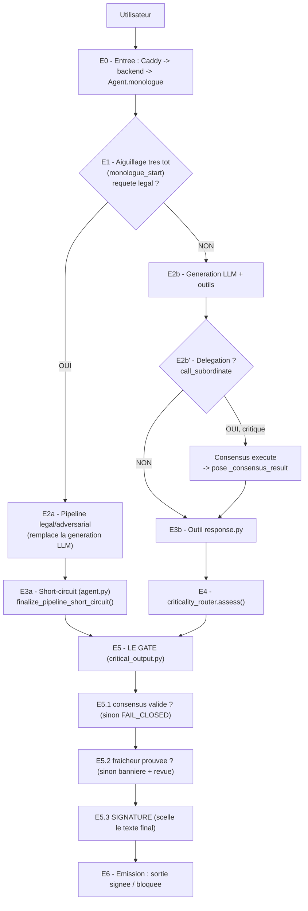

# Pipeline Evidence, pas à pas — pourquoi chaque étape est là où elle est

> **Destinataire** : Aya (ingénierie)
> **But de ce document** : comprendre le flux d'une requête, **étape par étape**, et surtout
> **pourquoi chaque étape est positionnée à cet endroit** (ce qui casserait si on l'inversait).
> **Complément de** `docs/missions/MISSION_AYA_01_cartographie_et_validation_e2e.md` : la mission décrit
> *quoi valider*, ce document explique *pourquoi le pipeline est construit ainsi*. Lis celui-ci **d'abord**.
> **Code de référence** : branche `main` (`ae421822`).

---

## 1. Le principe directeur (à garder en tête tout du long)

Tout le pipeline applique **une seule idée** : *on ne laisse JAMAIS sortir une réponse critique sans
preuve.* « Preuve » = (1) la criticité a été **évaluée**, (2) si c'est critique, un **consensus** l'a
validée, (3) la sortie est **signée** (intégrité + authenticité), (4) en cas de doute → **on bloque**
(fail-closed), pas l'inverse.

Pour tenir ça proprement, l'architecture impose **quatre points uniques** :

| Point unique | Fichier | Rôle |
|---|---|---|
| **1 entonnoir** d'entrée | `agent.py` (`Agent.monologue`) | toute requête passe par la même boucle |
| **1 routeur** de criticité | `python/helpers/criticality_router.py` | seule source de vérité « est-ce critique ? » |
| **1 gate** de sortie | `python/helpers/critical_output.py` | seule porte qui décide + signe |
| **1 doctrine** | `docs/adr/ADR-010-critical-output-doctrine.md` | les règles, écrites une fois |

> **Pourquoi des points UNIQUES ?** Parce qu'une garantie de sécurité ne vaut que si elle ne peut pas
> être contournée. S'il y avait deux endroits qui signent, ou deux logiques de criticité, il suffirait
> d'oublier l'un des deux pour créer une fuite. Un seul chemin = un seul endroit à auditer.

---

## 2. Le flux complet en une image



> Lis ce schéma de haut en bas : c'est **l'ordre réel d'exécution**. Les sections suivantes
> reprennent chaque étape `E*` et expliquent **pourquoi elle est à cette place**.

---

## 3. Le pipeline pas à pas (avec le « pourquoi ici »)

### E0 — Entrée : un seul point d'arrivée
- **Quoi** : HTTPS → Caddy (reverse proxy) → `evidence-backend` → `Agent.monologue` (`agent.py`).
- **Pourquoi ici / pourquoi ainsi** : tout converge vers **une** boucle agent. C'est la condition pour
  que les étapes suivantes (routeur, gate) soient **non contournables** : il n'existe pas de « porte de
  derrière » qui produirait une réponse sans traverser la boucle.

### E1 — Aiguillage **très tôt** : requête legal ou pas ? (`monologue_start`)
- **Quoi** : une extension `monologue_start` détecte si la requête relève du **pipeline legal/adversarial**
  (profil, env, ou auto-détection). Réf : `python/extensions/legal_safe_mode/_10_legal_safe_integration.py`.
- **Pourquoi AUSSI TÔT (avant la génération LLM)** : le pipeline legal **remplace** la génération normale
  (il produit lui-même la réponse via ses sous-pipelines). Décider après aurait deux défauts :
  1. on aurait **généré une réponse LLM pour rien** (gaspillage + risque de mélanger deux sorties) ;
  2. on perdrait le **déterminisme** : le pipeline pose une réponse finale validée, qui ne doit
     surtout pas être ré-écrite par la boucle LLM.
- **Conséquence d'un mauvais placement** : si l'aiguillage était après le LLM, une réponse legal pourrait
  être écrasée par une réponse LLM non validée → fuite de sortie critique.

### E2a / E3a — Chemin **pipeline** (legal détecté)
- **E2a** : le pipeline legal exécute ses phases et **pose le contexte de signature** sur l'agent
  (`_pipeline_final_response`, `_skip_llm`, `_consensus_result`, `_pipeline_requires_consensus`,
  `_output_policy`, `_pipeline_criticality_level`).
- **E3a — short-circuit** : `agent.py` voit `_pipeline_final_response`, **saute le LLM** et appelle le gate.

```415:426:agent.py
                pipeline_final_response = self.get_data("_pipeline_final_response")
                if pipeline_final_response is not None:
                    # ... FINALISATION CRITIQUE CONSOLIDÉE (ADR-010 / P1-1) ...
                    pipeline_requires_consensus = self.get_data("_pipeline_requires_consensus")
                    try:
                        from python.helpers.critical_output import finalize_pipeline_short_circuit
                        _fin = finalize_pipeline_short_circuit(self, pipeline_final_response)
```
- **Pourquoi le short-circuit appelle le MÊME gate** : voir §4 (convergence). Le pipeline a sa propre
  façon de produire la réponse, mais **pas** sa propre façon de la signer : il n'y a qu'une signature.

### E2b — Chemin **chat** (génération LLM normale)
- **Quoi** : la boucle LLM produit la réponse, éventuellement en **déléguant** à un sous-agent
  (`call_subordinate`).
- **Point clé — où s'exécute le consensus ?** Sur le chemin chat, le consensus n'est exécuté **que** si la
  requête est **déléguée** (`call_subordinate`). C'est là que `_consensus_result` est **réellement posé**.
  - **Pourquoi pas dans `response.py` ?** Parce que le consensus, c'est faire **travailler plusieurs LLM**
    (vote / débat). Ça ne peut se faire **pendant la production** de la réponse, pas au moment de la sceller.
    Au moment de l'émission, il est trop tard pour « aller chercher » un consensus : on ne fait plus que
    **vérifier** qu'il existe.
  - **Conséquence voulue (fail-closed)** : une requête **critique répondue en direct** (sans délégation,
    donc sans consensus exécuté) arrive au gate **sans** `_consensus_result` → **bloquée** (E5.1). Ce n'est
    pas un bug, c'est la garantie. Détail dans `MISSION_AYA_01` §1.4.

### E3b — Outil `response.py` : le point d'émission du chat
- **Quoi** : `ResponseTool.execute()` est la **sortie unique** du chemin chat. Il appelle le routeur (E4)
  puis le gate (E5).

```116:143:python/tools/response.py
            assessment = get_criticality_router().assess(query=query, agent_profile=agent_profile)
            requires_consensus = bool(assessment.requires_consensus)  # criticité déterminée
            ...
            result = finalize_critical_output(
                output_text=text,
                requires_consensus=requires_consensus,
                criticality_level=criticality_level,
                consensus_result=consensus_result,
                policy=policy,
                ...
            )
```

### E4 — Classification : `criticality_router.assess()`
- **Quoi** : décide `requires_consensus` et le `level` (LEVEL_1 / LEVEL_2 / LEVEL_3).
- **Pourquoi AVANT le gate** : le gate a besoin de savoir s'il doit **exiger un consensus** et quel
  comportement appliquer. La criticité est l'**entrée** de toute la matrice de décision ADR-010.
- **Ordre interne du routeur** (et un point d'attention) :
  1. **LEVEL 1** (définition, résumé, météo…) → retour anticipé, pas de consensus *(sauf opt-in)*.
  2. **LEVEL 3** (cas réel, décision, litige, action engageante) → consensus requis.
  3. sinon **LEVEL 2** (zone pro : analyse/comparaison) → consensus à la demande (opt-in) ou `force_consensus`.

```662:708:python/helpers/criticality_router.py
        if self._is_level1_simple(query) and not caller_forced and not user_opt_in:
            logger.info(f"LEVEL 1 (simple) detected, bypassing consensus: '{query[:50]}...'")
            ...
            return assessment
        ...
        is_level3 = self._is_level3_critical(query) or has_critical_action
```

> ⚠️ **Point d'attention connu (non corrigé à ce jour)** : LEVEL 1 est testé **avant** LEVEL 3 avec un
> `return` anticipé. Si une requête mélange un verbe LEVEL 1 large (« résume », « différence entre »,
> « liste ») **et** une situation critique (« j'ai été licencié, dois-je porter plainte ? »), elle est
> classée **LEVEL 1** et **ne déclenche pas le consensus**. La sortie est quand même **signée**, mais
> attestée comme « non critique ». La doctrine cible serait d'**escalader vers le niveau le plus critique**
> en cas de signaux conflictuels (tester LEVEL 3 avant le bypass LEVEL 1). À traiter en chantier dédié
> (TDD + audit hostile), hors de ce document.

### E5 — LE GATE : `finalize_critical_output()` — l'ordre interne est le cœur du sujet

Le gate exécute **quatre sous-étapes dans un ordre précis**. **L'ordre n'est pas cosmétique** : chaque
étape dépend du résultat de la précédente, et la signature doit venir **en dernier**.

#### E5.1 — Vérifier le consensus *(et éventuellement bloquer)* — **EN PREMIER**
- **Quoi** : si `requires_consensus=True` et que le `consensus_result` n'est **pas** `APPROVED` →
  `FAIL_CLOSED` (ou `FAIL_SOFT_BANNER` si une policy l'autorise **explicitement**).

```391:419:python/helpers/critical_output.py
    # ── D2/D3 : consensus requis mais invalide/absent ──
    if is_critical and not is_consensus_valid(view):
        status_txt = view.status if view is not None else "absent"
        reason = f"consensus requis mais résultat invalide/absent (status={status_txt})"
        if policy.fail_soft_allowed:
            ...
            return CriticalOutputResult(decision=CriticalOutputDecision.FAIL_SOFT_BANNER, ...)
        # défaut : fail-closed
        logger.warning("FAIL-CLOSED [%s]: %s", correlation_id, reason)
        return CriticalOutputResult(decision=CriticalOutputDecision.FAIL_CLOSED, can_emit=False, ...)
```
- **Pourquoi EN PREMIER** : inutile (et dangereux) de signer quelque chose qu'on va de toute façon
  refuser. Si la décision est « bloquer », on **sort immédiatement**, sans produire de signature qui
  pourrait être confondue avec une validation.

#### E5.2 — Fraîcheur des données — **AVANT la signature**
- **Quoi** : si la sortie est critique et que la fraîcheur n'est **pas** prouvée (`recency_verified≠True`),
  on force `human_review_required=True` et on **ajoute une bannière « potentiellement obsolète »** au texte.

```423:433:python/helpers/critical_output.py
    emitted_text = output_text
    if recency_unverified:
        emitted_text = output_text + _recency_banner(timestamp[:10], correlation_id)

    # ── Signature (D5/D6) ──
    try:
        signature = sign_evidence_output(
            output_text=emitted_text, input_text=input_text, consensus_view=view,
            ...
```
- **Pourquoi AVANT la signature (et c'est crucial)** : la bannière fait **partie du texte émis**. Si on
  signait d'abord puis on ajoutait la bannière, le texte affiché ne correspondrait **plus** à ce qui a été
  signé → la vérification anti-tamper renverrait `False` (ou pire, on tromperait l'auditeur). **On signe
  exactement ce que l'utilisateur voit, ni plus ni moins.**

#### E5.3 — Signature — **EN DERNIER**
- **Quoi** : `sign_evidence_output()` scelle **9 champs** (dont `output_hash`, `consensus_result_hash`,
  `criticality_level`, `timestamp`, `model`, `human_review_required`) en RSA-PSS-SHA256 (fallback HMAC).
- **Pourquoi EN DERNIER** : une signature ne vaut que si **plus rien ne bouge après**. Elle doit couvrir
  l'état **final** : le texte final (avec bannière éventuelle), la criticité retenue, le résultat de
  consensus, la décision de revue humaine. Toute étape qui modifierait la sortie **après** la signature
  invaliderait la preuve. C'est pour ça que classification (E4), consensus (E5.1) et fraîcheur (E5.2)
  sont **tous en amont**.
- **Garde-fou prod** : si aucun secret de signature n'est disponible **en production** sur une sortie
  **critique** → `FAIL_CLOSED` (on ne sort pas une réponse critique non signée).

### E6 — Émission : une seule sortie, cinq issues possibles
Le gate renvoie un `CriticalOutputResult` ; `response.py` / le short-circuit émettent le texte (+ la
`signed_output` si présente). Les issues (matrice ADR-010) :

| Décision | Quand | Effet |
|---|---|---|
| `EMIT_SIGNED` | critique + consensus APPROVED + secret présent | sortie signée opposable |
| `EMIT_NONCRITICAL_SIGNED` | non critique (LEVEL 1/2 sans opt-in) | signée, jamais bloquée |
| `FAIL_CLOSED` | critique sans consensus valide, ou secret absent en prod | **bloquée** (message fail-closed) |
| `FAIL_SOFT_BANNER` | critique sans consensus **mais** policy `fail_soft_allowed=True` | émise + signée + bannière « NON VALIDÉE » |
| `EMIT_UNSIGNED_DEGRADED` | secret absent **hors** prod/critique | émise, non signée, tracée |

---

## 4. Deux chemins, **un seul** gate (pourquoi cette convergence)

Il y a **deux** points d'émission, mais **une seule** doctrine de sortie :

| Chemin | Déclencheur | Émission | Appelle |
|---|---|---|---|
| **Chat** | requête non-legal | `python/tools/response.py` | `finalize_critical_output()` |
| **Pipeline** | legal détecté en `monologue_start` | `agent.py` (short-circuit) | `finalize_pipeline_short_circuit()` → `finalize_critical_output()` |

- **Pourquoi deux chemins** : ils **produisent** la réponse différemment (un LLM en direct vs un pipeline
  déterministe legal). Ça, c'est légitime et inévitable.
- **Pourquoi UN seul gate** : ils ne **sécurisent pas** la réponse différemment. Consensus, fraîcheur,
  signature, fail-closed : **mêmes règles, même code**. `finalize_pipeline_short_circuit` ne fait que lire
  le contexte posé par le pipeline puis appeler `finalize_critical_output` — la **même** fonction que le
  chat. S'il y avait deux gates, il faudrait auditer (et corriger) deux fois chaque règle.

---

## 5. Le réflexe à retenir : « et si on inversait ? »

| Si on déplaçait… | …ça casserait |
|---|---|
| l'aiguillage legal **après** le LLM (au lieu d'avant) | une réponse legal validée pourrait être écrasée par une sortie LLM non validée |
| le consensus **dans** `response.py` (au lieu de la délégation) | impossible : au moment de sceller, on ne peut plus faire débattre des LLM ; on ne fait que vérifier |
| le check consensus **après** la signature | on signerait des réponses qu'on bloque ensuite → signature ambiguë |
| la bannière fraîcheur **après** la signature | le texte affiché ≠ texte signé → anti-tamper `False` |
| la signature **ailleurs** qu'en dernier | la preuve ne couvrirait pas l'état final → non opposable |
| deux gates au lieu d'un | une règle oubliée d'un côté = fuite de sortie critique |

---

## 6. Pour aller plus loin
- Doctrine complète et matrice : `docs/adr/ADR-010-critical-output-doctrine.md`.
- Cartographie + chantier de validation E2E : `docs/missions/MISSION_AYA_01_cartographie_et_validation_e2e.md`.
- D'où vient `_consensus_result`, PRISM vs débat, signature RSA/HMAC : `MISSION_AYA_01` §1.4 à §1.6.
- Délégation chat en détail : `docs/architecture/CHAT_DELEGATION_PIPELINE_MAP.md`.

> Si tu constates un écart entre ce document et le code en le déroulant : **note-le** (le code fait foi),
> et signale-le — ce document doit rester un reflet fidèle du pipeline réel.


