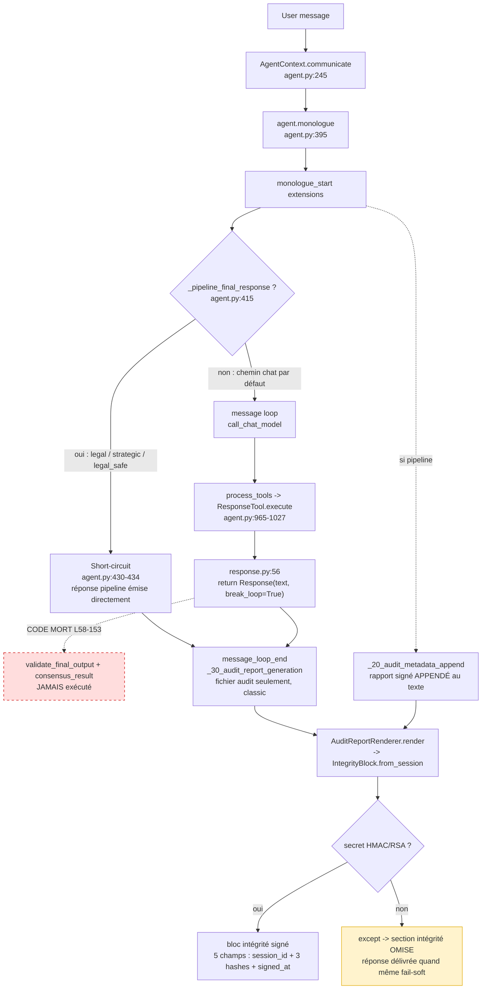
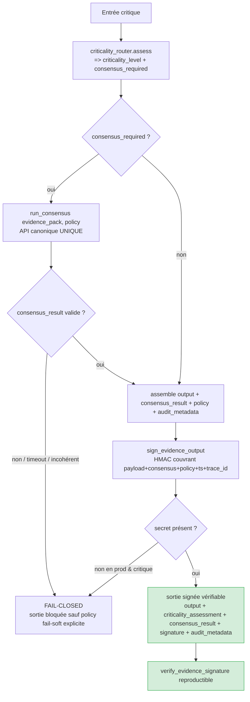

# Cartographie du chemin critique Evidence — router → consensus → sortie signée

> **Statut** : AUDIT (lecture seule). Aucun comportement modifié par ce document.
> **Date** : 2026-05-30
> **Méthode** : 3 explorations parallèles + vérification hostile des références (numéros de ligne et signatures recoupés sur le code source).
> **Portée** : `input → criticality_router → consensus → consensus_result → sortie signée`.

---

## 0. TL;DR (verdict d'audit)

Le chemin critique **annoncé** n'est **pas** le chemin **exécuté**. Trois ruptures majeures :

| # | Rupture | Preuve | Sévérité |
|---|---|---|---|
| R-1 | Le gate de sortie est **code mort**. La réponse finale est émise sans gate, sans consensus, sans signature. | `python/tools/response.py:56` (`return` anticipé) ; L58–153 inatteignables (ADR-009). | **CRITIQUE** |
| R-2 | `consensus_result` n'atteint **jamais** la sortie. Il n'est écrit qu'à 2 endroits (`call_subordinate.py`) et **consommé nulle part** sur le chemin actif. | `set_data("_consensus_result")` : `call_subordinate.py:374-379` et `:448-452` uniquement. Lecture : seulement dans le bloc mort `response.py:97-118`. | **CRITIQUE** |
| R-3 | La signature ne couvre **pas** le consensus/la policy/le trace_id. La sortie utilisateur n'est **jamais** signée en tant que telle ; seul un rapport d'audit annexe est signé (et fail-soft : section omise si secret absent). | `integrity_block.py:_build_sign_payload` (5 champs : `session_id`, 3 hashes, `signed_at`). Signature invoquée uniquement par `AuditReportRenderer`. | **CRITIQUE** |

Conclusion : **Evidence ne peut pas, aujourd'hui, produire une sortie critique signée alimentée par un `consensus_result` réel.** La promesse « chaîne opposable » n'est pas tenue sur le chemin par défaut.

---

## 1. Chemin RÉELLEMENT exécuté (production, aujourd'hui)

**Trait plein = exécuté en prod. Pointillé = inatteignable.**

### 1.1 Trois sous-chemins distincts

| Chemin | Déclencheur | Gate ? | consensus_result ? | Signature ? |
|---|---|---|---|---|
| **A. Chat classique** | agent appelle l'outil `response` | NON (mort) | NON | Rapport fichier seulement (`tmp/chats/{ctx}/audit_report.md`), pas dans l'UI |
| **B. Pipeline short-circuit** | profil legal / strategic / legal_safe pose `_pipeline_final_response` | NON (l'outil `response` n'est jamais atteint) | NON (consommé) | Rapport audit **appendé** au texte (`_20_audit_metadata_append.py:96-99`) |
| **C. Délégation** | `call_subordinate` | router appelé (`call_subordinate.py:255-259`) | écrit (`:374-379`, `:448-452`) mais jamais relu à la sortie | héritée du chemin A/B du parent |

---

## 2. Chemin ATTENDU (cible doctrine ADR-010)

**Écart cible↔réel** : aujourd'hui les flèches `router→consensus`, `consensus→consensus_result→output`, et `output→signature(couvrant le consensus)` n'existent pas sur le chemin par défaut.

---

## 3. Inventaire des modules : porteurs / orphelins / redondants

### 3.1 Noyau consensus (PRISM v2 — ADR-008)

| Module | Entrée canonique | Verdict | Note |
|---|---|---|---|
| `python/consensus/engine.py` | `run_consensus(evidence_pack, policy) -> ConsensusDecision` (**L377-382**) | **PORTEUR** | Exécuteur PRISM unique et autoritatif. |
| `python/consensus/__init__.py` | ré-export `run_consensus`, `get_consensus_engine` | **PORTEUR** | Façade paquet. |
| `python/helpers/consensus_manager.py` | quorum / votes (`ConsensusManager`) | **PORTEUR** (via engine) | `propose`/`submit_vote` directs hors engine = legacy/tests. |
| `python/helpers/consensus_contracts.py` | `ConsensusResultSchema`, `ConsensusStatusEnum` | **PORTEUR** | Schémas + validation stricte. |
| `python/helpers/consensus_arbiter.py` | `seek_consensus(action, context, ...) -> ConsensusResult` (**L841**) ; `ConsensusOrchestrator.seek_consensus` (**L642**) | **PORTEUR** | Wrapper LLM-arbitres → `run_consensus`. Méthodes legacy `_select_arbiters/_count_votes` = **MORTES**. |

### 3.2 Intégrations consensus — la zone de redondance

| Module | Rôle prétendu | Callers prod réels | Verdict |
|---|---|---|---|
| `python/helpers/adversarial_consensus_integration.py` | pipeline contradictoire 7 phases + PRISM phase 6 | API `adversarial_*` ; extension `legal_safe_mode` si `ADVERSARIAL_PIPELINE_ENABLED=1` | **PORTEUR (conditionnel)** |
| `python/helpers/legal_orchestrator.py` + `legal_pipeline.py` | consensus légal (`requires_consensus(ctx)` propre) | extension `legal_safe_mode` (profil legal_safe) | **PORTEUR (conditionnel)** |
| `python/helpers/collaborative_consensus.py` | débat 3 rounds (`run_collaborative_consensus`) — **PAS PRISM** | `call_subordinate._validate_with_consensus` (**L489**) | **PORTEUR mais REDONDANT** (subsystème de consensus parallèle, n'utilise pas `run_consensus`) |
| `python/helpers/consensus_integration.py` (`ResearchPipeline`) | dossier MCP legacy + confiance | **tests / `__main__` uniquement** | **ORPHELIN / REDONDANT** |
| `python/helpers/research_pipeline.py` (`EvidenceResearchPipeline`) | pipeline recherche+evidence | **tests / smoke / e2e uniquement** | **ORPHELIN** |
| `python/helpers/consensus_mcp_integration.py` (`research_with_consensus`) | façade MCP one-shot | **tests uniquement** | **ORPHELIN / REDONDANT** |
| `python/helpers/research_consensus_integration.py` (`research_with_consensus`) | recherche + criticité + `ResearchConclusion` | **tests uniquement** (importé non-appelé ailleurs) | **ORPHELIN / REDONDANT** |

> **Collision de nom** : deux fonctions `research_with_consensus` non liées coexistent (`consensus_mcp_integration.py:374` retournant `Dict` vs `research_consensus_integration.py:665` retournant `ResearchConclusion`). Source de confusion d'audit.

### 3.3 Routage & gate

| Module | Entrée | Verdict |
|---|---|---|
| `python/helpers/criticality_router.py` | `assess(query, agent_profile, ...) -> CriticalityAssessment` (**L525**) ; `requires_consensus = force_consensus or is_level3` (**L658-661**) | **PORTEUR** sur délégation/recherche/adversarial — **PAS** sur l'outil `response`. |
| `python/helpers/critical_decision_gate.py` | `enforce_or_route` (**L312**), `validate_final_output` (**L382**) | **MORT** sur le chemin de sortie. `enforce_or_route` n'a **aucun** caller prod (tests seulement). Anti-bypass `original_query` implémenté (L423-433) mais inactif. |
| `python/tools/response.py` | `ResponseTool.execute` | **PORTEUR** (émission) mais gate **désactivé** (L56 return ; L58-153 morts). |

### 3.4 Signature / intégrité

| Module | Entrée | Verdict |
|---|---|---|
| `python/helpers/integrity_block.py` | `IntegrityBlock.from_session(query, response, document, session_id)` (**L104**) ; `verify_signature(...)` (**L201**) | **PORTEUR** mais payload signé **insuffisant** (5 champs). `verify_signature` appelé **seulement en tests**. |
| `python/helpers/audit_report_renderer.py` | `_add_integrity` → `IntegrityBlock.from_session` (**L455-473**) | **PORTEUR** — **seul** point d'invocation de la signature en prod. |
| `python/helpers/log_signer.py` | `rsa_sign` / `rsa_verify` (RSA-PSS, prioritaire sur HMAC) | **PORTEUR** (si clé RSA configurée). |
| `python/helpers/session_envelope.py` | `integrity_hash` (SHA-256, **pas** HMAC) (**L132-143**) | **PORTEUR** — mécanisme d'intégrité séparé, non signé cryptographiquement. |

---

## 4. `consensus_required` — où c'est décidé (multi-source = risque)

| Source | Localisation | Règle |
|---|---|---|
| Chat / délégation / recherche / adversarial | `criticality_router.assess` **L658-661** | `force_consensus is True or is_level3` |
| Légal (indépendant du router) | `legal_pipeline.requires_consensus(ctx)` **L141-164** | scope BOARD ou risque MEDIUM/HIGH |
| Gate (inactif) | `critical_decision_gate.enforce_or_route` **L366** | recopie `assessment.requires_consensus` |

> **Défaut de cohérence** : deux doctrines de déclenchement coexistent (router vs legal_pipeline). À unifier (Phase 3).

---

## 5. `consensus_result` — peuplé vs consommé

### Peuplé (PRISM)

- `engine.run_consensus` → `ConsensusDecision` (L317-327)
- `seek_consensus` → `ConsensusResult` (L675-684)
- `research_consensus_integration.research` → `ResearchConclusion.consensus_result` (L488) — **orphelin**
- `legal_orchestrator` → dict (L1070-1096) — consommé par `legal_pipeline` (L1607-1688)

### Peuplé (non-PRISM, sur l'agent)

- `call_subordinate.py:374-379` (adversarial) et `:448-452` (subordinate pipeline) → `set_data("_consensus_result")`

### Consommé sur le chemin de sortie par défaut

- **PERSONNE.** Lecture uniquement dans le bloc mort `response.py:97-118`.
- `_consensus_result` n'est **jamais purgé** dans `agent.py` → donnée potentiellement périmée si le gate était réactivé tel quel.

---

## 6. Champs effectivement signés vs requis par la doctrine

| Champ requis (mission §5) | Présent dans la signature actuelle ? |
|---|---|
| `input_hash` | ✅ (`hash_request`) |
| `output_hash` | ✅ (`hash_response`) |
| `consensus_result_hash` | ❌ |
| `criticality_level` | ❌ |
| `policy_id` / `policy_version` | ❌ |
| `timestamp` | ✅ (`signed_at`) |
| `trace_id` / `correlation_id` | ❌ |
| `model` / `provider` metadata | ❌ |
| `human_review_required` | ❌ |

**Couverture actuelle : 3/9.** La signature ne lie pas la décision de consensus ni la policy au payload → **non opposable** au sens de la mission.

---

## 7. Comportement secret HMAC absent

- `_get_hmac_key()` (`integrity_block.py:38-46`) **lève `RuntimeError`** si `EVIDENCE_HMAC_KEY` absent (et pas de clé RSA).
- MAIS `AuditReportRenderer._add_integrity` **avale** l'exception (`except Exception: logger.warning`, L472-473) → **section intégrité omise, réponse délivrée quand même**.
- Net : **fail-soft silencieux** pour la signature aujourd'hui. La doctrine cible exige **fail-closed** pour une sortie critique.

---

## 8. Synthèse des actions (entrée des phases suivantes)

| Action | Cible | Phase |
|---|---|---|
| Unifier sur **une** API consensus (`run_consensus`) ; déprécier les 3-4 intégrations orphelines | §3.2 | 3 |
| Unifier le déclenchement `consensus_required` (router vs legal_pipeline) | §4 | 3 |
| Câbler un **seul** gate alimenté : router → consensus → consensus_result → sortie | §1, §5 | 4 |
| Étendre la signature aux 9 champs ; rendre `verify_*` invoqué et reproductible | §6 | 5 |
| Fail-closed sur secret absent en prod pour sortie critique | §7 | 5 |
| Supprimer/fusionner orphelins + bloc mort `response.py` L58-153 | §3.2, R-1 | 9 |

---

## Annexe — Fichiers porteurs à modifier (prévision)

- `python/consensus/engine.py` (API canonique)
- `python/tools/response.py` (suppression code mort + raccord)
- `python/helpers/critical_decision_gate.py` (ou son remplacement consolidé)
- `python/helpers/integrity_block.py` (extension payload signé + verify)
- `python/helpers/audit_report_renderer.py` (fail-closed critique)
- `python/helpers/criticality_router.py` (source unique consensus_required)
- À supprimer/déprécier : `consensus_integration.py`, `consensus_mcp_integration.py`, `research_consensus_integration.py`, `research_pipeline.py` (sous réserve d'analyse d'impact tests).
