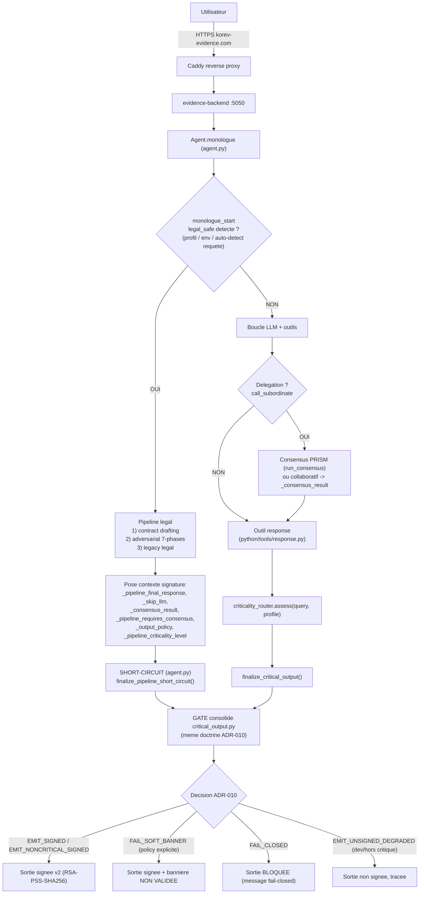

# Mission Aya — Chantier #1 : Cartographie Evidence + validation E2E du chemin critique

> **Destinataire** : Aya (ingénierie)
> **Date** : 2026-05-30
> **Pré-requis lecture** : `docs/adr/ADR-010-critical-output-doctrine.md`, `docs/adr/ADR-009-response-gate-disabled.md`,
> `docs/audit/critical_request_path_map.md`, `docs/audit/critical_path_remediation_report.md`,
> `docs/audit/critical_path_hostile_audit.md`, `docs/INFRA_SERVEUR_OVH.md`.
> **Commit de référence en production** : `930870f4` (branche `main`, image `korev/evidence-backend:1.0.0`, `v1.3.0`).

---

## 0. Pourquoi ce chantier en premier

Evidence vient d'être réaligné : toute **sortie critique** (chat **et** pipeline legal) est désormais
**signée (v2, RSA)**, **vérifiable**, **anti-tamper**, et **fail-closed par défaut**. Ce socle est prouvé
par 35 tests + un round-trip de signature réel dans le container prod.

**Ce qui n'est PAS encore prouvé** : le comportement de bout en bout sur **trafic réel** (une vraie
requête HTTP qui traverse tout le stack jusqu'à une sortie signée), le **statut CI** du commit déployé,
et un **consensus réel** (non simulé). Ton chantier #1 = **comprendre la cartographie complète** puis
**fermer ces trous par des preuves**, sans modifier le comportement métier.

C'est volontairement un chantier de **cartographie + validation** : il te fait apprendre tout le pipeline
et produit le dossier de preuve qui manque. Aucune réécriture de logique critique attendue ici.

---

## 1. CARTOGRAPHIE EVIDENCE — de la requête utilisateur à la sortie

### 1.1 Vue d'ensemble (flux réel)



### 1.2 Les DEUX points d'émission (à bien distinguer)

| Chemin | Déclencheur | Fichier d'émission | Fonction gate |
|---|---|---|---|
| **Chat** (réponse LLM normale) | requête non détectée legal | `python/tools/response.py` (`ResponseTool.execute`) | `finalize_critical_output()` |
| **Pipeline** (court-circuit) | legal détecté en `monologue_start` | `agent.py` (bloc short-circuit `_pipeline_final_response`) | `finalize_pipeline_short_circuit()` |

> Les deux convergent vers **le même gate** `python/helpers/critical_output.py`. Il n'y a **pas** deux
> doctrines : une seule (`finalize_critical_output`).

### 1.3 Décision « consensus ou pas » (criticality_router)

Source : `python/helpers/criticality_router.py` → `CriticalityRouter.assess(query, agent_profile, force_consensus=None)`
renvoie un `CriticalityAssessment(requires_consensus, strict_evidence_mode, ...)`.

| Type de requête | Niveau | `requires_consensus` | Comportement gate |
|---|---|:---:|---|
| Simple : définition, résumé, explication, météo, traduction (`LEVEL1_SIMPLE_PATTERNS`) | **LEVEL 1** | `False` | `EMIT_NONCRITICAL_SIGNED` (signé, jamais bloqué, pas de bannière) |
| Intermédiaire : analyse, comparaison, conseil | **LEVEL 2** | `False` (sauf `force_consensus`) | signé, `strict_evidence_mode=True` |
| Critique : décision réelle, litige, responsabilité, action engageante (`LEVEL3_CRITICAL_PATTERNS`, `CRITICAL_ACTION_PATTERNS`) | **LEVEL 3** | `True` | **consensus_result valide requis** → `EMIT_SIGNED`, sinon `FAIL_CLOSED` |
| `force_consensus=True` passé par le caller | tout niveau | `True` | consensus requis **inconditionnellement** |

### 1.4 D'où vient `_consensus_result` ? (POINT CLÉ À COMPRENDRE)

Sur le **chemin chat direct**, `_consensus_result` n'est peuplé **que** par :
- **la délégation** `python/tools/call_subordinate.py` (branche adversarial `:374`, branche subordinate `:448`) ;
- **l'extension legal** `python/extensions/legal_safe_mode/_10_legal_safe_integration.py` (`:299`, via `map_legal_consensus`).

**Conséquence directe et voulue (doctrine)** : une requête **LEVEL 3** répondue **directement** (sans
délégation, donc sans consensus exécuté) → `_consensus_result` absent → **`FAIL_CLOSED`**. Ce n'est pas un
bug : c'est la garantie fail-closed. Pour qu'une réponse critique passe, le consensus DOIT réellement
s'exécuter (délégation `call_subordinate` ou pipeline legal).

### 1.5 Moteur de consensus

- **Canonique** : `python/consensus/engine.py::run_consensus` via `ConsensusOrchestrator.seek_consensus`
  (PRISM, vote multi-arbitres, quorum, fail-closed).
- **Parallèle (réserve P1-3)** : `collaborative_consensus.run_collaborative_consensus` (débat 3 rounds,
  utilisé par `call_subordinate`) — **n'utilise pas** `run_consensus`. Sous-système non opposable.

### 1.6 Signature (critical_output.py)

- 9 champs signés (`signature_version=2`) : `input_hash`, `output_hash`, `consensus_result_hash`,
  `criticality_level`, `policy_id`, `policy_version`, `timestamp`, `trace_id`, `model`, `human_review_required`.
- **RSA-PSS-SHA256 d'abord** (clé prod `/evidence/keys/private.pem`, montée `:ro`) ; **HMAC-SHA256** en
  fallback (`EVIDENCE_HMAC_KEY`). Si **aucun** secret en **production** sur sortie critique → `FAIL_CLOSED` (D6).
- Vérification : `verify_evidence_signature(signed_output)` (recalcul des hashs + revalidation). Toute
  altération de `output` ou `consensus_result` → `False` (anti-tamper).

### 1.7 Matrice de décision du gate (ADR-010, résumé exécutable)

| Condition | Décision |
|---|---|
| `requires_consensus=True` + consensus APPROVED + secret présent | `EMIT_SIGNED` |
| `requires_consensus=True` + consensus absent/REJECTED/NO_CONSENSUS/INFRA_FAILURE | `FAIL_CLOSED`… |
| …sauf `policy.fail_soft_allowed=True` (explicite, ex. policy `legal-pipeline`) | `FAIL_SOFT_BANNER` (signé + « NON VALIDÉE ») |
| Secret signature absent **en prod** + sortie critique | `FAIL_CLOSED` |
| `requires_consensus=False` (LEVEL 1/2) | `EMIT_NONCRITICAL_SIGNED` |

---

## 2. LE CHANTIER #1 — Valider le chemin critique de bout en bout (preuves sur trafic réel)

### 2.1 Objectif

Produire un **dossier de preuve E2E** démontrant que, sur une instance live, le pipeline se comporte
exactement comme la doctrine ADR-010 le décrit — sur les **deux** chemins (chat + legal) et pour les
**deux** issues (signé / fail-closed). Confirmer le **CI** et un **consensus réel**.

### 2.2 Périmètre

**DANS le périmètre :**
- Comprendre et valider la cartographie §1 (annoter toute divergence constatée).
- Exécuter des requêtes réelles et capturer les `signed_output` + résultats de `verify_evidence_signature`.
- Confirmer le statut CI du commit `930870f4`.
- Exécuter au moins **un** consensus **réel** (sans `CONSENSUS_SIMULATION`).

**HORS périmètre (ne PAS traiter ici) :**
- P1-2 (migration medical/smoke), P1-3 (`collaborative_consensus`), P2 (endpoint de vérification, unification v1/v2).
- Toute modification de la logique critique. Si tu trouves un défaut → **ticket**, pas de correctif dans ce chantier.

### 2.3 Étapes

1. **Onboarding cartographie** : lire les docs pré-requis, dérouler le code des 2 points d'émission
   (`response.py`, short-circuit `agent.py`) et du gate (`critical_output.py`). Valider §1 ligne à ligne.
2. **Environnement de test sûr** : utiliser l'instance **demo** (`evidence-backend-demo`, déjà isolée) ou
   un run local — **ne pas** faire de tests destructifs sur `evidence-backend` (prod). Voir `docs/INFRA_SERVEUR_OVH.md`.
3. **Cas à capturer** (pour chacun : requête, décision gate, `signed_output`, `verify=True/False`) :
   - **C1 — LEVEL 1 (chat simple)** : ex. « Donne-moi la définition de la RGPD. » → attendu `EMIT_NONCRITICAL_SIGNED`, signé, `verify=True`.
   - **C2 — LEVEL 3 direct sans délégation** : une requête décision/action engageante répondue en direct → attendu **`FAIL_CLOSED`**.
   - **C3 — LEVEL 3 avec délégation (consensus réel)** : forcer le passage par `call_subordinate` → `_consensus_result` peuplé → attendu `EMIT_SIGNED`, `verify=True`.
   - **C4 — Pipeline legal** : requête juridique déclenchant le pipeline → attendu sortie signée v2 (ou `FAIL_SOFT_BANNER` si consensus non APPROVED, ou `FAIL_CLOSED`).
   - **C5 — Anti-tamper** : altérer `output` d'un `signed_output` capturé → `verify_evidence_signature` doit renvoyer `False`.
4. **Consensus réel** : rejouer C3 **sans** `CONSENSUS_SIMULATION` (clés LLM configurées) et confirmer un vote multi-arbitres réel.
5. **CI** : confirmer le statut des GitHub Actions sur `930870f4` (le merge vers `main` a été fait en direct, CI non confirmée verte à ce stade).
6. **Livrable** : rédiger `docs/audit/e2e_live_validation_2026-MM-DD.md` (gabarit §2.5) avec les 5 cas + CI + consensus réel.

### 2.4 Critères d'acceptation (Definition of Done)

- [ ] Les 5 cas C1–C5 capturés avec preuve (requête, décision, extrait `signed_output`, résultat `verify`).
- [ ] C2 démontre bien un `FAIL_CLOSED` (pas de sortie critique brute).
- [ ] C5 démontre l'anti-tamper (`verify=False` après altération).
- [ ] Au moins un consensus **réel** (non simulé) exécuté et tracé.
- [ ] Statut CI du commit `930870f4` documenté (vert / rouge + détail).
- [ ] Document de preuve commité, et la cartographie §1 confirmée ou corrigée (PR si correction).
- [ ] **Aucune modification** de la logique critique dans ce chantier.

### 2.5 Gabarit du livrable

```
# Validation E2E live — chemin critique Evidence (<date>)
## Environnement (instance, commit, env vars)
## C1 LEVEL 1 — requête / décision attendue / décision obtenue / signed_output / verify
## C2 LEVEL 3 direct — ... (attendu FAIL_CLOSED)
## C3 LEVEL 3 + délégation (consensus réel) — ...
## C4 Pipeline legal — ...
## C5 Anti-tamper — ...
## Consensus réel — preuve du vote multi-arbitres
## CI — statut sur 930870f4
## Divergences vs cartographie §1 (le cas échéant) + tickets ouverts
## Verdict
```

---

## 3. ÉLÉMENTS NÉCESSAIRES

### 3.1 Fichiers clés

| Rôle | Fichier |
|---|---|
| Gate consolidé + signature v2 | `python/helpers/critical_output.py` |
| Mapping consensus legal | `python/helpers/legal_signing.py` |
| Routage criticité | `python/helpers/criticality_router.py` |
| Émission chat | `python/tools/response.py` |
| Émission pipeline (short-circuit) | `agent.py` (bloc `_pipeline_final_response`) |
| Pipeline legal (3 sous-pipelines) | `python/extensions/legal_safe_mode/_10_legal_safe_integration.py` |
| Délégation → consensus_result | `python/tools/call_subordinate.py` |
| Moteur consensus canonique | `python/consensus/engine.py` (`run_consensus`) |
| Doctrine | `docs/adr/ADR-010-critical-output-doctrine.md` |

### 3.2 Tests existants (à rejouer pour s'imprégner)

```bash
EVIDENCE_ENV=development CONSENSUS_SIMULATION=true \
  .venv-ci311/bin/python -m pytest \
  tests/test_critical_output_doctrine.py \
  tests/e2e/test_critical_request_signed_output.py \
  tests/test_legal_pipeline_signed_output.py \
  tests/test_response_tool_failclosed.py \
  tests/test_consensus_entrypoint_delegation.py \
  tests/test_observability_logs.py -q
# Attendu : 35 passed
```

### 3.3 Variables d'environnement importantes

| Variable | Effet |
|---|---|
| `EVIDENCE_ENV` | `production` → fail-closed strict si secret absent ; `development` → toléré |
| `CONSENSUS_SIMULATION` | `true` → arbitres LLM mockés (tests). **Désactiver** pour un consensus réel |
| `EVIDENCE_RSA_PRIVATE_KEY_PATH` | clé de signature prod (`/evidence/keys/private.pem`) |
| `EVIDENCE_HMAC_KEY` | secret HMAC (fallback si RSA indisponible) |
| `LEGAL_PIPELINE_HOOK`, `ADVERSARIAL_PIPELINE_ENABLED` | activent les pipelines legal/adversarial |

### 3.4 Accès serveur

Voir `docs/INFRA_SERVEUR_OVH.md` (SSH, IP, procédure deploy). **Règle de sécurité du chantier** :
tests sur **demo** ou en local. Aucune commande destructive sur `evidence-backend` (prod). Aucun secret
en clair dans les logs ou le livrable (uniquement `correlation_id` + hashs).

---

## 4. GARDE-FOUS (ce qu'il ne faut PAS casser)

- **Ne jamais** transformer un `FAIL_CLOSED` en émission brute « pour débloquer » : c'est la garantie centrale.
- **Ne pas** introduire de fail-soft sans `policy.fail_soft_allowed=True` explicite.
- **Ne pas** ré-router une réponse déjà finalisée par un pipeline (`_pipeline_validated_response`).
- Toute modif de code passe par l'**audit hostile pré-commit** (protocole interne en 3 phases) et une PR.

---

## 5. RÉSERVES CONNUES (contexte, hors chantier #1)

| ID | Réserve | Priorité |
|---|---|:---:|
| P1-2 | Migration `agents/medical/tools/prism_integration.py` + `tools/smoke_test.py` vers l'API canonique, puis suppression de `research_consensus_integration` / `research_pipeline` (dépréciés). | P1 |
| P1-3 | `collaborative_consensus` : validateur parallèle non opposable, ne passe pas par `run_consensus`. | P1 |
| P2-x | Endpoint de vérification a posteriori, unification signature v1 (`integrity_block`) / v2 (`critical_output`). | P2 |

> Ces réserves seront des chantiers ultérieurs. Le chantier #1 les **documente** mais ne les traite pas.
