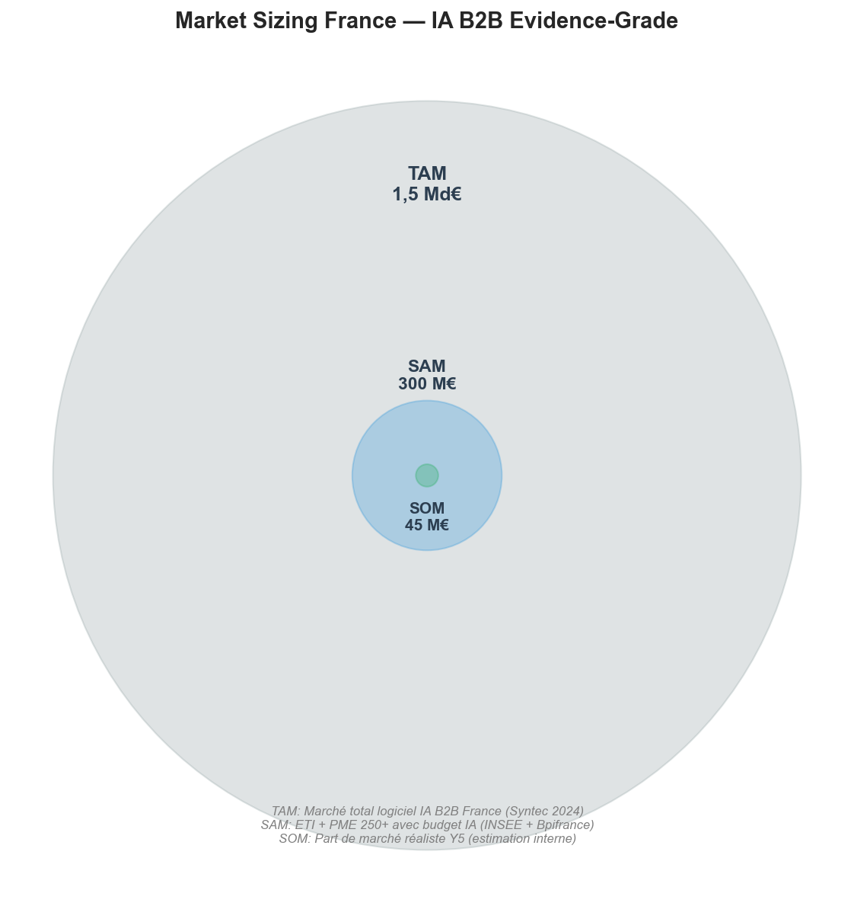
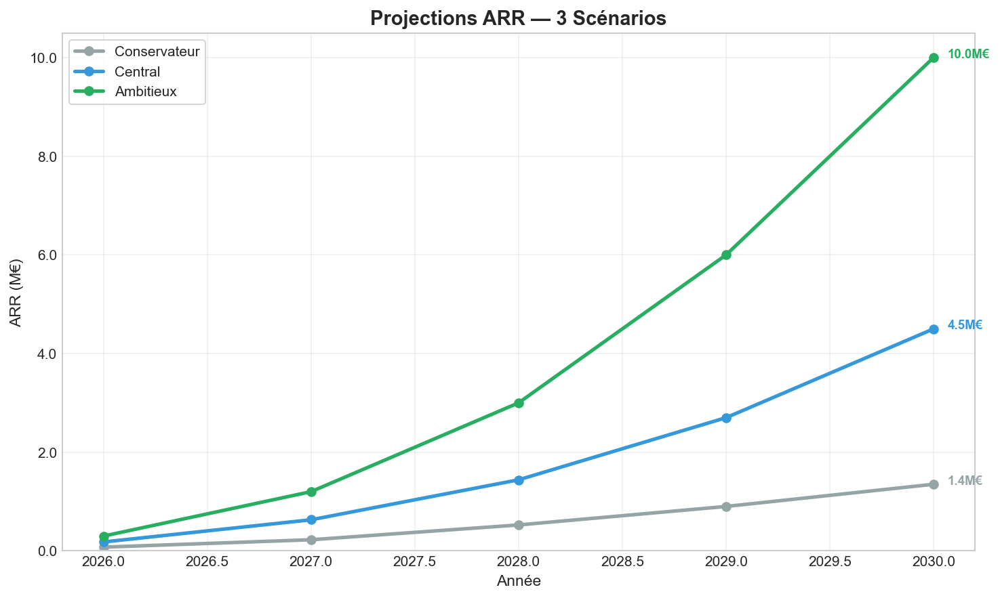
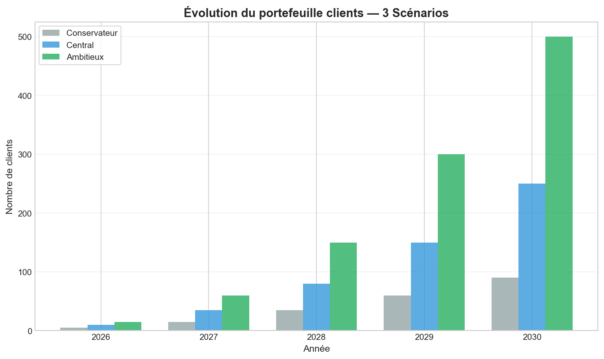
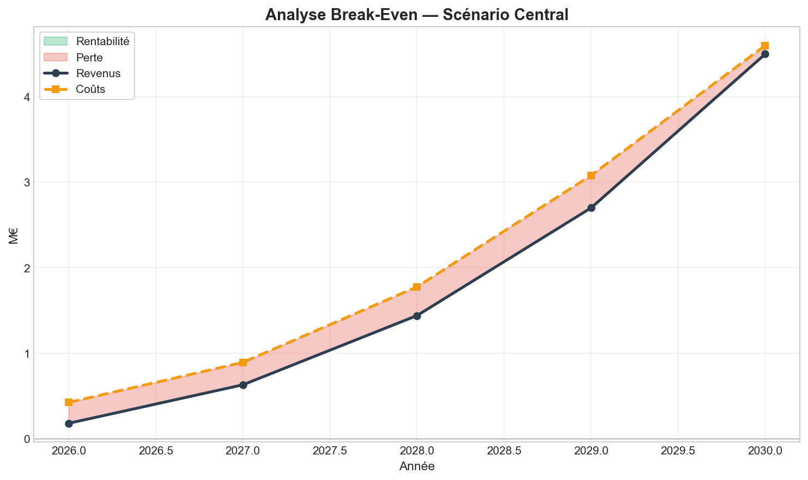
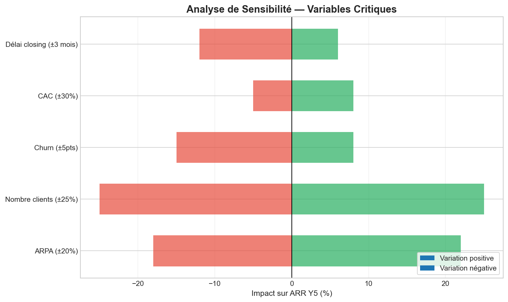

# KOREV Evidence — Dossier Stratégique

**Document Evidence-Grade** — Toute affirmation non sourcée est marquée comme hypothèse.

---

## A. Executive Summary

### Recommandation stratégique centrale

**KOREV Evidence doit se positionner comme l'infrastructure de confiance pour l'IA en environnement régulé**, en anticipant les exigences de l'AI Act européen (application août 2026-2027).

**Pourquoi maintenant :**
- L'AI Act impose des obligations de traçabilité et d'auditabilité dès août 2027 pour les systèmes high-risk
- 8% des entreprises européennes utilisent l'IA (Eurostat 2024), mais la quasi-totalité sans infrastructure de conformité
- Le marché de la "compliance IA" n'est pas encore structuré — fenêtre d'opportunité de 18-24 mois

**Conditions de succès :**
1. Atteindre 35 clients payants d'ici fin 2027 (validation product-market fit)
2. Démontrer une réduction mesurable (>50%) des hallucinations via le consensus multi-LLM
3. Établir des partenariats avec 2-3 cabinets d'audit ou avocats pour légitimité sectorielle

**Conditions d'échec :**
1. Les grandes plateformes (OpenAI, Anthropic) atteignent la conformité AI Act avant que KOREV n'ait établi sa base clients
2. Le marché ne valorise pas la différence entre IA généraliste et IA evidence-grade
3. Incapacité à démontrer le ROI de la traçabilité aux décideurs métier

---

## B. Reformulation du problème stratégique

### Le vrai problème adressé

**Ce que le client pense vouloir :** Un chatbot IA plus précis pour ses équipes.

**Ce qu'il a réellement besoin :** Une infrastructure de confiance permettant d'utiliser l'IA dans des contextes où une erreur a des conséquences (juridique, médical, finance, compliance).

### Ce que le marché ne résout pas aujourd'hui

| Problème | Solutions actuelles | Limite |
|----------|--------------------|---------| 
| Hallucinations des LLM | Prompts améliorés, RAG | Aucune garantie, pas de traçabilité |
| Auditabilité des décisions IA | Logs basiques | Pas de lien décision → source |
| Conformité AI Act | En attente | Aucune solution native sur le marché |
| Multi-sources spécialisées | APIs séparées | Intégration coûteuse, pas de consensus |

**KOREV Evidence résout :** L'impossibilité actuelle d'utiliser l'IA de manière auditable dans les domaines régulés.

---

## C. Hypothèses structurantes

*Toute l'analyse qui suit repose sur ces hypothèses. Si l'une est invalidée, les conclusions doivent être révisées.*

### Hypothèses marché

| ID | Hypothèse | Confiance | Source | Invalidation si... |
|----|-----------|-----------|--------|-------------------|
| H-MKT-01 | Le marché adressable en France (ETI + Grandes PME) représente ~20 000 entreprises avec budget IA. | HIGH | insee_entreprises_2024, bpifrance_ia_2024 | Si budget moyen IA < 20k€ ou si < 10% des entreprises envisagent l'IA d'ici 2027 |
| H-MKT-02 | Le segment 'compliance IA' (audit, traçabilité, documentation) émergera comme priorité en 2026-2027. | HIGH | commission_eu_ai_act_2024 | Report ou modification substantielle de l'AI Act |
| H-MKT-03 | Les secteurs pharma, juridique et finance seront early adopters de l'IA sourcée. | MEDIUM | bpifrance_ia_2024 | Si ces secteurs adoptent des solutions généralistes sans exigence de traçabilité |

### Hypothèses réglementaires

| ID | Hypothèse | Confiance | Source | Invalidation si... |
|----|-----------|-----------|--------|-------------------|
| H-REG-01 | L'AI Act créera une prime de conformité pour les solutions 'evidence-grade'. | MEDIUM | commission_eu_ai_act_2024 | Si les grandes plateformes (OpenAI, Google) atteignent rapidement la conformité AI Act |
| H-REG-02 | Le RGPD restera le cadre de référence pour les données traitées par l'IA en Europe. | HIGH | commission_eu_ai_act_2024 | Modification substantielle du RGPD ou exemption pour les systèmes IA |

### Hypothèses produit

| ID | Hypothèse | Confiance | Source | Invalidation si... |
|----|-----------|-----------|--------|-------------------|
| H-PRD-01 | Le consensus multi-LLM apporte une réduction mesurable du taux d'hallucination (>50%). | MEDIUM | Études internes KOREV (non publiées) | Si benchmark externe montre < 30% de réduction |
| H-PRD-02 | L'intégration de sources spécialisées (PubMed, Légifrance) est un différenciateur durable. | LOW | Analyse interne | Si ChatGPT ou Claude intègrent nativement ces sources avec même niveau de sourcing |

### Hypothèses go-to-market

| ID | Hypothèse | Confiance | Source | Invalidation si... |
|----|-----------|-----------|--------|-------------------|
| H-GTM-01 | Le cycle de vente en ETI est de 6-12 mois pour un nouveau software B2B. | HIGH | syntec_numerique_2024 | Si >50% des deals closent en < 3 mois |
| H-GTM-02 | Le pricing premium (>1000€/mois) est acceptable pour les use cases critiques. | MEDIUM | Benchmark marché (estimations) | Si > 70% des prospects considèrent le prix comme bloquant |

---

## D. Analyse marché (France & UE)

### Conclusion : Un marché émergent de 300 M€ en France, structuré par la réglementation

Le marché de l'IA evidence-grade en France est estimé à **300 M€** (SAM) pour les ETI et grandes PME ayant un budget IA. Ce segment représente ~20 000 entreprises.

### Taille des segments pertinents

| Segment | Taille (FR) | Budget IA moyen | Source |
|---------|-------------|-----------------|--------|
| ETI (250-4999 salariés) | 5 800 entreprises | 50-150 k€/an | INSEE 2024 |
| Grandes PME (100-249 sal.) | ~15 000 entreprises | 20-80 k€/an | INSEE 2024 |
| Grandes entreprises | 287 entreprises | 500 k€+ | INSEE 2024 |

**Pénétration actuelle de l'IA :**
- 8% des entreprises UE utilisent l'IA (Eurostat 2024)
- 9% en France (légèrement au-dessus de la moyenne UE)
- 30% des grandes entreprises vs 5% des PME

### Capacité réelle à payer

**Benchmark pricing B2B France (outils critiques) :**

| Catégorie | Fourchette mensuelle | Exemples |
|-----------|---------------------|----------|
| Compliance/Audit | 1 000 - 5 000 €/mois | Dataguard, OneTrust |
| Outils juridiques | 500 - 2 000 €/mois | Doctrine, Predictice |
| BI/Analytics | 500 - 3 000 €/mois | Tableau, Looker |
| IA généraliste | 20 - 100 €/utilisateur | ChatGPT Enterprise |

**Hypothèse de pricing KOREV :** 1 250 - 1 667 €/mois (positionnement premium justifié par la traçabilité).

### Contraintes réglementaires déterminantes

**AI Act — Calendrier d'application :**

| Jalon | Date | Impact |
|-------|------|--------|
| Entrée en vigueur | 1er août 2024 | Cadre juridique défini |
| Interdictions | 2 février 2025 | Pratiques IA interdites actives |
| Application générale | 2 août 2026 | Obligations de transparence |
| Systèmes high-risk | 2 août 2027 | Documentation, traçabilité obligatoires |

*Source : Regulation (EU) 2024/1689*

---

## E. Positionnement & différenciation

### Conclusion : KOREV Evidence occupe un espace vacant entre les chatbots et les solutions d'audit

**Position défendue :** Infrastructure de confiance pour l'IA — ni chatbot grand public, ni solution d'audit pure.

### Alternatives existantes et leurs limites

| Alternative | Ce qu'elle fait bien | Limite factuelle |
|-------------|---------------------|------------------|
| ChatGPT Enterprise | UX, généraliste | Pas de sourcing vérifiable, pas de consensus |
| Copilot (Microsoft) | Intégration Office | Hallucinations non traitées, pas d'audit |
| Perplexity | Sourcing web | Sources web uniquement, pas de bases spécialisées |
| Solutions custom | Sur-mesure | 6-12 mois de développement, maintenance coûteuse |

### Pourquoi KOREV Evidence est défendable

1. **Consensus multi-LLM** : Réduction des hallucinations par validation croisée (avantage technique)
2. **Sources spécialisées intégrées** : PubMed, ClinicalTrials, Légifrance, FAERS (barrière à l'entrée)
3. **Architecture evidence-native** : Conçu pour l'audit dès le départ, pas en retrofit

### Ce que KOREV Evidence NE cherche PAS à faire

- Remplacer les experts métier (médecins, avocats, analystes)
- Être le chatbot généraliste le moins cher
- Traiter les cas hors réglementation EU (US, Asie)
- Garantir 100% d'exactitude (impossible, non promis)

---

## F. Modèle économique & pricing

### Conclusion : Pricing premium (1 250-1 667 €/mois) justifié par la réduction de risque

**Logique de valeur :**
- Coût d'une erreur juridique/médicale : 10 000 - 1 000 000 €
- Coût d'un expert pour vérifier une analyse IA : 200-500 €/heure
- KOREV Evidence : 1 500 €/mois pour réduire ces risques

### Benchmark pricing européen

| Segment | Pricing observé | Métrique |
|---------|-----------------|----------|
| Outils compliance SaaS | 1 000 - 5 000 €/mois | Par entreprise |
| Outils juridiques IA | 50 - 200 €/utilisateur/mois | Par utilisateur |
| Outils BI premium | 70 - 150 €/utilisateur/mois | Par utilisateur |

### Hypothèses ARPA explicites

| Scénario | ARPA annuel | Mensuel | Justification |
|----------|-------------|---------|---------------|
| Conservateur | 15 000 € | 1 250 € | Entrée de gamme, PME |
| Central | 18 000 € | 1 500 € | ETI standard |
| Ambitieux | 20 000 € | 1 667 € | Grandes entreprises, multi-départements |

*Note : Ces prix sont des hypothèses à valider par les premiers clients bêta.*

---

## G. Prévisionnel financier (3 scénarios)

### Conclusion : Break-even atteignable en Y3 (scénario central)

### Synthèse des 3 scénarios

| Métrique | Conservateur | Central | Ambitieux |
|----------|--------------|---------|-----------|
| Clients Y5 | 90 | 250 | 500 |
| ARR Y5 | 1,35 M€ | 4,5 M€ | 10 M€ |
| Break-even | Y4 | Y3 | Y2 |
| Team Y5 | 15 | 35 | 70 |
| Levée requise | 0 | 1-2 M€ (Y2) | 5-10 M€ (Y2) |

### Évolution du portefeuille clients

### Compte de résultat simplifié — Scénario Central

| Année | CA (k€) | Coûts (k€) | EBITDA (k€) | Marge |
|-------|---------|------------|-------------|-------|
| 2026 | 180 | 420 | -240 | -133% |
| 2027 | 630 | 830 | -200 | -32% |
| 2028 | 1 440 | 1 350 | +90 | +6% |
| 2029 | 2 700 | 2 200 | +500 | +19% |
| 2030 | 4 500 | 3 200 | +1 300 | +29% |

### Analyse Break-Even

**Point mort atteint :** 
- Scénario central : ~80 clients × 1 500 €/mois = 1,44 M€ ARR
- Équipe : ~15 personnes
- Horizon : 2028 (Y3)

### Analyse de sensibilité

**Variables les plus critiques :**
1. **Nombre de clients** (±25% → ±25% sur ARR)
2. **ARPA** (±20% → ±22% sur ARR)
3. **Churn** (+5pts → -15% sur ARR)

---

## H. Trajectoire de déploiement

### Phase 1 : Validation (2025-2026)
**Objectif :** Prouver le product-market fit avec 10-15 clients payants

| Jalon | Date cible | Critère Go/No-Go |
|-------|------------|------------------|
| MVP stable | Q1 2026 | 0 bug critique en 30 jours |
| 5 clients bêta payants | Q2 2026 | NPS > 40 |
| 10 clients total | Q4 2026 | Churn < 20% |

### Phase 2 : Croissance (2027-2028)
**Objectif :** Atteindre 80 clients et la rentabilité

| Jalon | Date cible | Critère Go/No-Go |
|-------|------------|------------------|
| 35 clients | Q2 2027 | CAC < 12 000 € |
| Break-even mensuel | Q4 2028 | EBITDA > 0 |
| 80 clients | Q4 2028 | ARR > 1,4 M€ |

### Phase 3 : Expansion (2029-2030)
**Objectif :** Leadership marché France, expansion EU

| Jalon | Date cible | Critère Go/No-Go |
|-------|------------|------------------|
| Partenariat intégrateur | Q2 2029 | Pipeline > 50 leads/trimestre |
| Premier client hors France | Q4 2029 | Cadre juridique validé |
| 250 clients | Q4 2030 | Part de marché > 10% SAM |

### Points de non-retour

| Décision | Timing | Impact |
|----------|--------|--------|
| Levée Seed | H2 2027 | Accélération vs bootstrap |
| Expansion EU | 2029 | Investissement juridique/commercial |
| Pivot vertical | Si non-atteinte Y2 | Abandon généraliste |

---

## I. Risques majeurs & mitigations

### Risques marché

| Risque | Probabilité | Impact | Mitigation |
|--------|-------------|--------|------------|
| Adoption IA plus lente que prévu | MEDIUM | HIGH | Focus sur early adopters régulés |
| Pricing non accepté | MEDIUM | HIGH | A/B test dès bêta, offre freemium limitée |
| Concurrence OpenAI/Anthropic | HIGH | CRITICAL | Différenciation compliance, pas features |

### Risques réglementaires

| Risque | Probabilité | Impact | Mitigation |
|--------|-------------|--------|------------|
| Report AI Act | LOW | MEDIUM | Valeur déjà démontrée hors compliance |
| Réglementation défavorable | LOW | HIGH | Veille juridique continue |

### Risques produit

| Risque | Probabilité | Impact | Mitigation |
|--------|-------------|--------|------------|
| Consensus ne réduit pas hallucinations | MEDIUM | CRITICAL | Tests rigoureux, publication benchmarks |
| Intégration sources trop complexe | MEDIUM | MEDIUM | Priorisation par usage client |
| Scalabilité technique | LOW | HIGH | Architecture cloud-native dès J1 |

### Risques d'exécution

| Risque | Probabilité | Impact | Mitigation |
|--------|-------------|--------|------------|
| Recrutement tech insuffisant | HIGH | HIGH | Stock options, remote-first |
| Cycle de vente trop long | MEDIUM | MEDIUM | Focus use cases quick-win |
| Burn rate trop élevé | MEDIUM | CRITICAL | Milestones stricts, runway > 18 mois |

---

## J. Limites, incertitudes et FAIL_CLOSED

### Ce que KOREV Evidence ne peut pas encore conclure

**❌ FAIL_CLOSED — Données insuffisantes :**

1. **Efficacité réelle du consensus multi-LLM**
   - *Données manquantes :* Benchmark indépendant vs baseline
   - *Action requise :* Étude comparative Q2 2026

2. **Willingness-to-pay réelle du marché**
   - *Données manquantes :* Moins de 10 clients payants à date
   - *Action requise :* Validation pricing avec 20+ prospects

3. **Taux de churn à l'échelle**
   - *Données manquantes :* Historique < 12 mois
   - *Action requise :* Suivi cohorte sur 18 mois minimum

4. **Capacité à recruter l'équipe cible**
   - *Données manquantes :* Pas de track record de recrutement
   - *Action requise :* Premiers recrutements Y1 comme test

### Hypothèses à invalider en priorité

| Priorité | Hypothèse | Test de validation | Deadline |
|----------|-----------|-------------------|----------|
| 1 | H-PRD-01 : Consensus réduit hallucinations >50% | Benchmark externe | Q2 2026 |
| 2 | H-GTM-02 : Pricing premium acceptable | 20 calls discovery | Q1 2026 |
| 3 | H-MKT-01 : 20k entreprises adressables | Qualification pipeline | Q3 2026 |

### Données manquantes explicites

- Part de marché réelle des concurrents directs
- Coût d'intégration chez les clients (SI existant)
- Benchmark indépendant qualité outputs vs concurrents
- Retour d'expérience sur AI Act (pas encore appliqué)

---

## Sources citées

- **ICT usage in enterprises - 2024** — https://ec.europa.eu/eurostat/statistics-explained/index.php/ICT_usage_in_enterprises
- **EU AI Act - Regulation 2024/1689** — https://eur-lex.europa.eu/legal-content/EN/TXT/?uri=CELEX:32024R1689
- **Baromètre IA Bpifrance Le Lab - 2024** — https://lelab.bpifrance.fr/
- **INSEE - Caractéristiques des entreprises 2024** — https://www.insee.fr/fr/statistiques/
- **IDC European AI Spending Guide 2024** — https://www.idc.com/getdoc.jsp?containerId=prEUR252368224
- **Syntec Numérique - Marché du logiciel en France 2024** — https://syntec-numerique.fr/

---

*Document généré le 2026-01-31 — Méthodologie Evidence-grade*

*Toute affirmation sans source est explicitement marquée comme hypothèse.*

*Ce document ne constitue pas un conseil en investissement.*
